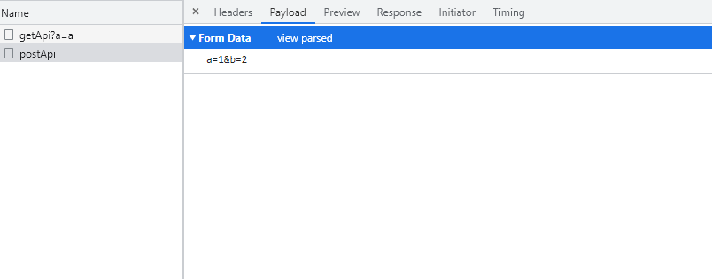
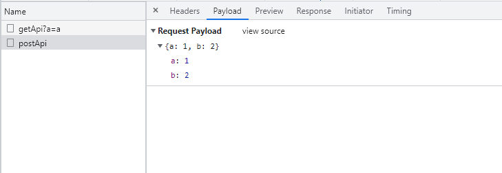
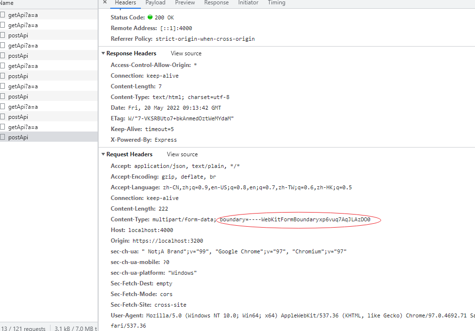
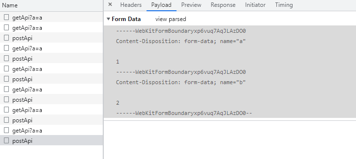

## Content-Type 简介

Content-Type 用于向接收方说明传输资源的媒体类型，包含三个指令

-   media type：声明传输数据的媒体类型
-   charset：声明传输数据采用的是何种字符集
-   boundary：数据分界符，浏览器中会自动生成，有多部分数据实体时（multipart/form-data），该指令是必需的，用于区分消息的边界

因为 GET 方法在 http 报文格式中没有请求主体（body）部分，通常使用 QueryString 的方式传递，例如 https://test.com/api?a=1&b=2，所以 GET 方法不需要设置 Content-Type

HTTP 协议规定 POST 方法的请求数据必须放在 body 中，但是并没有规定数据必须使用什么编码方式，所以就需要设置 Content-Type 字段来说明 body 中的数据是用的什么格式，服务端就可以根据请求头 headers 中的 Content-Type 字段来对 body 中的数据进行编码

在 axios 中，params 传递的数据会拼接到 url 中，而 data 中的数据则会作为请求主体部分进行发送

```js
axios({
    method: "post",
    url: "http://xxx/xxx",
    // params: {},
    data: {},
});
```

## Content-Type 的各种类型

### application/x-www-form-urlencoded

表单提交时 Content-Type 默认为 application/x-www-form-urlencoded，数据项名称和数据值以“=”号分割，数据项与数据项之间以“&”分割

```html
<form action="https://xxx.com/api/submit" method="post" enctype="application/x-www-form-urlencoded">
    <input type="text" name="name" value="kfg" />
    <input type="text" name="age" value="23" />
    <button type="submit">Submit</button>
</form>
```

键与值以“=”拼接，数据项之间以&拼接

```
// Request Header 请求头（省略）

// Body 主体
name=kfg&age=23
```

在 axios 中，POST 方法的 Content-Type 如果设置为 application/x-www-form-urlencoded，因为数据还是 JSON 格式，需要将 data 数据进行转化，我们可以使用 qs 库转为正确的格式，服务端就能够正确解析了

```js
import qs from "qs";
const data = qs.stringify({ a: 1, b: 2 }); // 将对象转为a=1&b=2

axios({
    method: "post",
    url: "http://localhost:4000/postApi",
    headers: {
        "Content-Type": "application/x-www-form-urlencoded;charset=utf-8",
    },
    data: data,
});
```



### application/json;charset=utf-8

以 JSON 字符串的形式进行传输，也是平常用的最多的一种格式

axios 的 Content-Type 默认就是使用的该格式进行传输



### multipart/form-data

对于二进制文件或者非 ASCII 字符的传输，application/x-www-form-urlencoded 是低效的

对于包含文件、二进制数据、非 ASCII 字符的内容，应该使用 multipart/form-data 格式

```html
<form action="http://localhost:4000/postApi" method="post" enctype="multipart/form-data">
    <input type="text" name="name" value="kfg" />
    <input type="text" name="age" value="23" />
    <input type="file" name="file" />
    <button type="submit">Submit</button>
</form>
```

浏览器自动生成随机的 boundary 并添加在请求头 Content-Type 中



请求主体会根据生成的 boundary 分割各个字段的数据


