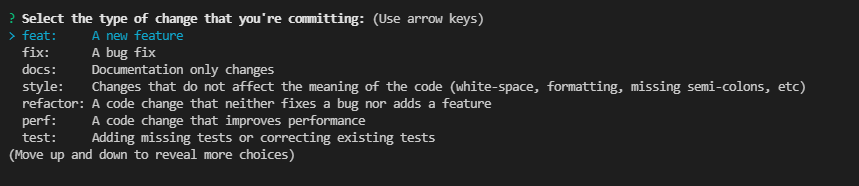
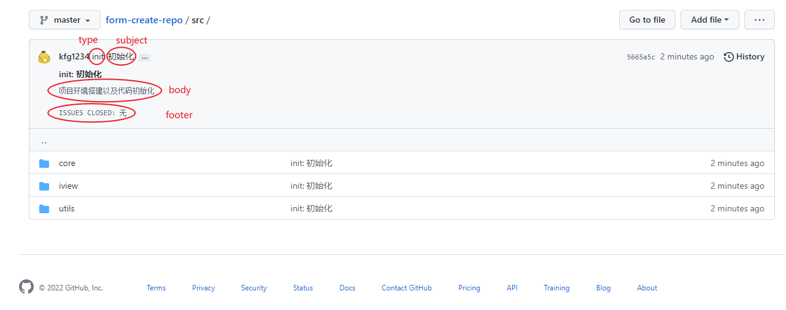
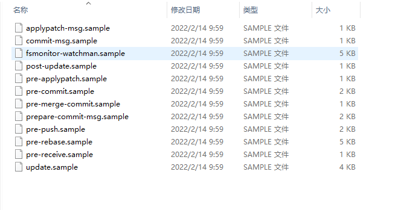
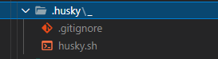
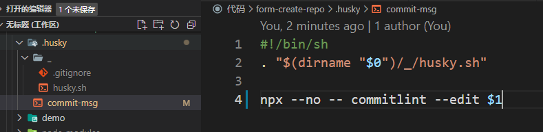
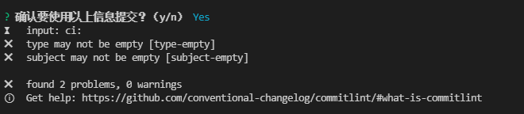

## commitizen 的使用

每次提交代码时，都需要编写`Commit Message`，否则是不允许提交的，编写 Commit Message 需要遵循一定的范式，内容应该清晰明了，指明本次提交的目的，便于日后追踪问题，在团队的

### 全局安装

```
npm install -g commitizen
```

在项目根目录输入如下命令

```
commitizen init cz-conventional-changelog --save-dev --save-exact
```

上面命令做了两件事

1. 安装模块 `cz-conventional-changelog` 适配器
2. 将`config.commitizen`配置添加到`package.json`中，如下：

```js
{
    "config": {
        "commitizen": {
            "path": "./node_modules/cz-conventional-changelog"
        }
    }
}
```
然后使用 `git cz` 代替 `git commit`命令，会在命令行跳出选项进行选择，如下图：

### 项目上安装

```
npm i commitizen -D
```

在项目根目录输入如下命令生成选项，用来生成符合格式的 Commit message，如下图：

```
npx commitizen init cz-conventional-changelog --save-dev --save-exact
```

上面的`config.commitizen`配置也在项目根目录可以创建`.czrc`文件来代替，写入：

```js
{
  "path": "cz-conventional-changelog"
}
```
:::warning 注意：
因为是在项目上安装无法使用`git cz`命令，在`package.json`中配置，执行命令`npm run commit`进行提交
:::
```js
 {
  "scripts": {
    "commit": "git-cz",
  }
```

## Commit Message 的标准格式
`Commit Message` 标准格式包括三个部分：Header，Body，Footer，上面弹出的问题就是去设置这三个部分的信息。

- `Header`：`Header`包含以下信息
    1. `type`：用于说明类型
    
    2. `scope`：说明影响的范围，比如数据层、控制层、视图层等等，根据项目需求设置
    3. `subject`：主题，简短描述  

- `Body`：对主题的补充，详细描述
- `Footer`：主要是一些关联 `issue` 的操作

**当提交完之后，可以看到如下效果**  


## 自定义提交规范

自定义提交规范，我们需要用到 `cz-customizable`，`cz-customizable` 和 `cz-conventional-changelog` 一样，都是 `commitizen`的适配器，但是 `cz-customizable` 支持一定程度上的自定义。

```
npm i cz-customizable -D
```

修改`package.json`或`.czrc`中的配置：

```
{
    "config": {
        "commitizen": {
            "path":"node_modules/cz-customizable"
        }
    }
}
```
或
```
{
  "path": "node_modules/cz-customizable"
}
```
创建`.cz-config.js`，用来自定义选项，如下列出常用的配置
```js
module.exports = {
    // 主题长度限制
    subjectLimit: 100, //默认100
    // 主题分隔符
    // subjectSeparator: ":", //默认冒号
    // 提交类型前缀
    // typePrefix:"", //默认空
    // 提交类型后缀
    // typeSuffix:"", //默认空
    // 说明影响的范围，比如数据层、控制层、视图层等等，根据项目需求设置
    // scopes: [],
    // 可选类型
    types: [
        { value: "init", name: "init:      初始化" },
        { value: "feat", name: "feat:      新功能" },
        { value: "fix", name: "fix:       修复" },
        { value: "docs", name: "docs:      文档变更" },
        { value: "style", name: "style:     代码格式（不影响代码运行的变动）" },
        { value: "refactor", name: "refactor:  重构（既不是增加feature）,也不是修复bug" },
        { value: "pref", name: "pref:      性能优化" },
        { value: "test", name: "test:      增加测试" },
        { value: "chore", name: "chore:     构建过程或辅助工具的变动" },
        { value: "revert", name: "revert:    回退" },
        { value: "build", name: "build:     打包" },
    ],

    // 步骤，即问题列表
    messages: {
        type: "请选择提交的类型；",
        customScope: "请输入修改的范围（可选）",
        subject: "请简要描述提交（必填）",
        body: "请输入详细描述（可选）",
        footer: "请选择要关闭的issue（可选）",
        confirmCommit: "确认要使用以上信息提交？（y/n）",
    },
    // 想跳过的问题列表
    // skipQuestions: ["body", "footer"],
};
```

## 对Commit Message进行校验

在前面的配置中，已经可以实现规范选项，进行规范的 `message` 的编辑，但是如果我们忘记使用 `git cz`, 直接使用了 `git commit -m "my commit"`, `message` 信息依然会被提交上去，项目中会出现不规范的提交 `message`，因此我们还需要 `commitlint` + `husky` 校验我们的提交信息是否规范。

### 安装commitlint
```
npm install @commitlint/config-conventional @commitlint/cli -D
```
在项目根目录创建文件`commitlint.config.js`，写入如下配置

```js
module.exports = {
    // 从node_modules中解析和加载@commitlint/config-veright
    extents: ["@commitlint/config-conventional"],
    /*
        rule由name和配置数组组成
        数组中第一位为level，可选0,1,2，0为禁用，1为输出警告信息，2为输出错误信息
        第二位为应用与否，可选always|never
        第三位该rule的值
    */
    rules: {
        // type 类型定义，表示 git 提交的 type 必须在以下类型范围内
        "type-enum": [2, "always", ["init", "feat", "fix", "ci", "docs", "style", "refactor", "perf", "test", "chore", "revert", "build"]],
        // <type> 不能为空
        "type-empty": [2, "never"],
        // <type> 格式 小写
        "type-case": [2, "always", "lower-case"],
        // 影响的范围为空禁用，即<scope>可以为空
        "scope-empty": [0],
        // <scope> 格式 小写
        "scope-case": [2, "always", "lower-case"],
        // <subject> 不能为空
        "subject-empty": [2, "never"],
        // <body> 不能为空
        // "body-empty": [2, "never"],
        // <body> 以空行开头
        // "body-leading-blank": [1, "always"],
        // <footer> 以空行开头
        // "footer-leading-blank": [1, "always"],
    },
};
```

### Git Hooks介绍
在 Git 中也有许多的事件（`commit`、`push` 等等），每个事件也是对应了有不同的钩子的（如 `commit` 前，`commit` 后），那么我们就可以在这些钩子这里配置一些自己需要执行的操作来实现各种各样的需求。

Git Hooks 的实现其实非常简单，就是在`.git/hooks`文件下，保存了一些 `shell` 脚本，然后在对应的钩子中执行这些脚本就行了。比如下图中，这是一个还没有配置 `Git Hooks` 的仓库，默认会有很多`.sample`结尾的文件，这些都是示例文件，如果要生效，去掉.sample后缀即可。  



我们知道` Git Hook` 保存在 `.git` 文件夹中，因为`.git`是没法上传到远程仓库的，我们在本地配置好 `Git Hook` 后，怎么分享给其他人呢？这时候，就需要用到 `Husky`插件了。 `Husky`插件能在git钩子执行阶段中插入其他命令，来执行其他功能

### 安装husky
```
npm install husky -D
```
执行如下命令，启动`GitHooks`，
```
npx husky
```
生成如下文件  



在`package.json`添加如下配置，当别人克隆仓库安装依赖时，自动启用GitHooks
```js 
{
  "scripts": {
    "prepare": "husky install"
  }
}
```
添加 `commitlint` 的 `hook` 到 `husky` 中，在 `commit-msg`钩子时进行校验
```
npx husky add .husky/commit-msg 'npx --no -- commitlint --edit $1'
// 上面失效用下面的
npx husky add .husky/commit-msg \"npx --no -- commitlint --edit $1\"
或者
npx husky add .husky/commit-msg "npx --no -- commitlint --edit $1"
```
生成如下文件：  



然后进行提交 `npm run commit`，如果没有通过commitlint的校验，会生成如下错误信息。



### 使用lint-staged

`lint-staged`能够帮助你在提交之前，根据代码质量工具，如Prettier和ESLint，执行自动修复

1. 安装
```
npm i lint-staged -D
```

2. 在`package.json`中写入`lint-staged`的命令

```json
{
    "script":{
        "lint:lint-staged": "lint-staged"
    }
}
```

3. 然后添加`npm run lint:lint-staged`命令到pre-commit钩子上

```
npx husky add .husky/pre-commit "npm run lint:lint-staged"
```

4. 新建`.lintstagedrc.js` 文件，写入要执行的命令，提交代码时就会执行
```js
module.exports = {
  '*.{js,jsx,ts,tsx}': ['eslint --fix', 'prettier --write'],
};
```