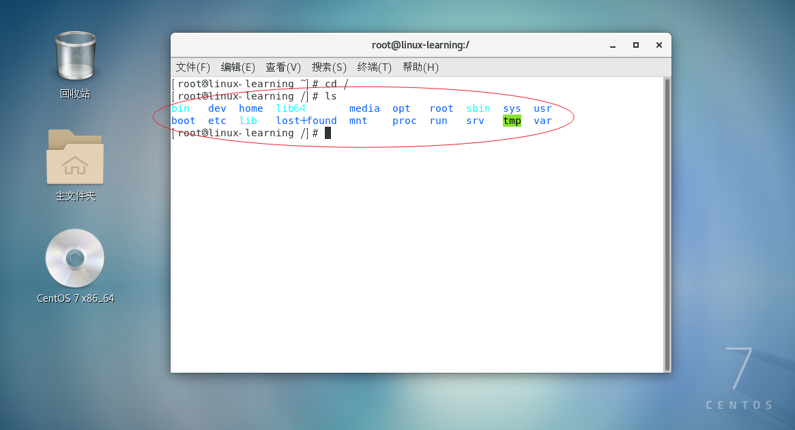
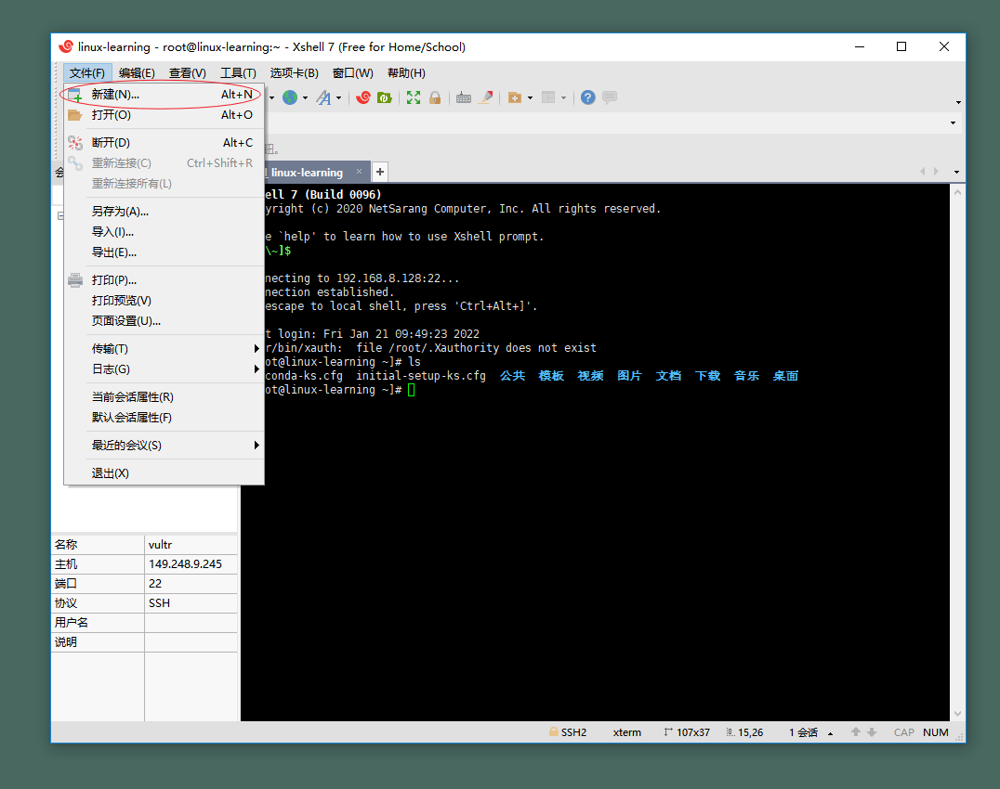
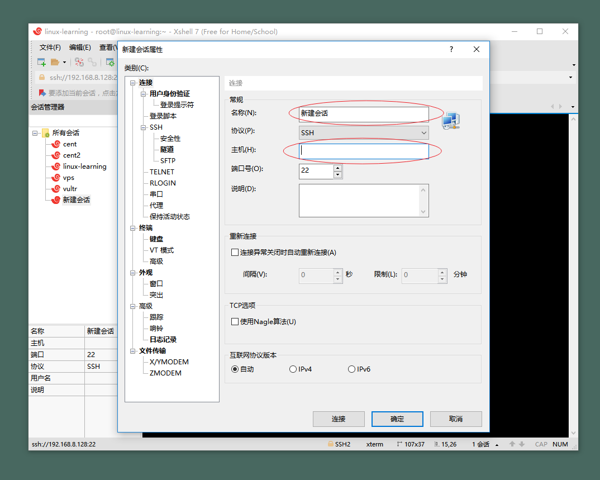

Linux的文件系统采用的是树状目录结构，最上的根目录是`/`,然后是在此目录下再创建其他的目录。**在linux的世界里，一切皆文件**。

## 具体的目录结构：

点击鼠标右键，点击打开终端，输入`cd /`，切换到根目录，输入`ls`查看所有文件。

- `/bin`：  
bin是`Binary`的缩写，这个目录存放着最经常使用的命令，其他目录中也有`bin`目录，比如:`/usr/bin`、`/usr/local/bin`等、作用是一样的。

- `/sbin`：  
 s是`Super User`的意思，这里存放的是系统管理员使用的系统管理程序。

- `/home`：    
存放普通用户的主目录，在`Linux`中每个用户都有一个自己的目录，一般该目录名是以用户账号命名。

- `/root`：   
该目录为系统管理员，也称作超级权限者的用户主目录。

- `/lib`：  
系统开机所需要的最基本的动态连接共享库，类似于`Windows`的DLL文件（在`Windows`操作系统中, DLL对于程序执行是非常重要的, 因为程序在执行的时候, 必须链接到DLL文件, 才能够正确地运行）。

- `/lost + found`： 
这个目录一般情况下是空的，当系统非法关机后，这里就存放了一些文件。

- `/etc`：  
所有的系统管理所需要的的配置文件和子目录，比如安装`mysql`数据库的`my.conf`。

- `/usr`：    
这是一个非常重要的目录，用户的很多应用程序和文件都在这个目录下，类似于`windows`下的`program files`目录。

- `/boot`： 
存放的是启动`Linux`时使用的核心文件，包括一些连接文件以及镜像文件。

- `/proc`：  
这个目录是一个虚拟的目录，它是系统内存的映射，访问这个目录来获取系统信息。

- `/srv`：  
`service`缩写，存放一些服务器启动之后需要提取的数据。

- `/sys`：  
这是`Linux2.6`内核的一个很大变化，该目录下安装了2.6内核中新出现的一个文件系统`sysfs`。

- `/dev`：  
类似于Windows的设备管理器，把所有的硬件用文件的形式存储。

- `/media`：  
Linux会自动识别一些设备，例如U盘、光驱等等，当识别后，Linux会把识别的设备挂载到这个目录下。

- `/mnt`： 
系统提供该目录是为了让用户临时挂载别的文件系统，我们可以将外部的存储挂载在/mnt上，然后进入该目录就可以查看内容了。

- `/opt` ：  
这是给逐级额外安装软件所存放的目录。如安装ORACLE数据库就可以放在该目录下，默认为空。

- `/var`：  
这个目录存放不断扩充着的东西，习惯将经常修改的目录放在这个目录下，包括各种日志文件。

- `/selinux：[security-enhanced-linux]`：  
SELinux是一种安全仔细用，它能控制程序只能访问特定文件，有三种模式，可以自行设置。

## 远程登录到Linux服务器

前面已经安装还了`XShell`和`Xftp`，`Xftp`与`XShell`的创建过程一样，下面以`Xshell`远程连接`Linux`为例：

- 点击新建  

- 输入名称，自定义，输入远程`Linux`的ip地址

- 双击刚刚创建的会话，输入用户名和密码，即可进入`Linux`远程终端  

## 