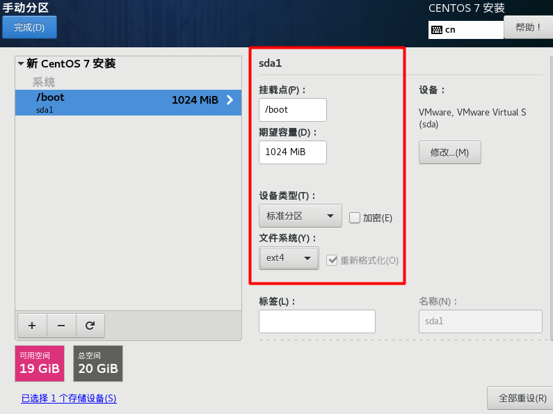

## 安装VMware虚拟机

进入链接安装好VMware虚拟机，:point_right:[安装vmware](https://mp.weixin.qq.com/s/AzlgCdJ6Mh2G0A8Var6aGg)  

下载好后，进行安装，点击下一步即可，有两处可以自己设置。
- 不推荐下载到C盘  


- 取消勾选，不用自动更新，保持版本固定  


## 下载CentOS7

我们这里安装CentOS 7的版本
- CentOS 7：目前主流的生产环境，:point_right:[安装vmware](http://mirrors.aliyun.com/centos/7/isos/x86_64/CentOS-7-x86_64-DVD-2009.iso)
- CentOS 8：未来的主流。
 
## 新建具有图形界面的Linux操作系统

- 点击新建虚拟机  

  


- 选择典型，点击下一步  

  


- 选择稍后安装操作系统，点击下一步  

  


- 选择圈出的地方，点击下一步  


- 自定义虚拟机名称，和文件目录，不推荐C盘  


- 就用默认的20G，点击下一步   


- 点击完成  


- 选择之前下载的CentOS7  


- 选择第一个，不需要 Test this media ，否则检测时间很长  

  

- 等待安装  

  

- 选择语言  

  

- 选择软件安装  


- 软件选择(套餐)，需要什么，安装好后也可以再安装。也可以根据需要勾选附加项，比如这里勾选了兼容库和基本开发工具(jdk,gcc), 安装好后，也可以卸载，更新等操作。实际开发中，没必要安装桌面。  

  

- 分区操作  


- 选择我要配置分区，点击完成   


- 点击+号  

  

- 先指定/boot分区，即引导分区，大小为1G, 然后点击添加挂载点   

  


- 指定swap分区设备类型和文件系统  

  


- 指定主分区，点击完成

  


- 点击完成接受更改 


- 这里不启用kdump，真实开发才选择上  

  


- 设置主机名和打开网络
:::warning 注意：
这里一定不要忘记打开网络，不然没网，远程工具没法连接
:::

  


- 设置root管理员账号，创建新的用户，密码都是123456


  


- 点击重启即可 

  

- 接受同意许可  

  


- 默认以普通用户登录，可以切换成root,，点击未列出  


- 具有图形界面的Linux系统  


## 新建没有图形界面的Linux操作系统

- 只需要在软件选择这里不去选择GNOME桌面就行了。

 

- 没有图形界面的Linux系统，只有命令行，真实开发一般都是无图形界面的  


## 下载Xshell和Xftp

### 免费版本
可以去官网下载免费版本（非商业用途），会限制窗口的打开数量。![下载免费版本](https://www.xshell.com/zh/free-for-home-school/。  

需要填写邮箱，会把下载链接发到你的邮箱里。

### 破解版本


## tomcat安装

- 使用`Xftp`将下载的`tomcat`压缩包，拖动到`/opt/tomcat`目录下


- 在终端切换到`/opt/tomcat`目录下，输入解压命令`tar -zxvf`进行解压。

 

- 切换刚刚解压的`tomcat`文件下的`bin`目录，执行`./startup.sh`命令，开启tomcat。

 

- tomcat默认使用端口为8080，需要设置防火墙打开8080端口，输入下面命令打开端口。  

```
firewall-cmd --add-port=8080/tcp --permanent 
firewall-cmd --reload 
firewall-cmd --query-port=8080/tcp
```

- 在浏览器输入`http://liunxIp:8080/`，出现如下界面说明启动成功。  

 