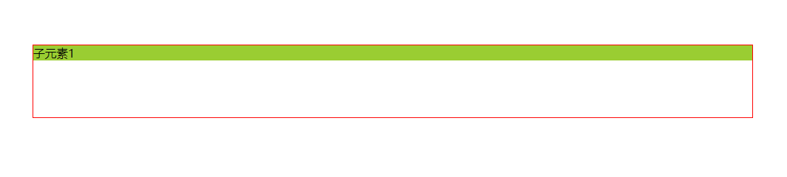

## 负外边距

margin 值为负值时，即为负外边距，设置为负外边距时，框向内部收缩，在文档流中占的位置就会变小，实际的盒子内容就会覆盖其他元素或者被其他元素覆盖

- 当 margin-top、margin-left 为负值时，上边界和左边界会向内缩，表现效果就是元素上移，左移，覆盖上侧或者左侧的元素
- 当 margin-bottom、margin-right 为负值时，下边界和右边界会向内缩，表现效果就是元素后边的和下边的元素上移，左移，元素被后边的或者下边的元素覆盖

## 没有给定宽度时

当元素没有设置宽度时或者宽度设置为`auto`时，负外边距会影响盒子的宽度，表现效果如下所示：

```html
<!DOCTYPE html>
<html lang="en">
  <head>
    <meta charset="UTF-8" />
    <meta http-equiv="X-UA-Compatible" content="IE=edge" />
    <meta name="viewport" content="width=device-width, initial-scale=1.0" />
    <title>Document</title>
    <style>
      .father {
        margin: 100px;
        border: 1px solid red;
        height: 100px;
      }

      .child {
        background-color: yellowgreen;
        /* margin-left: -50px; */
        /* margin-right: -50px; */
      }
    </style>
  </head>
  <body>
    <div class="father">
      <div class="child">子元素1</div>
    </div>
  </body>
</html>
```

默认是子盒子占满父盒子的宽度，父盒子为红色框



```css
.child {
  background-color: yellowgreen;
  margin-left: -50px;
  margin-right: -50px;
}
```

如果我们给子盒子添加负外边距，效果如下


## 给定宽度时

当元素设置宽度时，表现效果如下所示：

```html
<!DOCTYPE html>
<html lang="en">
  <head>
    <meta charset="UTF-8" />
    <meta http-equiv="X-UA-Compatible" content="IE=edge" />
    <meta name="viewport" content="width=device-width, initial-scale=1.0" />
    <title>Document</title>
    <style>
      .father {
        margin: 100px;
        border: 1px solid red;
        height: 100px;
      }

      .child {
        background-color: yellowgreen;
        width: 100px;
        /* margin-left: -50px; */
        margin-right: -50px;
      }
    </style>
  </head>
  <body>
    <div class="father">
      <div class="child">子元素1</div>
    </div>
  </body>
</html>
```


设置左负外边距，子元素向左偏移


## 浮动时使用负外边距

元素浮动且给定了宽度时

表现效果如下所示：

```html
<!DOCTYPE html>
<html lang="en">
  <head>
    <meta charset="UTF-8" />
    <meta http-equiv="X-UA-Compatible" content="IE=edge" />
    <meta name="viewport" content="width=device-width, initial-scale=1.0" />
    <title>Document</title>
    <style>
      .father {
        border: 1px solid red;
        overflow: hidden;
        padding: 10px;
      }

      .child {
        width: 200px;
        height: 200px;
        float: left;
      }
      .item1 {
        background-color: red;
      }
      .item2 {
        background-color: yellowgreen;
        /* margin-left: -100px; */
        /* margin-right: -100px; */
      }
      .item3 {
        background-color: blue;
        margin-right: -100%;
      }
    </style>
  </head>
  <body>
    <div class="father">
      <div class="child item1">子元素1</div>
      <div class="child item2">子元素2</div>
      <div class="child item3">子元素3</div>
    </div>
  </body>
</html>
```


当我们给子元素 2 加上左负外边距时，表现为子元素 2 向左移动并覆盖子元素 1


当继续给子元素 2 加上右负外边距时，表现为子元素 3 为向左移动并覆盖子元素 2

```css
.item2 {
  background-color: yellowgreen;
  margin-left: -100px;
  margin-right: -100px;
}
```


### 圣杯布局

利用负外边距我们可以实现圣杯布局和双飞翼布局（负外边距只是其中一种实现方式）

```html
<!DOCTYPE html>
<html lang="en">
  <head>
    <meta charset="UTF-8" />
    <meta http-equiv="X-UA-Compatible" content="IE=edge" />
    <meta name="viewport" content="width=device-width, initial-scale=1.0" />
    <title>Document</title>
  </head>
  <style>
    .box {
      height: 600px;
    }
    .wrapper {
      width: 100%;
      height: 100%;
      /* padding进行占位，left盒子和right盒子将使用负外边距，然后覆盖padding的位置 */
      padding-left: 150px;
      padding-right: 150px;
      overflow: hidden;
      box-sizing: border-box;
    }
    .left {
      float: left;
      width: 150px;
      height: 100%;
      background-color: yellow;
      margin-left: -100%;
      position: relative;
      left: -150px;
    }
    .center {
      float: left;
      width: 100%;
      height: 100%;
      background-color: pink;
    }
    .right {
      float: left;
      width: 150px;
      height: 100%;
      background-color: blue;
      margin-left: -150px;
      position: relative;
      right: -150px;
    }
  </style>
  <body>
    <div class="box">
      <div class="wrapper">
        <div class="center"></div>
        <div class="left"></div>
        <div class="right"></div>
      </div>
    </div>
  </body>
</html>
```


### 双飞翼布局

```html
<!DOCTYPE html>
<html lang="en">
  <head>
    <meta charset="UTF-8" />
    <meta http-equiv="X-UA-Compatible" content="IE=edge" />
    <meta name="viewport" content="width=device-width, initial-scale=1.0" />
    <title>Document</title>
  </head>
  <style>
    .box {
      height: 600px;
    }
    .main {
      float: left;
      width: 100%;
      height: 100%;
    }
    .center {
      height: 100%;
      /* 与圣杯布局原理一样，使用margin进行占位，left盒子和right盒子将使用负外边距，然后覆盖margin的位置 */
      margin: 0 150px;
      background-color: aqua;
    }

    .left {
      float: left;
      width: 150px;
      height: 100%;
      background-color: yellow;
      margin-left: -100%;
    }

    .right {
      float: left;
      width: 150px;
      height: 100%;
      background-color: blue;
      margin-left: -150px;
    }
  </style>
  <body>
    <div class="box">
      <div class="main">
        <div class="center"></div>
      </div>
      <div class="left"></div>
      <div class="right"></div>
    </div>
  </body>
</html>
```


## 绝对定位时使用负外边距

当子盒子宽度固定时，我们也可以使用负外边距来实现盒子居中

```html
<!DOCTYPE html>
<html lang="en">
  <head>
    <meta charset="UTF-8" />
    <meta http-equiv="X-UA-Compatible" content="IE=edge" />
    <meta name="viewport" content="width=device-width, initial-scale=1.0" />
    <title>Document</title>
    <style>
      .father {
        margin: 100px;
        border: 1px solid red;
        height: 200px;
        position: relative;
      }

      .child {
        background-color: yellowgreen;
        position: absolute;
        width: 100px;
        height: 100px;
        top: 50%;
        left: 50%;
        /* 当子盒子宽度固定时，使用负外边距实现居中效果 */
        margin-top: -50px;
        margin-left: -50px;
      }
    </style>
  </head>
  <body>
    <div class="father">
      <div class="child">子元素1</div>
    </div>
  </body>
</html>
```


