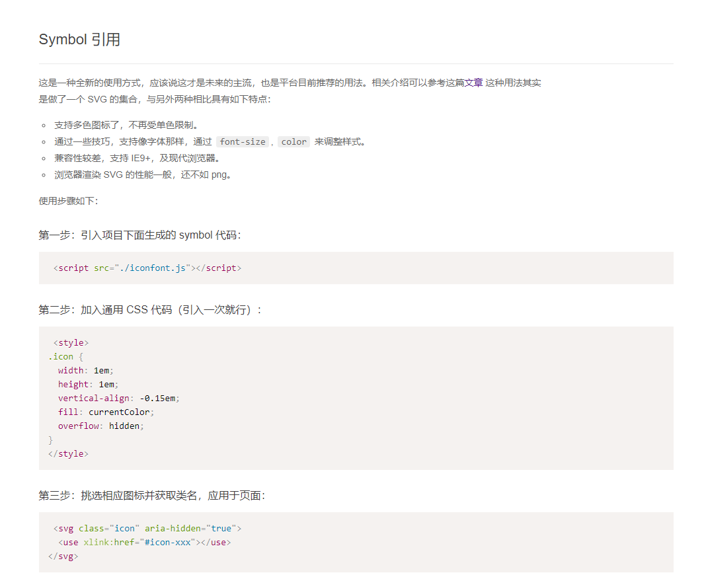

## Svg Sprite

平常我们 iconfont 的 Symbol 引用方式，就是通过 svg 去绘制图标



使用 `vite-plugin-svg-icons` 插件，可以直接将文件夹中的 svg 文件加载，不需要通过上面的方式引入

-   在项目运行时就生成所有图标，只需操作一次 dom
-   内置缓存，仅当文件被修改时才会重新生成

安装

```
npm i vite-plugin-svg-icons -D
```

在 `vite.config.js` 中配置插件

```js
import { createSvgIconsPlugin } from "vite-plugin-svg-icons";
import path from "path";

export default () => {
    return {
        plugins: [
            createSvgIconsPlugin({
                // 指定加载的图标文件夹
                iconDirs: [path.resolve(process.cwd(), "src/assets/icons")],
                // 指定symbolId格式
                symbolId: "icon-[dir]-[name]",
            }),
        ],
    };
};
```

查看更详细配置的说明 :point_right:[官方文档](https://github.com/vbenjs/vite-plugin-svg-icons/blob/main/README.zh_CN.md)

在 src/main.ts 引入注册脚本即可使用

```js
import "virtual:svg-icons-register";
```

在项目直接使用即可，symbolId 也就是以#icon-xxx 属性值，如果是嵌套文件夹，则使用连字符进行拼接

```html
<svg aria-hidden="true">
    <use xlink:href="#icon-sun" fill="red" />
</svg>
```

封装成组件使用更加方便

```vue
<template>
    <svg aria-hidden="true">
        <use :xlink:href="symbolId" :fill="color" />
    </svg>
</template>

<script>
import { defineComponent, computed } from "vue";

export default defineComponent({
    name: "SvgIcon",
    props: {
        prefix: {
            type: String,
            default: "icon",
        },
        name: {
            type: String,
            required: true,
        },
        color: {
            type: String,
            default: "#333",
        },
    },
    setup(props) {
        const symbolId = computed(() => `#${props.prefix}-${props.name}`);
        return { symbolId };
    },
});
</script>
```

## Iconify

Iconify 是功能最丰富的图标框架。 可以与任何图标库一起使用的统一图标框架

在 vite 中使用 vite-plugin-purge-icons 插件来使用 Iconify

```
npm i @iconify/iconify
npm i vite-plugin-purge-icons @iconify/json -D
```

@iconify/json（~120MB）包括 Iconify 中的所有图标集，因此您可以安装一次并根据需要使用其中任何图标（只有实际使用的图标才会捆绑到生产版本中）

在 `vite.config.js` 中直接引入

```js
import PurgeIcons from "vite-plugin-purge-icons";

export default {
    plugins: [PurgeIcons()],
};
```

在 `main.js`引入

```js
import Iconify from "@purge-icons/generated";
```

使用方式：

```html
<span class="iconify" data-icon="material-symbols:10k"></span>
```

vben 将其封装成组件使用

:::tip 提示
如果 Icon 以名称以“|svg”结尾，则转为 SvgIcon 组件，前提是 name 需要在 src/assets/icons 文件下有对应的 svg 文件
:::

```vue
<template>
    <SvgIcon :size="size" :name="getSvgIcon" v-if="isSvgIcon" :class="[$attrs.class, 'anticon']" :spin="spin" />
    <span v-else ref="elRef" :class="[$attrs.class, 'app-iconify anticon', spin && 'app-iconify-spin']" :style="getWrapStyle"></span>
</template>
<script lang="ts">
import type { PropType } from "vue";
import { defineComponent, ref, watch, onMounted, nextTick, unref, computed, CSSProperties } from "vue";
import SvgIcon from "./SvgIcon.vue";
import Iconify from "@purge-icons/generated";
import { isString } from "@/utils/is";
import { propTypes } from "@/utils/propTypes";

const SVG_END_WITH_FLAG = "|svg";
export default defineComponent({
    name: "Icon",
    components: { SvgIcon },
    props: {
        // icon name
        icon: propTypes.string,
        // icon color
        color: propTypes.string,
        // icon size
        size: {
            type: [String, Number] as PropType<string | number>,
            default: 16,
        },
        spin: propTypes.bool.def(false),
        prefix: propTypes.string.def(""),
    },
    setup(props) {
        const elRef = ref<ElRef>(null);

        // 如果Icon以名称以“|svg”结尾，则转为SvgIcon组件，前提是在src/assets/icons文件下有对应的svg文件
        const isSvgIcon = computed(() => props.icon?.endsWith(SVG_END_WITH_FLAG));
        const getSvgIcon = computed(() => props.icon.replace(SVG_END_WITH_FLAG, ""));
        const getIconRef = computed(() => `${props.prefix ? props.prefix + ":" : ""}${props.icon}`);

        // icon名称变化时，重新渲染新的图标
        const update = async () => {
            if (unref(isSvgIcon)) return;

            const el = unref(elRef);
            if (!el) return;

            await nextTick();
            const icon = unref(getIconRef);
            if (!icon) return;

            const svg = Iconify.renderSVG(icon, {});
            if (svg) {
                el.textContent = "";
                el.appendChild(svg);
            } else {
                const span = document.createElement("span");
                span.className = "iconify";
                span.dataset.icon = icon;
                el.textContent = "";
                el.appendChild(span);
            }
        };

        // icon图标样式
        const getWrapStyle = computed((): CSSProperties => {
            const { size, color } = props;
            let fs = size;
            if (isString(size)) {
                fs = parseInt(size, 10);
            }

            return {
                fontSize: `${fs}px`,
                color: color,
                display: "inline-flex",
            };
        });

        watch(() => props.icon, update, { flush: "post" });

        onMounted(update);

        return { elRef, getWrapStyle, isSvgIcon, getSvgIcon };
    },
});
</script>
<style lang="less">
.app-iconify {
    display: inline-block;
    // vertical-align: middle;

    &-spin {
        svg {
            animation: loadingCircle 1s infinite linear;
        }
    }
}

span.iconify {
    display: block;
    min-width: 1em;
    min-height: 1em;
    background-color: @iconify-bg-color;
    border-radius: 100%;
}
</style>
```
