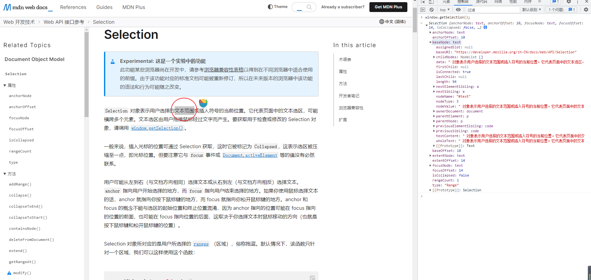
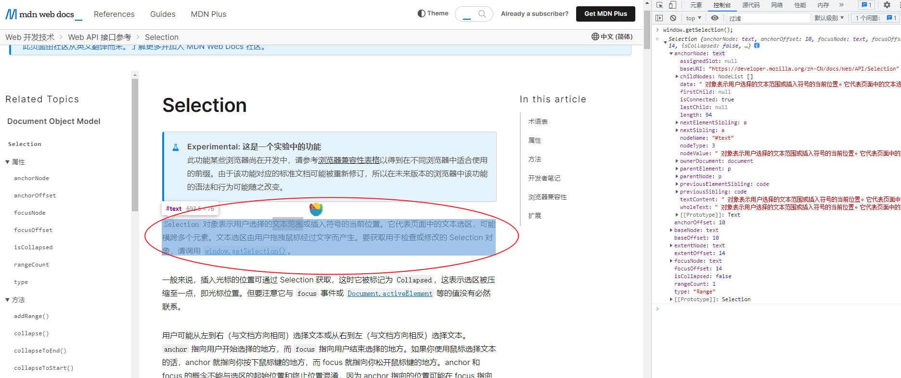

## Selection

window.getSelection 方法可以获取当前页面中鼠标选中区域的信息，如下图所示

术语：

-   锚点 (anchor)：选中区域时，鼠标开始选中时的那个点
-   焦点 (focus)：结束选中时，松开鼠标时的那个点
-   范围 (range)：选中的范围

### 属性

-   anchorNode (只读)

选中区域起点所在的节点

-   anchorOffset (只读)

选中区域起点在 anchorNode 中的位置偏移

1. 如果 anchorNode 是文本节点，那就是该文本第一文字到选中区域第一个文字之间的字数
2. 如果 anchorNode 是一个元素，那就是选中区域元素之前的同级节点数

### 方法

-   removeAllRanges
    移除所有选中区域

-   toString
    获取当前选中区域的纯文本内容

更多属性和方法查阅官网 :point_right:[Selection MDN](https://developer.mozilla.org/zh-CN/docs/Web/API/Selection)
