## HTMLElement 接口属性

### offsetParent

只读属性：

offsetLeft 和 offsetTop 计算相对偏移量时的父元素（父元素的定位不能是`position:static`，逐层向外找，找不到则相对父元素为 body），如果该元素设置`display:none`或者`position:fixed`，则它的 offsetParent 为 null

### offsetLeft 和 offsetTop

只读属性：

相对于 offsetParent 父元素的偏移量，不包括边框和外边距

-   当该元素为如果设置为`display:none`，则 offsetLeft 和 offsetTop 为 0
-   当该元素为如果设置为`position:fixed`，则 offsetLeft 和 offsetTop 相对于浏览器可视区域

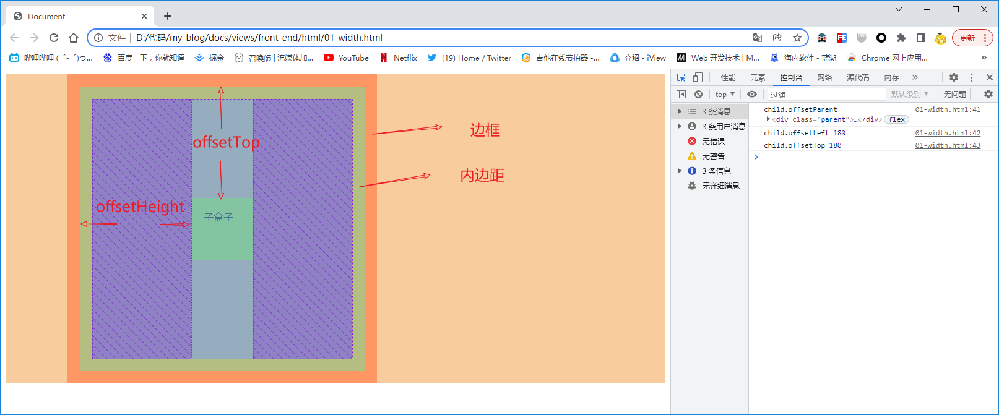

### offsetWidth 和 offsetHeight

只读属性：

offsetWidth || offsetHeight = border + padding + content（不包括 margin）

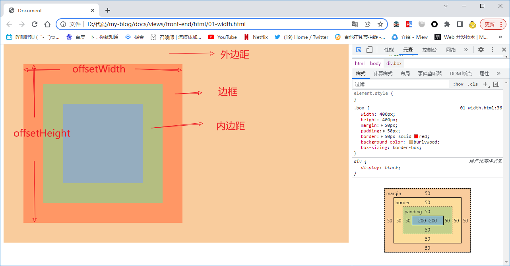

### clientWidth 和 clientHeight

只读属性：

clientWidth || clientHeight = padding + content （不包括 border、margin、滚动条）

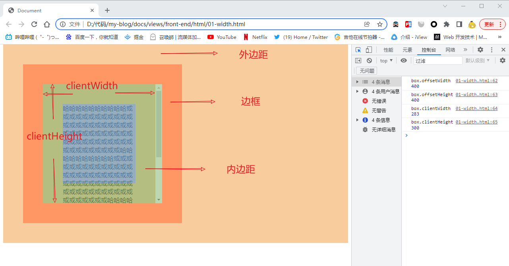

### clientTop 和 clientLeft

只读属性：

clientTop：上边框的宽度  
clientLeft：左边框的宽度

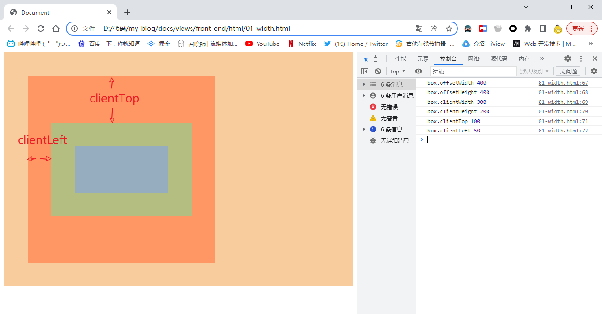

### scrollWidth 和 scrollHeight

只读属性：

scrollWidth || scrollHeight：可视区域宽度（padding + content） + 被隐藏区域宽度（不包括滚动条）

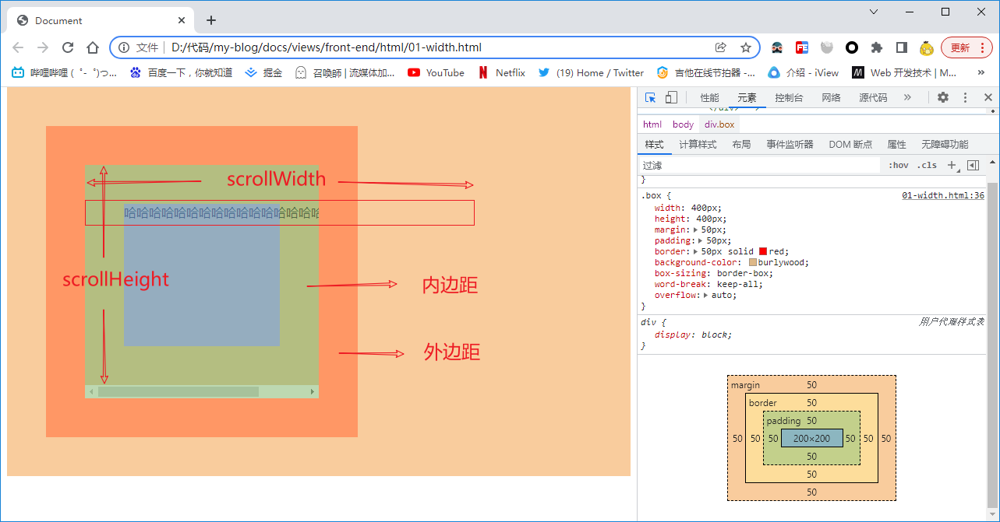

### scrollTop 和 scrollLeft

可读写属性：

scrollTop || scrollLeft：超出可视区域部分的宽度

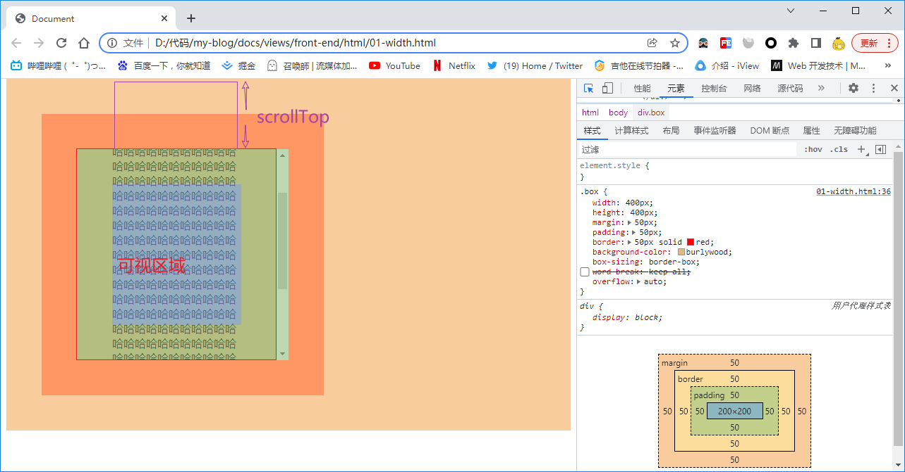

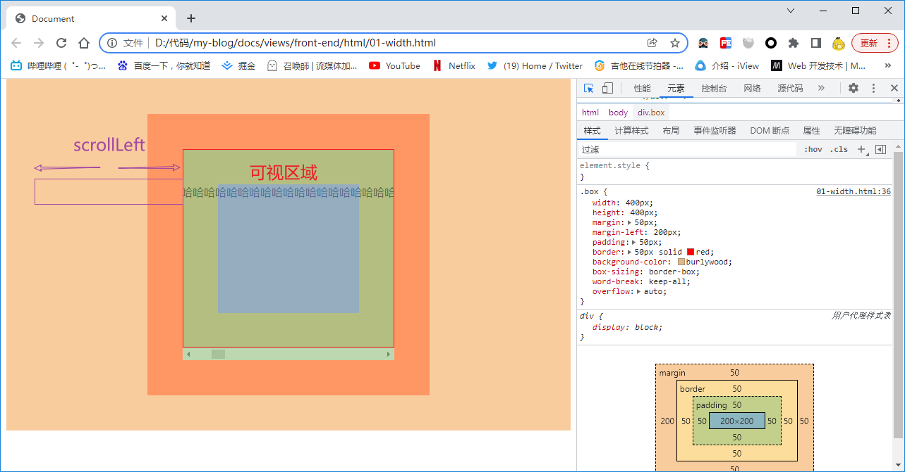

## event 鼠标事件源属性

### clientX 和 clientY

只读属性：

clientX || clientY：点击位置与浏览器可视区域之间的距离（不包括窗口镶边）

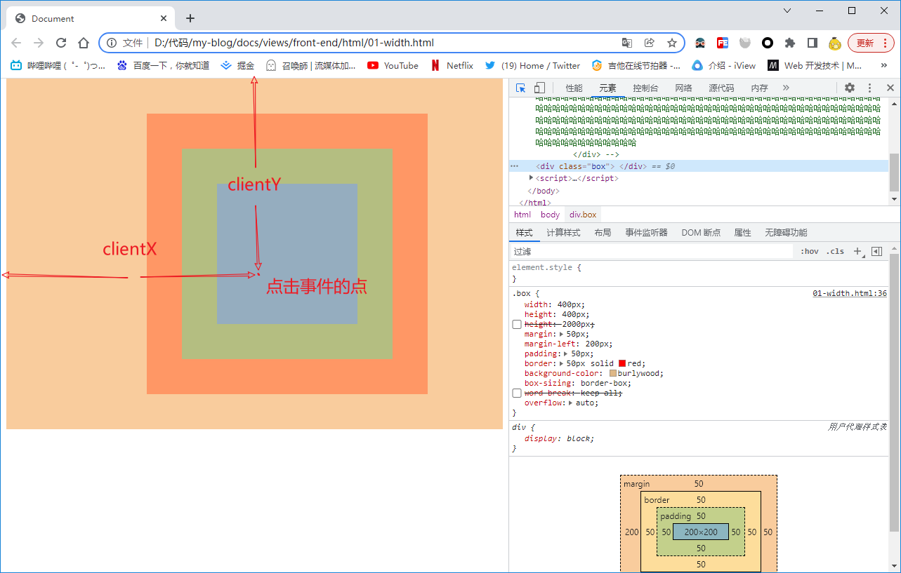

### x 和 y

clientX 和 clientY 的别名

### offsetX 和 offsetY

只读属性：

offsetX || offsetY：点击位置与事件源元素的内填充边距离

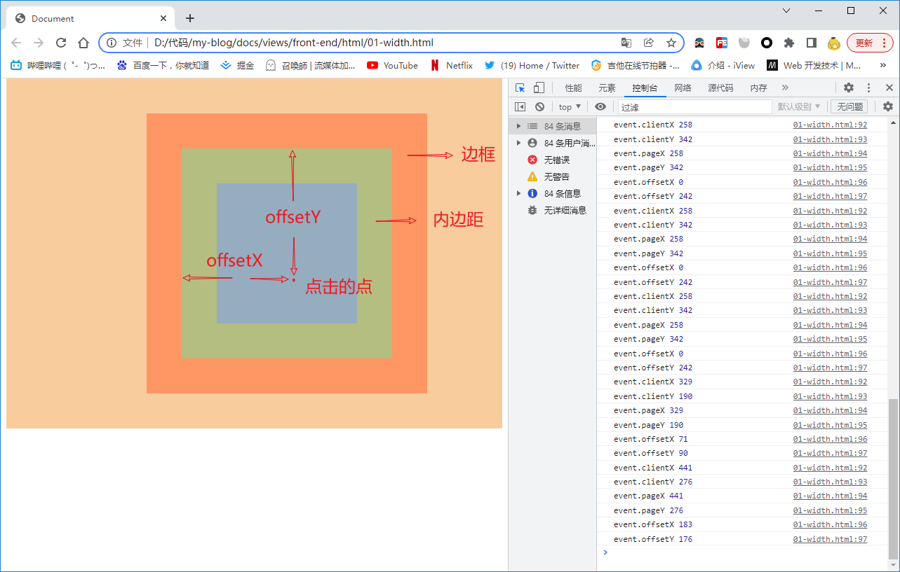

### pageX 和 pageY

只读属性：

如果浏览器有滚动条则

offsetY = clientX + 超出浏览器可视区域的长度  
offsetY = clientY + 超出浏览器可视区域的长度

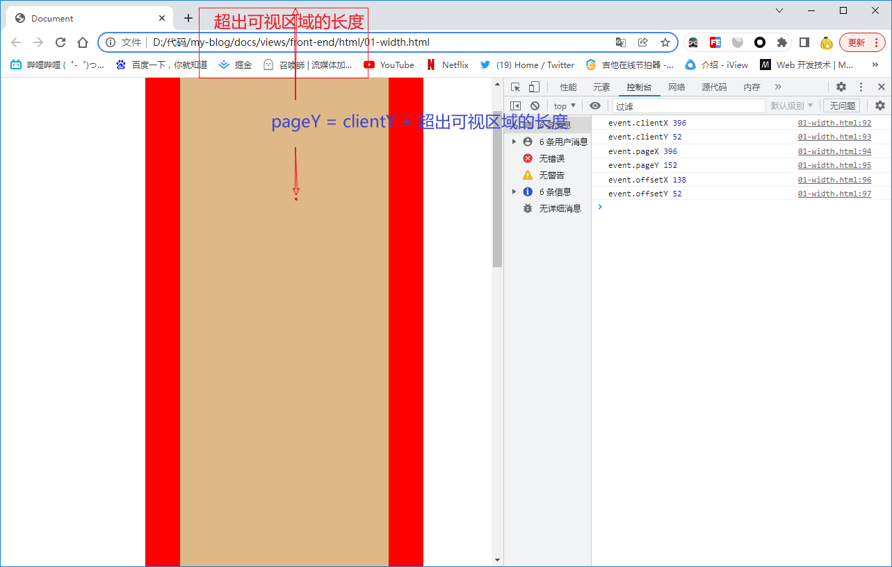

### screenX 和 screenY

只读属性：

screenX || screenY：点击位置与屏幕窗口的距离

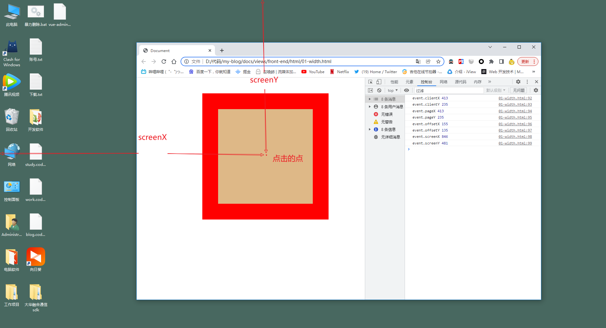

## window 属性

### innerWidth 和 innerHeight

只读属性：

浏览器窗口的内部宽度和高度

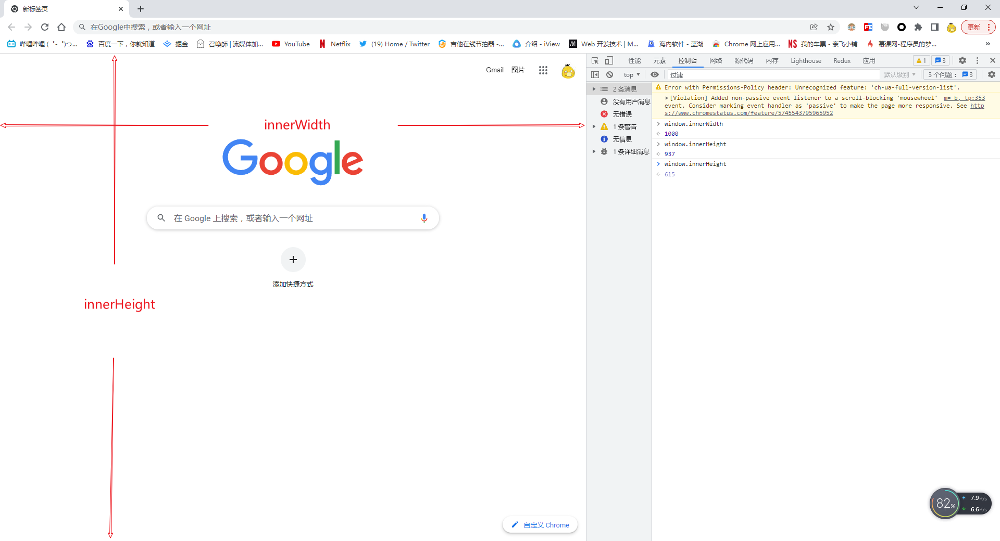

### outerWidth 和 outerHeight

只读属性：

浏览器窗口的外部宽度和高度，包括侧边栏（如果存在）、窗口镶边（window chrome）和调正窗口大小的边框

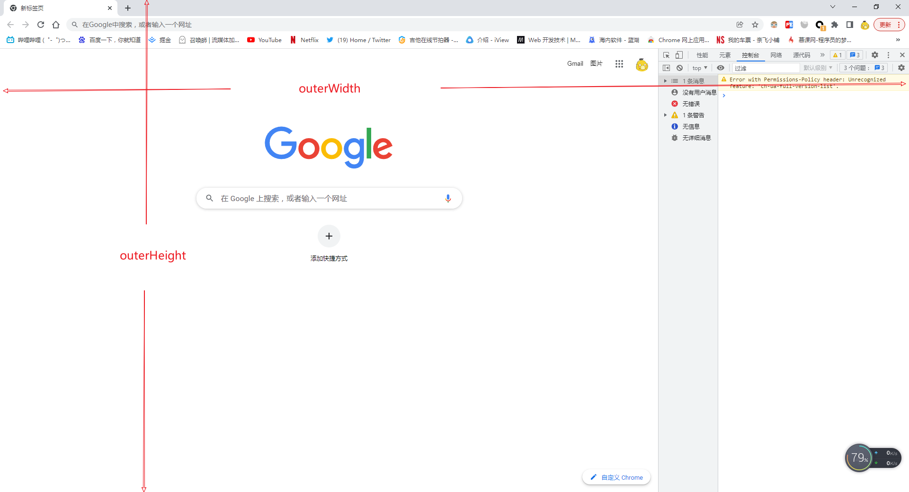

### screenLeft 和 screenTop

只读属性：

screenLeft || screenTop：浏览器边框到屏幕边缘的距离

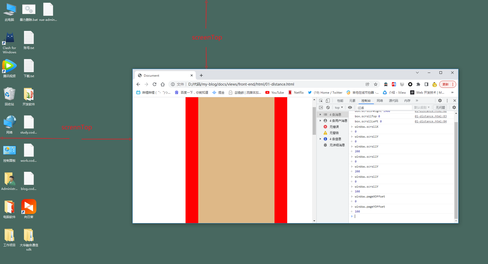

### screenX 和 screenY

只读属性：

screenX || screenY：浏览器边框到操作系统边缘的距离， windows 电脑上与 screenLeft 和 screenTop 相等

### scrollX 和 scrollY

只读属性：

scrollX || scrollY：水平方向和垂直方向滚动的像素值

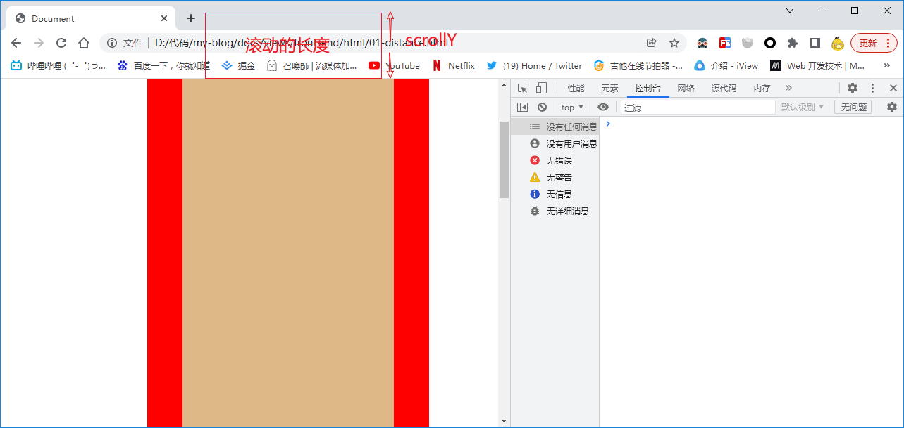

### pageXOffset 和 pageYOffset

scrollX 和 scrollY 的别名

## HTMLElement 方法

## getBoundingClientRect()

`Element.getBoundingClientRect()` 方法返回元素的大小及其相对于视口的位置。

::warning 注意
这里 body 的 margin 占了 8px
:::

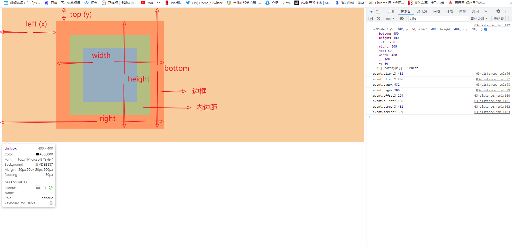

如果超出了可视区域范围，如下图：

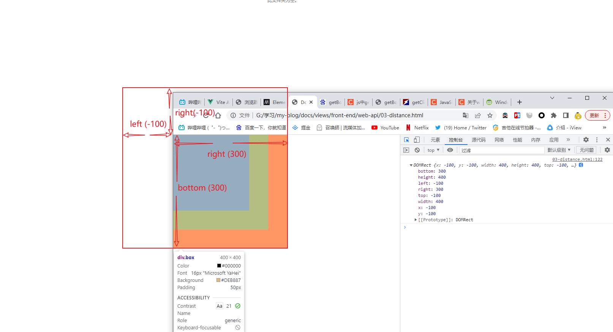