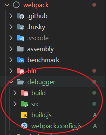
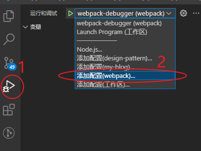
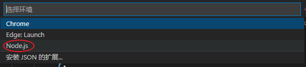
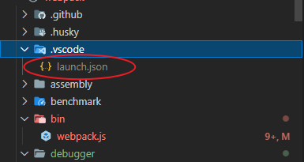
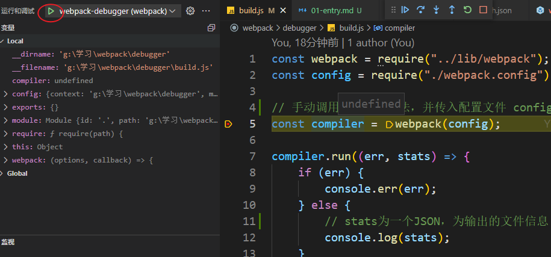

## 命令行入口

1. 首先当我们执行 `npm run build` 的时候，也就是在命令行执行 `webpack build` 命令的时候，会找到 `node_modules/.bin/webpack.cmd` 命令

```shell {12}
@ECHO off
SETLOCAL
CALL :find_dp0

IF EXIST "%dp0%\node.exe" (
  SET "_prog=%dp0%\node.exe"
) ELSE (
  SET "_prog=node"
  SET PATHEXT=%PATHEXT:;.JS;=;%
)

"%_prog%"  "%dp0%\..\webpack\bin\webpack.js" %*
ENDLOCAL
EXIT /b %errorlevel%
:find_dp0
SET dp0=%~dp0
EXIT /b
```

就会执行重点标记的那行文件`webpack\bin\webpack.js`，也就是 webpack 的入口文件

2. 该文件主要就是判断你是否安装了 `webpack-cli` 命令行工具，如果没有就会询问是否要安装`webpack-cli`，最终都会执行 `runCli` 方法，`runCli` 方法的作用就是找到 `webpack-cli/bin/cli.js` 进行加载

```js
const isInstalled = (packageName) => {
    /* 判断是否安装了 webpack-cli */
};

const runCli = (cli) => {
    const path = require("path");
    const pkgPath = require.resolve(`${cli.package}/package.json`); //不加载模块，返回模块路径
    const pkg = require(pkgPath);
    // 找到webpack-cli下package.json中的bin字段对应的文件，进行加载
    require(path.resolve(path.dirname(pkgPath), pkg.bin[cli.binName]));
};

const cli = {
    name: "webpack-cli",
    package: "webpack-cli",
    binName: "webpack-cli",
    installed: isInstalled("webpack-cli"),
    url: "https://github.com/webpack/webpack-cli",
};

if (!cli.installed) {
    /* 没有安装则会询问是否要安装webpack-cli */
} else {
    // 主要代码
    runCli(cli);
}
```

3. 我们继续找到 `webpack-cli/bin/cli.js` 文件，主要是执行 `runCLI` 方法，并传入我们在命令行输入的选项

```js
// webpack-cli/bin/cli.js
const importLocal = require("import-local");
const runCLI = require("../lib/bootstrap");

if (!process.env.WEBPACK_CLI_SKIP_IMPORT_LOCAL) {
    // Prefer the local installation of `webpack-cli`
    if (importLocal(__filename)) {
        return;
    }
}

process.title = "webpack";
// process.argv为接受的命令行参数（也就是执行命令webpack build --config ...传入的选项）
runCLI(process.argv);
```

`runCLI` 方法来自`webpack-cli/lib/bootstrap.js`文件，该方法创建了一个`WebpackCLI`实例，并执行了该实例的`run`方法，所以关键的代码肯定是在实例的`run`方法中

```js
// webpack-cli/lib/bootstrap.js
const WebpackCLI = require("./webpack-cli");
const runCLI = async (args) => {
    // Create a new instance of the CLI object
    const cli = new WebpackCLI();

    try {
        await cli.run(args);
    } catch (error) {
        cli.logger.error(error);
        process.exit(2);
    }
};

module.exports = runCLI;
```

`WebpackCLI` 里面有将近 2000 代码，这里只需要把主体流程部分进行说明

4. 首先 `WebpackCLI` 引入了第三方库 `commander`，是用来处理命令行选项的，可以注册命令和选项
   在`run`方法里面会调用 loadCommandByName -> makeCommand 方法来注册命令，同时会注册命令执行时的回调，当我们在命令行输入`webpack build`命令时，会触发回调执行`runWebpack`，接下来就是看`runWebpack`方法干了什么

```js
const { program, Option } = require("commander"); //创建命令的三方库

class WebpackCLI {
    constructor() {
        this.program = program;
        this.program.name("webpack");
    }

    makeCommand(commandOptions, options, action) {
        // 创建命令：比如build、watch等等
        const command = this.program.command(commandOptions.name, {
            /**/
        });

        if (typeof options === "function ") {
            options();
        }

        /*...*/
        // 输入命令时的执行的回调，也就是传入的第三个参数
        command.action(action);
    }

    // run方法里面主要是注册命令以及各种回调
    run() {
        /**/
        const loadCommandByName = function () {
            // build命令信息
            const isBuildCommandUsed = {
                /*...*/
            };

            const watchCommandOptions = {
                /*...*/
            };

            const watchCommandOptions = {
                /*...*/
            };

            const watchCommandOptions = {
                /*...*/
            };

            if (isBuildCommandUsed || isWatchCommandUsed) {
                // 这里用来创建build、watch命令
                this.makeCommand(
                    isBuildCommandUsed ? buildCommandOptions : watchCommandOptions,
                    async () => {
                        // 导入webpack，loadWebpack就是require("webpack")
                        this.webpack = await this.loadWebpack();
                        /**/
                    },
                    async () => {
                        /**/
                        // 执行webpack函数
                        await this.runWebpack(options, isWatchCommandUsed);
                    }
                );
            } else {
                // 这里用来创建help命令
                this.makeCommand(helpCommandOptions, [], () => {});
                // 这里用来创建version命令
                this.makeCommand(versionCommandOptions, [], () => {});
            }
        };

        loadCommandByName();
    }

    async runWebpack(options, isWatchCommand) {
        /**/
        const compiler = await this.createCompiler(options, callback);
        /**/
    }

    createCompiler(options, callback) {
        let compiler;
        // 执行webpack函数，创建compiler对象
        compiler = this.webpack(options, callback);

        return compiler;
    }
}
```

5. `runWebpack`方法调用 createCompiler，createCompiler 又执行 webpack 函数，传入配置文件以及回调，最终生成了一个 compile 对象，它就是我们 webpack 打包的第一个核心有关成员

其实 `webpack-cli` 的作用就是注册一系列命令，以及将我们在命令中输入的选项和配置文件的选项进行合并，并最终调用 `webpack` 方法，开启 webpack 的构建流程

所以我们完全可以跳过上面 `webpack-cli` 提供的这些功能，直接使用 webpack 函数来接收配置文件 config，传入回调或者手动调用 compile.run 方法即可

## 调试 webpack

去官网拉取最新的代码，在根目录新建调试文件



在 `build.js` 中，直接使用 webpack 方法，创建 compiler

```js
const webpack = require("../lib/webpack");
const config = require("./webpack.config");

// 手动调用webpack方法，并传入配置文件 config
const compiler = webpack(config);

compiler.run((err, stats) => {
    if (err) {
        console.err(err);
    } else {
        // stats为一个JSON，为输出的文件信息
        console.log(stats);
    }
});
```

### 在 VSCode 中进行调试

使用 VSCode 自带的调试工具，选择项目目录进行调试



选择运行环境，选择 Node.js



然后会在项目生成一个 json 文件，配置 program 属性，也就是执行文件



```json
{
    // 使用 IntelliSense 了解相关属性。
    // 悬停以查看现有属性的描述。
    // 欲了解更多信息，请访问: https://go.microsoft.com/fwlink/?linkid=830387
    "version": "0.2.0",
    "configurations": [
        {
            "type": "pwa-node",
            "request": "launch",
            "name": "webpack-debugger",
            "skipFiles": ["<node_internals>/**"],
            // ${workspaceFolder}指的是选择的项目目录，也就是webpack文件目录
            "program": "${workspaceFolder}/debugger/build.js",
            "outFiles": ["${workspaceFolder}/**/*.js"]
        }
    ]
}
```

点击开始按钮即可开始调试


