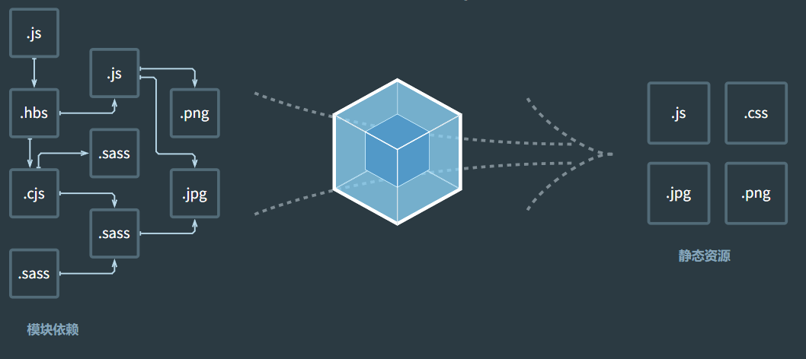

## webpack简介

webpack 是一个用于现代 JavaScript 应用程序的 静态模块打包工具  

**如何打包？**
- webpack在处理应用程序时，会根据命令后者配置文件找到入口文件  
- 从入口开始，形成一个依赖图关系，包含应用程序中所需的所有模块（比如js文件、css文件、图片、字体等）  
- 然后遍历图结构，打包一个个的模块（根据文件的不同使用不同的loader来解析
  


## webpack安装    

::: tip 前提：
安装Node.js
:::

首先初始化为一个npm项目
:::warning 注意：
项目名称不能包含中文
:::
```
npm init --yes
```
- 全局安装：安装到全局环境，在命令行输入webpack，即可打包。（默认以src下的index.js文件为入口）
- 局部安装：安装到项目中，保持版本一致
```
npm install webpack webpack-cli -g   全局安装
npm install webpack webpack-cli -D   局部安装
```

## webpack命令

### 命令
`webpack-cli`提供了许多命令，下面介绍一些常用的命令
- `webpack build`：`webpack`默认命令，进行打包，`build`可以省略
- `webpack serve `：启动本地服务
- `webpack version `：查看`webpack`版本
- `webpack help `：查看帮助信息

### 命令选项
紧跟命后的选项
- `--entry [文件路径]`：应用的入口文件
- `--output-path [文件路径]`：应用的入口文件
- `--config [文件路径]`：使用配置文件进行构建，默认为`webpack.config.js`
- `--env [参数]`：当 `webpack` 配置导出为函数时，会收到一个 `environment` 的参数，


更多`webpack`命令可以在官网中查阅:point_right:[webpack命令](https://webpack.docschina.org/api/cli/)

示例
```
webpack build --entry ./src/main.js --output-path ./dist   以项目根目录下的src中main.js为入口进行打包，输出到根目录下的dist目录

webpack就是
webpack build --config webpack.config.js   根据配置文件的信息进行打包

webpack serve就是
webpack serve --config webpack.config.js   根据配置文件的信息启动本地服务

webpack build --config webpack.config.js --env platform=app --env production   参数environment里会有定义的属性{ platform: "app", production: true }
```

## webpack配置文件

最基础的目录结构
```
.
├── node_modules 
├── src
│   ├── index.js
├── index.html
├── package-lock.json
├── package.json
└── webpack.config.js
```

默认的webpack配置文件为```webpack.config.js```，可以通过在```package.json```中修改默认配置文件名称
```js
{
    "scripts": {
        "build": "webpack --config wk.config.js"
    },
}
```
## 指定入口/出口

在```package.json```中配置 `webpack` 命令，运行```npm run build```即可进行打包。

```js
{
  "scripts": {
      "build": "webpack"
  },
}
```
后面可以跟选项参数，比如：
- `--entry`：入口文件为src目录下的main.js。
- `--output-path`：打包后文件夹为build目录。
不推荐使用这种方式指定入口文件。
```js
{
  "scripts": {
      "build": "npx webpack --entry ./src/main.js --output-path ./build"
  },
}
```

- 在```webpack.config.js```中进行配置，**优先使用配置文件的方式**。
```js
const path = require("path");

module.exports = {
    entry: "./src/main.js", //入口文件
    output: {
        filename: "build.js", //打包后的文件名
        path: path.resolve(__dirname, "./build"),  //必须使用绝对路径
    },
};
```
> webpack默认可以处理js文件，但无法处理ES6语法进行polyfill，需要使用babel-loader进行处理。

## loader配置方式

webpack默认处理js文件，处理其他文件需要使用对应的loader，在```module.rules```中允许配置多个loader
- test：匹配文件规则，使用正则表达式
- use：为数组对象，对象内设置loader，**在use中配置的loader，解析顺序为从后往前**，当use中只有一个loader时，可以简写成loader属性
```js
module.exports = {
   module: {
        // 在rules里面配置loader
        rules: [
            {
                // 匹配文件规则，使用正则表达式
                test: /\.xxx/, //匹配以.xxx结尾的文件
                // loader: "xxx-loader", //当use中只有一个loader时，可以简写
                use: [
                    {
                        /* loader */
                    }
                ]
            },
            {
                /*...*/
            },
        ],
    },
};
```


## 处理css、less等样式文件

### css文件
处理```.css```文件，需要安装两个loader，为```css-loader，style-loader```
```
npm install css-loader -D
npm install style-loader -D
```
> 可以在引入的地方内联使用css-loader，```import "css-loader!../css/index.css"```，不推荐

- ```css-loader```负责将```.css```文件解析，解析后不会插入到页面
- ```style-loader```负责将解析后的css，插入到页面
```js
module.exports = {
   module: {
        rules: [
            {
                // 匹配文件规则，使用正则表达式
                test: /\.css/, //匹配以.css结尾的文件
                // loader: "css-loader", //当use中只有一个loader时，可以简写
                use: [
                    // "css-loader",  //没有options参数时，可以简写，直接写字符串
                    // {
                    //     loader: "css-loader",
                    //     options: {},  //传入到css-loader的配置项
                    // },

                    // 多个loader时，编译顺序从后往前，也就是先解析完.css文件，再将css插入到页面中
                    "style-loader", // style-loader负责将解析后的css插入head标签中
                    "css-loader",
                ],
            },
        ],
    },
};
```

### less文件
处理```.less```文件，需要安装```less-loader```
```
npm install less-loader -D
```
将```less-loader```紧接着```css-loader```放置，其余像Sass、Stylus等css预处理文件，同理
```js
module.exports = {
   module: {
        rules: [
            {
                test: /\.css/,
                use: [
                    "style-loader", 
                    "css-loader",
                ],
            },
            {
                // 处理.less结尾文件
                test: /\.less$/,
                use: ["style-loader", "css-loader", "less-loader"],
            },
        ],
    },
};
```

## 处理其他资源

### file-loader
安装
```
npm install file-loader -D
```
```file-loader```帮助我们处理```import/require()```方式引入的资源，并将它放到我们输出的文件中。  

file-loader的使用，选项参数
- outputPath：打包后输出的目标目录
- name：打包后的资源名字，可以使用占位符
  - ext：表示文件的扩展名
  - name：文件的原始名称 
  - hash:6：使用MD4散列函数根据文件内容，生成的128为hash值，可进行长度截取

- esModule：默认为true，表示是否以ES模块的形式引入，在某些情况下，使用ES模块是有益的，比模如块连接和摇树的情况。所以使用require引入的资源是个对象，```require().default```才能拿到资源路径
```js
module.exports = {
    module: {
        rules: [
            {
                test: /\.(png|jpe?g|gif|svg)$/,
                use: [
                    {
                        loader: "file-loader",
                        options: {
                            name: "img/[name].[hash:6].[ext]",
                            // outputPath: "img", // 图片文件输出的目录，可以直接在name中指定输出目录
                            esModule: false, //默认为true，表示是否以es module的形式引入，使用require引入的资源是个对象，require().default才能拿到资源路径                            
                        },
                    },
                ],
            },
        ],
    },
};
```

### url-loader
```url-loader```和```file-loader```的工作方式是相似的，区别就是```url-loader```可以将较小的文件，转换成```base64```的URL。  

```js
module.exports = {
    module: {
        rules: [
            {
                test: /\.(png|jpe?g|gif|svg)$/,
                use: [
                    {
                        loader: "url-loader",
                        options: {
                            name: "img/[name].[hash:6].[ext]",
                            // outputPath: "img", // 图片文件输出的目录，可以直接在name中指定输出目录
                            limit: 100 * 1024, //限制文件大小，小于100kb的文件转化为base64的URL
                        },
                    },
                ],
            },
        ],
    },
};
```

## 资源模块(asset module)
在webpack 5 之前，通常使用
- ```raw-loader```：将文件导入为字符串
- ```url-loader```：将文件作为 data URI 内联到 bundle 中
- ```file-loader```：将文件发送到输出目录

在webpack5之后，添加4种资源类模块型，来替换之前的这些loader。
- ```asset/resource``` 发送一个单独的文件并导出 URL。之前通过使用 file-loader 实现。
- ```asset/inline```  导出一个资源的 data URI。之前通过使用 url-loader 实现。
- ```asset/source``` 导出资源的源代码。之前通过使用 raw-loader 实现。
- ```asset``` 在导出一个 data URI 和发送一个单独的文件之间自动选择。之前通过使用 url-loader，并且配置资源体积限制实现。

### asset/resource
使用```asset/resource```类型  

在```output```选项内使用```assetModuleFilename```可以指定输出文件目录，**注意这里的[ext]包含后缀名前面的.（点符号）**。
也可以在rules内使用```generator.filename```，**仅适用于```asset``` 和 ```asset/resource``` 模块类型**
```js
module.exports = {
    entry: "./src/main.js", //入口文件
    output: {
        filename: "index.js", //打包后的文件名
        path: path.resolve(__dirname, "./build"), //必须使用绝对路径
        assetModuleFilename: 'img/[name].[hash:6][ext]',// 使用asset/resource资源模块类型，可以指定输出文件目录，注意这里的[ext]包含后缀名前面的.（点符号）
    },
    module: {
        rules: [
            {
                test: /\.(png|jpe?g|gif|svg)$/,
                type: "asset/resource", //file-loader的效果
                generator: { 
                    //generator内也可以指定输出文件目录，仅适用于asset 和 asset/resource 模块类型
                    filename: "img/[name].[hash:6][ext]",
                },
            },
        ],
    },
};
```

### asset/inline
使用```asset/inline```模块无需指定输出的目录，因为所有匹配的资源全部会转换成data URI
```js
module.exports = {
    module: {
        rules: [
            {
                test: /\.(png|jpe?g|gif|svg)$/,
                type: "asset/inline",
            },
        ],
    },
};
```
### asset/source

使用```asset/source```将文件作为字符串导入
```js
module.exports = {
    module: {
        rules: [
            {
                test: /\.txt$/, //将txt文件作为字符串导入
                type: "asset/source", //raw-loader的效果
            },
        ],
    },
};
```

### asset
使用```asset```，webpack 将按照默认条件，自动地在 resource 和 inline 之间进行选择：小于 8kb 的文件，将会视为 inline 模块类型，否则会被视为 resource 模块类型。设置```parser.dataUrlCondition.maxSize```可修改此条件
```js
module.exports = {
    module: {
        rules: [
            {
                test: /\.(png|jpe?g|gif|svg)$/,
                type: "asset", //url-loader的效果
                generator: {
                    // generator内也可以指定输出文件目录，仅适用于asset 和 asset/resource 模块类型
                    filename: "img/[name].[hash:6][ext]",
                },
                parser: {
                    dataUrlCondition: {
                        maxSize: 300 * 1024, // 300kb，相当于url-loader的limit选项
                    },
                },
            },
        ],
    },
};
```
## 处理字体图标文件
直接使用```asset/resource```类型处理
```js
module.exports = {
    module: {
        rules: [
            {
                test: /\.ttf$/, //处理字体图标文件
                type: "asset/resource",
                generator: {
                    filename: "font/[name].[hash:6][ext]",
                },
            },
        ],
    },
};
```