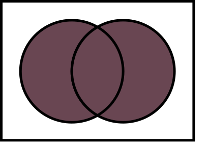

## 浏览器兼容性

**针对不同的浏览器支持的特性，比如css特性，js语法之间的兼容性，我们应该如何去解决处理？市面上有大量的浏览器，有Chrome、Safari、IE?Edge、UC等等，他们的市场占率是多少？需不需要兼容它们呢？**


其实在很多脚手架配置中，都能看到类似这样的配置信息，就是使用browserslist工具来实现的
```
> 1%
last 2 versions
not dead
```

## browserslist
**官方定义：browserslist是一个，在不同的前端工具之间，共享目标浏览器和Node.js版本的配置。**  

browserslist会根据编写规则来查询支持哪些浏览器，已方便决定是否需要进行兼容性支持。查询使用的是caniuse-lite工具，这个工具的数据来自于caniuse网站上。:point_right:[caniuse](https://caniuse.com/usage-table)

**<font color="red">browserslist只负责查询，兼容性的转化则需要交给其他工具来实现</font>**，比如：
- Autoprefixer
- Babel
- postcss-preset-env
- eslint-plugin-compat
- stylelint-no-unsupported-browser-features
- postcss-normalize
- obsolete-webpack-plugin


### 编写规则
- 查询组合  

| 组合类型      |                          图片示例                          | 举    例                                                                                                                       |
| ------------- | :--------------------------------------------------------: | ------------------------------------------------------------------------------------------------------------------------------ |
| `or`/`,` 并集 |                     | `> .5% or last 2 versions` <br> `> .5%, last 2 versions`                                                                       |
| `and` 交集    |       | `> .5% and last 2 versions`                                                                                                    |
| `not` 补集    |  | 下面3个意思都是一样 <br> `> .5% and not last 2 versions` <br> `> .5% or not last 2 versions` <br> `> .5%, not last 2 versions` |

- 默认规则：`> 0.5%, last 2 versions, Firefox ESR, not dead`
  - `> 0.5%`：市场占有率大于0.5%的浏览器
  - `last 2 versions`：浏览器的最新的2个版本
  - `Firefox ESR`：最新的Firefox 扩展支持版本
  - `not dead`: 在24个月内，官方支持或更新的浏览器

更多规则可查询官网:point_right:[browserslist官网](https://github.com/browserslist/browserslist)
### 使用方法
:::tip 提示
在安装webpack的时候browserslist已经自动安装，所以不需要再手动安装
:::

在命令行输入```npx browserslist ">1%, last 2 version, not dead"```可以查询支持哪些浏览器，只输入```npx browserslist```则查询默认规则。

> 在window下，如果```npx browserslist```后面跟了编写规则，会在执行目录生成一个名称为```%1```的文件，信息在这里面，ios端则正常。
```
D:\代码\webpack-learning\2.webpack配置文件(css)>npx browserslist
and_chr 96
and_ff 95
and_qq 10.4
and_uc 12.12
android 96
baidu 7.12
chrome 97
chrome 96
chrome 95
chrome 94
edge 97
edge 96
firefox 95
firefox 94
firefox 91
firefox 78
ie 11
ios_saf 15.2
ios_saf 15.0-15.1
ios_saf 14.5-14.8
ios_saf 14.0-14.4
ios_saf 12.2-12.5
kaios 2.5
op_mini all
op_mob 64
opera 82
opera 81
safari 15.2
safari 15.1
safari 14.1
safari 13.1
samsung 15.0
samsung 14.0
```
1. 方式一：  

在package.json文件中添加如下代码
```js
{
    "browserslist": [
        "last 1 version",
        "> 1%",
        "not dead"
    ]
}
```

2. 方式二：  

在项目根目录创建```.browserslistrc```文件，并写入规则
```
> 1%
last 2 versions
not dead
```

## PostCSS
PostCSS是一个通过JavaScript来转换样式的工具，PostCSS 提供了一个解析器，它能够将 CSS 解析成抽象语法树。在这之后，利用插件来做有用的事情，比如寻错或自动添加css前缀。**PostCSS本质上就是一个平台，需要依赖插件系统**，目前拥有200多个插件。:point_right:[PostCss中文文档](https://github.com/postcss/postcss/blob/main/docs/README-cn.md)

安装```postcss```
```
npm install postcss -D
```

可以安装```postcss```命令行工具，进行功能测试
```
npm install postcss-cli -D
```
安装```autoprefixer```插件
```
npm install autoprefixer -D
```
在命令行输入
```
npx postcss ./src/postcss/test.css -o ./src/postcss/res.css -u autoprefixer 
```
- ```postcss``` 目标文件
- ```-o``` 输出文件目录
- ```-u``` 使用的插件

目标文件：```test.css```
```css
:fullscreen {
    
}
.content {
    user-select: none;
    transition: all 2s ease;
}
```

输出结果：```res.css```
```css
:-webkit-full-screen {
    
}
:-ms-fullscreen {
    
}
:fullscreen {
    
}
.content {
    -webkit-user-select: none;
       -moz-user-select: none;
        -ms-user-select: none;
            user-select: none;
    transition: all 2s ease;
}

/*# sourceMappingURL=data:application/json;base64,eyJ2ZXJzaW9uIjozLCJzb3VyY2VzIjpbInRlc3QuY3NzIl0sIm5hbWVzIjpbXSwibWFwcGluZ3MiOiJBQUFBOztBQUVBO0FBRkE7O0FBRUE7QUFGQTs7QUFFQTtBQUNBO0lBQ0kseUJBQWlCO09BQWpCLHNCQUFpQjtRQUFqQixxQkFBaUI7WUFBakIsaUJBQWlCO0lBQ2pCLHVCQUF1QjtBQUMzQiIsImZpbGUiOiJyZXMuY3NzIiwic291cmNlc0NvbnRlbnQiOlsiOmZ1bGxzY3JlZW4ge1xyXG4gICAgXHJcbn1cclxuLmNvbnRlbnQge1xyXG4gICAgdXNlci1zZWxlY3Q6IG5vbmU7XHJcbiAgICB0cmFuc2l0aW9uOiBhbGwgMnMgZWFzZTtcclxufVxyXG4iXX0= */
```

更多命令参数请看官网:point_right:[postcss-cli官网](https://github.com/postcss/postcss-cli)

### 在webpack中使用postcss

安装```postcss-loader```
```
npm install postcss-loader -D
```
1. 方式一：

```js
module.exports = {
   module: {
        rules: [
            {
                test: /\.css/,
                use: [
                    "style-loader", 
                    "css-loader",
                    {
                        loader: "postcss-loader",
                        options: {
                            postcssOptions: {
                                // 依赖的插件
                                // plugins: ["autoprefixer"], //也可以只写字符
                                plugins: [require("autoprefixer")],
                            },
                        },
                    },
                ],
            },
           
        ],
    },
};
```

2. 方式二：使用postcss配置文件方式
在根目录创建```postcss.config.js```文件，并写入

安装预设，这里我们不使用```autoprefixer```，而使用```postcss-preset-env```，```postcss-preset-env```将现代CSS转换为大多数浏览器可以理解的东西，根据目标浏览器或运行时环境确定所需的Polyfills。功能比```autoprefixer```更加强大。
```
npm i postcss-preset-env -D
```

```js
module.exports = {
    plugins: ["postcss-preset-env"],
};
```
在```webpack.config.js```中，就可以直接写字符串了
::: warning 注意
当css文件中使用了```@import```语法导入其他css文件，需要设置该属性，不然通过```@import```导入的css文件无法被```postcss-loader```处理。数值为回退处理的层数。
:::
```js
module.exports = {
   module: {
        rules: [
            {
                test: /\.less/,
                use: [
                    "style-loader", 
                    {
                        loader: "css-loader",
                        options: {
                            importLoaders: 2, // 当css文件中使用了@import语法导入其他css文件，需要设置该属性，不然通过@import导入的css文件无法被postcss-loader处理
                        },
                    },
                    "postcss-loader",
                    "less-loader",
                ],
            },
           
        ],
    },
};
```
