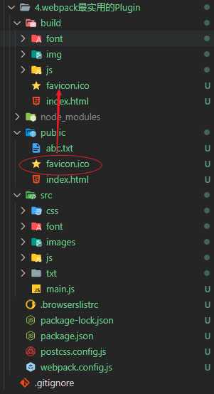

## Plugins插件系统
webpack的另一个核心是Plugin  
- loader是用于特定的模块类型，让webpack拥有了加载和解析非JavaScript文件的能力
- Plugin可以用于更加广泛，目的在于解决loader无法实现的其他事，从打包优化和压缩，到重新定义环境变量，功能强大到可以用来处理各种各样的任务


### CleanWebpackPlugin
每次修改了配置，重新打包时，都要手动删除打包的目录，使用```clean-webpack-plugin```插件，打包时会自动删除之前的打包目录。  

安装
```
npm install clean-webpack-plugin -D
```
```js
const { CleanWebpackPlugin } = require("clean-webpack-plugin");
module.exports = {
    plugins:[
        new CleanWebpackPlugin() //使用CleanWebpackPlugin插件，打包时会自动删除之前的打包目录
    ]
};
```

### HtmlWebpackPlugin
```html-webpack-plugin```插件会自动创建一个html文件，并将打包好的js等资源自动引入该html。
安装
```
npm install html-webpack-plugin -D
```
可以传入选项参数
- title：生成的html文件中，title标签的内容
- template：可以指定模板去生成html
```js
const path = require("path");
const { CleanWebpackPlugin } = require("clean-webpack-plugin");
const HtmlWebpackPlugin = require("html-webpack-plugin");
const { DefinePlugin } = require("webpack");
module.exports = {
    plugins: [
        new CleanWebpackPlugin(), //使用CleanWebpackPlugin插件，打包时会自动删除之前的打包目录
        // HtmlWebpackPlugin自动创建一个html文件，并将打包好的js等资源自动引入该html
        new HtmlWebpackPlugin({
            title: "webpack教程", //生成的html文件中，title标签的内容
            template: "./public/index.html", //可以指定模板去生成html
        }),
        // DefinePlugin用来定义全局常量
        new DefinePlugin({
            BASE_URL: JSON.stringify("./"), //由于本插件会直接替换文本，因此提供的值必须在字符串本身中再包含一个 实际的引号
        }),
    ],
};
```
这里我们以vue项目的```public/index.html```为模板示例  
其中使用了```<%= BASE_URL %>，<%= htmlWebpackPlugin.options.title %>```，这是ejs的语法
- ```<%= BASE_URL %>``` 使用的是全局变量，由```DefinePlugin```创建的，下一个说明的插件就是```DefinePlugin```。
- ```<%= htmlWebpackPlugin.options.title %>```是```HtmlWebpackPlugin```创建时传入的参数
```html
<!DOCTYPE html>
<html lang="">
  <head>
    <meta charset="utf-8">
    <meta http-equiv="X-UA-Compatible" content="IE=edge">
    <meta name="viewport" content="width=device-width,initial-scale=1.0">
    <link rel="icon" href="<%= BASE_URL %>favicon.ico">
    <title><%= htmlWebpackPlugin.options.title %></title>
  </head>
  <body>
    <noscript>
      <strong>We're sorry but <%= htmlWebpackPlugin.options.title %> doesn't work properly without JavaScript enabled. Please enable it to continue.</strong>
    </noscript>
    <div id="app"></div>
    <!-- built files will be auto injected -->
  </body>
</html>

```
打包后的html
```html
<!DOCTYPE html>
<html lang="">
    <head>
        <meta charset="utf-8" />
        <meta http-equiv="X-UA-Compatible" content="IE=edge" />
        <meta name="viewport" content="width=device-width,initial-scale=1" />
        <link rel="icon" href="./favicon.ico" />
        <title>webpack教程</title>
        <script defer="defer" src="index.js"></script>
    </head>
    <body>
        <noscript
            ><strong>We're sorry but webpack教程 doesn't work properly without JavaScript enabled. Please enable it to continue.</strong></noscript
        >
        <div id="app"></div>
    </body>
</html>

```
### DefinePlugin
```DefinePlugin```是webpack内置的一个插件，无需再安装，用来定义全局常量
:::tip 提示
由于本插件会直接替换文本，因此提供的值必须在字符串本身中再包含一个实际的引号
:::
```js
const { DefinePlugin } = require("webpack");
module.exports = {
    plugins: [
        new DefinePlugin({
            BASE_URL: JSON.stringify("./"),
        }),
    ],
};
```

### CopyWebpackPlugin
上面的模板还有```favicon.ico```没有处理，```favicon.ico```在public文件下，在vue项目中，public文件下的资源是作为静态资源直接拷贝到打包目录下的，就是通过```copy-webpack-plugin```实现的。    

```copy-webpack-plugin```可以直接将已经存在的单个文件或整个目录复制到打包后的目录。  

安装
```
npm install copy-webpack-plugin -D
```

```js
const CopyWebpackPlugin = require("copy-webpack-plugin");
module.exports = {
    plugins: [
        // CopyWebpackPlugin可以直接将已经存在的单个文件或整个目录复制到打包后的目录。
        new CopyWebpackPlugin({
            patterns: [
                {
                    from: "public",
                    // to: "dest", //可以不需要指定复制的到的目录，默认值为打包出口output
                    globOptions: {
                        ignore: [
                            "**/index.html", //忽略public下的index.html
                            "**/abc.txt", //忽略public下的abc.txt
                        ],
                    },
                },
            ],
        }),
    ],
};
```

最终，打包后的文件目录



## 总结
经过上面这些```loader```，```plugin```的配置，就可以构建最基本的打包环境。