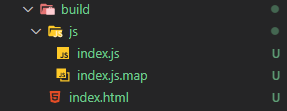
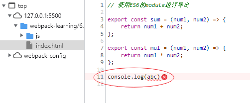
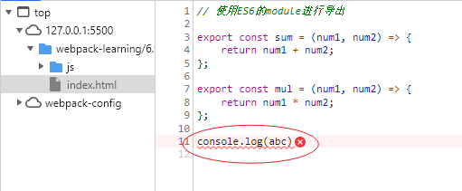
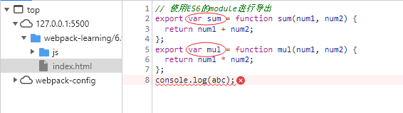
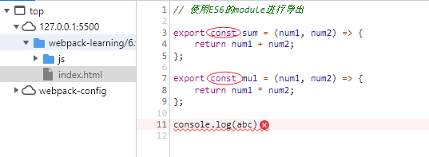
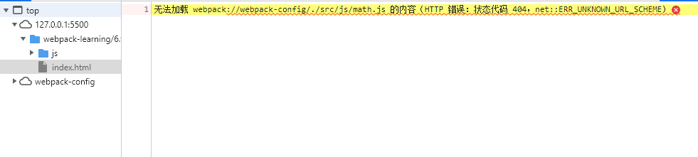

## 认识source-map
打包后我们的代码运行在浏览器上，是经过了压缩丑化的，也就是实际上运行的代码和我们编写的代码是有差异的，比如：
- ES6的代码转化成ES5
- 对应的行号、列号经过打包肯定不一样
- 使用TypeScript等方式编写代码，最终转化为javascript

但是当代码报错是需要调试，调试转换后的代码是很困难的，所以webpack提供了source-map，帮助我们将转换的代码映射到源文件，是浏览器可以重构原始源并在调试器中显示重建原始源。  

在```webpack.config.js```中设置source-map，是通过设置```devtool```属性。下面几个值不会生成source-map：
- 不设置```devtool```
- ```false```
- ```eval```

```js
module.exports = {
    mode: "production", //生产环境下，默认没有devtool选项，即不使用source-map
    // devtool: false, //设置为false，一样是不使用source-map
};
```

```js
module.exports = {
    mode: "development", //开发环境下，不设置devtool，默认为eval值，不生成source-map
    // devtool: "eval", 
};
```
设置为eval并不会生成source-map，而会使用eval函数包裹模块内的源代码（并非我们真正写的源代码），主要是在最后一行```# sourceURL=webpack://webpack-config/./src/index.js```可以形成映射，方便我们在调试面板找到错误代码

```js
eval("__webpack_require__.r(__webpack_exports__);\n/* harmony import */ var _js_math_js__WEBPACK_IMPORTED_MODULE_0__ = __webpack_require__(/*! ./js/math.js */ \"./src/js/math.js\");\n\r\nconst { dateFormat } = __webpack_require__(/*! ./js/format */ \"./src/js/format.js\");\r\n\r\n// 使用ES6的语法，低版本浏览器不支持\r\nconsole.log((0,_js_math_js__WEBPACK_IMPORTED_MODULE_0__.sum)(20, 30));\r\nconsole.log((0,_js_math_js__WEBPACK_IMPORTED_MODULE_0__.mul)(20, 30));\r\n\r\n// 使用CommonJS模块，浏览器不支持\r\nconsole.log(dateFormat());\r\n\r\n// 在命令行输入webpack，即可打包（默认以src下的index.js文件为入口）\r\n\n\n//# sourceURL=webpack://webpack-config/./src/index.js?");

```
## devtool各种值的含义

### source-map
打包后会生成一个映射文件，以```.map```结尾



在```index.js```文件下生成一行注释，开发工具会根据这个注释文件找到映射文件，进行解析。
```js
//# sourceMappingURL=index.js.map
```


### eval-source-map
打包后不会生成```.map```的映射文件，而是将模块内的源代码和转成base64编码的```.map```文件，放入到eval函数中。
```js
'__webpack_require__.r(__webpack_exports__);\n/* harmony import */ var _js_math_js__WEBPACK_IMPORTED_MODULE_0__ = __webpack_require__(/*! ./js/math.js */ "./src/js/math.js");\n\r\nconst { dateFormat } = __webpack_require__(/*! ./js/format */ "./src/js/format.js");\r\n\r\n// 使用ES6的语法，低版本浏览器不支持\r\nconsole.log((0,_js_math_js__WEBPACK_IMPORTED_MODULE_0__.sum)(20, 30));\r\nconsole.log((0,_js_math_js__WEBPACK_IMPORTED_MODULE_0__.mul)(20, 30));\r\n\r\n// 使用CommonJS模块，浏览器不支持\r\nconsole.log(dateFormat());\r\n\r\n// 在命令行输入webpack，即可打包（默认以src下的index.js文件为入口）\r\n
//# sourceURL=[module]\n//# sourceMappingURL=data:application/json;charset=utf-8;base64,eyJ2ZXJzaW9uIjozLCJmaWxlIjoiLi9zcmMvaW5kZXguanMuanMiLCJtYXBwaW5ncyI6Ijs7QUFBd0M7QUFDeEMsUUFBUSxhQUFhLEVBQUUsbUJBQU8sQ0FBQyx1Q0FBYTtBQUM1QztBQUNBO0FBQ0EsWUFBWSxnREFBRztBQUNmLFlBQVksZ0RBQUc7QUFDZjtBQUNBO0FBQ0E7QUFDQTtBQUNBIiwic291cmNlcyI6WyJ3ZWJwYWNrOi8vd2VicGFjay1jb25maWcvLi9zcmMvaW5kZXguanM/YjYzNSJdLCJzb3VyY2VzQ29udGVudCI6WyJpbXBvcnQgeyBzdW0sIG11bCB9IGZyb20gXCIuL2pzL21hdGguanNcIjtcclxuY29uc3QgeyBkYXRlRm9ybWF0IH0gPSByZXF1aXJlKFwiLi9qcy9mb3JtYXRcIik7XHJcblxyXG4vLyDkvb/nlKhFUzbnmoTor63ms5XvvIzkvY7niYjmnKzmtY/op4jlmajkuI3mlK/mjIFcclxuY29uc29sZS5sb2coc3VtKDIwLCAzMCkpO1xyXG5jb25zb2xlLmxvZyhtdWwoMjAsIDMwKSk7XHJcblxyXG4vLyDkvb/nlKhDb21tb25KU+aooeWdl++8jOa1j+iniOWZqOS4jeaUr+aMgVxyXG5jb25zb2xlLmxvZyhkYXRlRm9ybWF0KCkpO1xyXG5cclxuLy8g5Zyo5ZG95Luk6KGM6L6T5YWld2VicGFja++8jOWNs+WPr+aJk+WMhe+8iOm7mOiupOS7pXNyY+S4i+eahGluZGV4Lmpz5paH5Lu25Li65YWl5Y+j77yJXHJcbiJdLCJuYW1lcyI6W10sInNvdXJjZVJvb3QiOiIifQ==\n//# sourceURL=webpack-internal:///./src/index.js\n'
```

### inline-source-map
打包后不会生成```.map```的映射文件，而会在```index.js```文件末尾生成一行注释，而这行注释内容为```.map```文件的base64编码
```js
//# sourceMappingURL=data:application/json;charset=utf-8;base64,eyJ2ZXJzaW9uIjozLCJmaWxlIjoianMvaW5kZXguanMiLCJtYXBwaW5ncyI6Ijs7Ozs7O...
```

### cheap-source-map
会生成```.map```的映射文件，但是会更高效一些（cheap低开销），它没有生成列映射，只能精准到行，因为在开发中通常只需要行信息就可以定位到错误了。

source-map精确到了行，列。  



cheap-source-map只精确到了行。 



### cheap-module-source-map
会生成```.map```的映射文件，当我们的代码经过了loader的处理，比如```babel-loader```，在调试控制台映射出来的代码是最原始的代码，而如果是```cheap-source-map```，就是loader转换过之后的代码。

```cheap-source-map```，映射出来的代码是经过```babel-loader```转化过的。




```cheap-module-source-map```，映射出来的代码是原始的代码。



### hidden-source-map
会生成```.map```的映射文件，但是不会在```index.js```中添加最后一行引用注释，在调试控制台中报的错也不会对应到原始文件了。
```hidden-source-map```用的比较少，可以在开发环境使用```source-map```，生成环境使用```hidden-source-map```。
```js
// 被删除掉了
//# sourceMappingURL=index.js.map
```

### nosources-source-map
会生成```.map```的映射文件，只有错误信息提示，不会在调试控制台显示原始文件。  



## 多个值的组合
webpack提供给我们26个值，是可以进行多组合的，通过上面介绍的最基本的取值，组合起来也很容易理解，组合规则如下：
- ```inline- | hidden- |eval- ```：三个值时三选一，不能一起选。
- ```nosources```：可选值
- ```cheap```：可选值，并且可以跟随```module```。

在开发中，最佳实践是什么呢？
- 开发环境：推荐使用```source-map```和`cheap-module-source-map`，这也是vue和react使用的值。
- 测试环境：同上
- 生产环境：false，缺省值（不写）