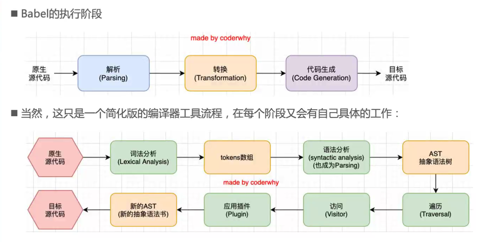
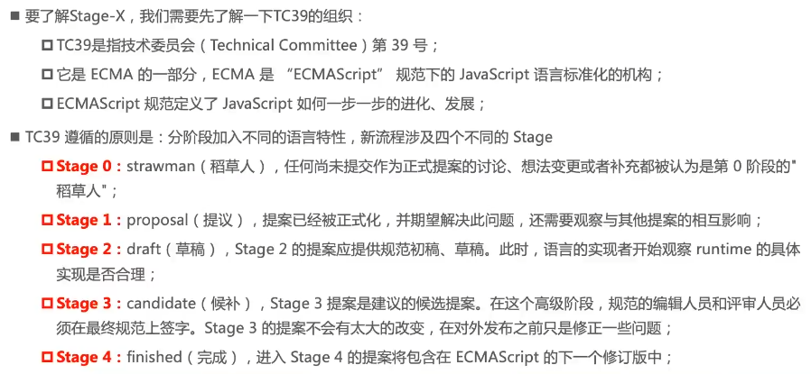

## 什么是 babel

`babel`是一个工具链，主 要用于将高版本的 js 代码转化为向后兼容版本的`JavaScript`，包括语法转化、源代码转换、Polyfill 实现目标缓解缺少的功能。 开发中，我们想要使用 ES6 语法、`TypeScript`、开发`React`项目都离不开`babel`。

## 安装 babel

```
npm install @babel/core -D  //核心包
npm install @babel/cli -D   //命令行工具
```

只安装核心包是并没有什么功能的，需要安装插件。安装插件`@babel/plugin-transform-arrow-functions`，用来转换箭头函数的。

```
npm install @babel/plugin-transform-arrow-functions -D
```

安装插件`@babel/plugin-transform-block-scoping`，用来将`const`声明转换为`var`声明

```
npm install @babel/plugin-transform-block-scoping -D
```

在命令行输入下述命令：

-   `babel`：后面跟目标目录或文件
-   `--out-file/-o`：编译单个文件
-   `--out-dir/-d`：编译整个目录
-   `--plugins`：使用安装的插件

```
npx babel src --out-dir result --plugins=@babel/plugin-transform-arrow-functions,@babel/plugin-transform-block-scoping
```

需要哪个功能，还需要一个个安装对应插件，很不方便，安装`@babel/preset-env`预设插件，相当于多个插件的组合，后面再来讲预设代表的含义。

```
npm install @babel/preset-env -D
```

执行如下命令，所需要的功能都会自动帮你转换。

```
npx babel src --out-dir result --presets=@babel/preset-env
```

## babel 的底层原理

`babel`是如何将一段代码（ES6、TypeScript、React）转换成另外一段代码（ES5）呢？

`babel`其实就相当于一个编译器，也有编译器的工作流程：

-   解析阶段（Parsing）
-   转换阶段（Transformation）
-   生成阶段（Code Generation）



## webpack 中使用 babel

### webpack.config.js 中使用

安装`babel-loader`

```
npm install @babel/core -D  //核心包
npm install babel-loader -D
npm install @babel/preset-env -D
```

可以只安装所需的功能，在`plugins`选项中设置需要的插件，不过这种方式比较少用。一般是使用预设`preset`，预设可以被看作是一组 babel 插件。
`@babel/preset-env`的选项参数：

-   `targets`：指定适配的浏览器，一般不写这个参数，<font color="red">`@babel/preset-env`默认会根据`.browserslistrc`文件内容进行适配</font>。
-   `modules`：将 esModule 转换为 CommonJs

更多参数可查看官网:point_right:[@babel/preset-env 参数配置](https://www.babeljs.cn/docs/babel-preset-env#options)

```js
module.exports = {
    module: {
        rules: [
            {
                test: /\.js$/,
                use: [
                    {
                        loader: "babel-loader",
                        options: {
                            // plugins: ["@babel/plugin-transform-arrow-functions", "@babel/plugin-transform-block-scoping"], // 可以安装对应的插件来进行对应功能的转换
                            // presets: ["@babel/preset-env"], //预设插件，多个插件的组合。
                            presets: [
                                [
                                    "@babel/preset-env",
                                    {
                                        targets: ["chrome 88"], //可以指定适配的浏览器
                                        modules: "commonjs", //将esModule转换为CommonJs
                                    },
                                ],
                            ],
                        },
                    },
                ],
            },
        ],
    },
};
```

### 旧版本的使用方法

`babel`旧版本的使用

```js
module.exports = {
    module: {
        rules: [
            {
                test: /\.js$/,
                use: [
                    {
                        loader: "babel-loader",
                        options: {
                            presets: ["es2015", "react", "stage-3"],
                        },
                    },
                ],
            },
        ],
    },
};
```



从 babel7 开始，已经不建议使用了，建议使用`preset-env`设置。

### 配置文件方式

在根目录创建文件，有两种：

-   `.babelrc.json/.js/.cjs/.mjs`或者`.babelrc`文件：早起使用较多的配置方式，但对于配置分包的项目比较麻烦，不推荐。
-   `babel.config.json/.js/.cjs/.mjs`文件：babel7 后的配置方式，可以直接作用与项目中的子包。

创建`babel.config.js`文件

```js
module.exports = {
    // plugins: ["@babel/plugin-transform-arrow-functions", "@babel/plugin-transform-block-scoping"],
    presets: [
        [
            "@babel/preset-env",
            {
                targets: ["chrome 88"], //可以指定适配的浏览器
                modules: "commonjs", //将esModule转换为CommonJs
            },
        ],
    ],
};
```

`webpack.config.js`中就只要使用`babel-loader`就行了。

```js
module.exports = {
    module: {
        rules: [
            {
                test: /\.js$/,
                use: ["babel-loader"],
            },
        ],
    },
};
```

## Polyfill

### 什么是Polyfill？
`Polyfill` 翻译为垫片，填充物，相当于一个补丁。比如我们使用了一些新的语法特性`Promise、Generator、Symbol`，以及实例方法`Array.prototype.includes`等，浏览器压根不认识这些特性，我们就可以使用`Polyfill`来填充或者说打印补丁，那么就会包含该特性了。

### 使用Polyfill
在`babel7.4.0`之前，可以使用`@babel/Polyfill`的包，但现在已经不推荐使用了。  
在`babel7.4.0`之后，可以通过单独引入`core-js`和`regenerator-runtime`来完成`polyfill`的使用。  

安装
```
npm install core-js regenerator-runtime -s
```
在`babel.config.js`中进行配置，也是通过设置`@babel/preset-env`预设的选项来实现。
```js
module.exports = {
    presets: [
        [
            "@babel/preset-env",
            {
                // useBuiltIns: false,//不使用Polyfill
                // useBuiltIns: "entry",//使用Polyfill，需要在入口文件中引入core-js/regenerator-runtime
                useBuiltIns: "usage", //使用Polyfill，代码中需要那些polyfill，就引用相关api
                corejs: 3, //Polyfill默认使用corejs的版本为2，但是安装的是3的版本，会报错，所以指定为使用3的版本
            },
        ],
    ],
};
```
在`webpack.config.js`中设置`exclude`属性，因为第三方库中可能使用了`polyfill`，和`babel`可能会产生冲突，进行排除
```js
module.exports = {
    module: {
        rules: [
            {
                test: /\.js$/,
                exclude: /node_modules/, //第三方库中可能使用了polyfill，和babel可能会产生冲突，进行排除
                use: [
                    {
                        loader: "babel-loader",
                        options: {},
                    },
                ],
            },
        ],
    },
};
```
`useBuiltIns`属性有三种选值：
- `false`：默认为false，不使用`Polyfill`
- `entry`：使用`Polyfill`，需要在入口文件中引入`core-js/regenerator-runtime`  

`@babel/preset-env`会根据需要适配的浏览器进行自动转化，引入目标环境特定需要的功能
```js
import "core-js/stable";
import "regenerator-runtime/runtime";
```
- `usage`：使用`Polyfill`，代码中需要那些`Polyfill`，就引用相关功能，还需设置属性`corejs:3`，因为默认使用`core-js`的版本为2，但是安装的是3的版本，会报错，所以指定为使用3的版本。
   
更详细的说明，可以查看:point_right:[core-js文档](https://github.com/zloirock/core-js/blob/master/docs/zh_CN/2019-03-19-core-js-3-babel-and-a-look-into-the-future.md)

### 认识plugin-transform-runtime
在前面我们使用的`Polyfill`，默认情况添加的特性都是全局的。比如我们使用了数组的`includes`方法，`babel` 的 `polyfill` 机制是直接在 `global.Array.prototype` 上添加，这样直接修改了全局变量的原型。  

这个问题在开发第三方库的时候尤其重要，因为我们开发的第三方库修改了全局变量，有可能和另一个也修改了全局变量的第三方库发生冲突，或者和使用我们的第三方库的使用者发生冲突。  

所以一般在编写第三方库的时候才会使用该插件，不要将`useBuiltIns` 和该插件混合使用。  

安装插件
```
npm install @babel/plugin-transform-runtime -D
```
因为我们安装的`core-js`是3的版本，还需要安装`@babel/runtime-corejs3`。
```
npm install @babel/runtime-corejs3 -s
```
在`babel.config.js`中配置
```js
module.exports = {
    plugins: [
        [
            "@babel/plugin-transform-runtime",
            {
                corejs: 3,
            },
        ],
    ],
};
```

## React的jsx支持

对`react jsx`代码进行处理，需要如下插件:
- `@babel/plugin-syntax-jsx`
- `@babel/plugin-transform-react-jsx`
- `@babel/plugin-transform-react-display-name`

但是开发中，我们不需要一个个去安装这些插件，依然是用预设插件`@babel/preset-react`就行了。  

安装预设 
```
npm install @babel/preset-react -D
```
安装`react`
```
npm install react react-dom -s
```
将入口文件修改为`.jsx`文件，并写入`react`代码
```js
import React, { Component } from "react";
import ReactDOM from "react-dom";

class App extends Component {
    constructor(props) {
        super(props);

        this.state = {
            message: "Hello React",
        };
    }

    render() {
        return (
            <div>
                <h2>{this.state.message}</h2>
            </div>
        );
    }
}

ReactDOM.render(<App/>, document.getElementById("app"));
```
记得修改`webpack.config.js`配置
```js
const path = require("path");
const { CleanWebpackPlugin } = require("clean-webpack-plugin");
const HtmlWebpackPlugin = require("html-webpack-plugin");
module.exports = {
    mode: "development",
    devtool: "source-map", //打包后会生成一个映射文件，以.map结尾
    // entry: "./src/index.js", //入口文件
    entry: "./src/react_index.jsx", //入口文件，测试react jsx使用
    output: {
        filename: "js/index.js", //打包后的文件名
        path: path.resolve(__dirname, "./build"), //必须使用绝对路径
    },
    module: {
        rules: [
            {
                test: /\.jsx?$/,
                exclude: /node_modules/, //第三方库中可能使用了polyfill，和babel可能会产生冲突，进行排除
                use: [
                    {
                        loader: "babel-loader",
                    },
                ],
            },
        ],
    },
    plugins: [
        new CleanWebpackPlugin(), //使用CleanWebpackPlugin插件，打包时会自动删除之前的打包目录
        // HtmlWebpackPlugin自动创建一个html文件，并将打包好的js等资源自动引入该html
        new HtmlWebpackPlugin({
            title: "webpack教程", //生成的html文件中，title标签的内容
            template: "./index.html",
        }),
    ],
};
```
并新增html模板
```html
<!DOCTYPE html>
<html>
    <head>
        <meta charset="utf-8" />
        <title>webpack教程</title>
        <meta name="viewport" content="width=device-width, initial-scale=1" />
        <script defer src="js/index.js"></script>
    <script defer src="js/index.js"></script></head>
    <body>
        <div id="app"></div>
    </body>
</html>

```
在`babel.config.js`中配置好预设就行了。

```js
module.exports = {
    presets: [
        ["@babel/preset-react"],
    ],
};
```

## 加载vue文件

vue官方提供了`vue-loader`来处理vue文件。:point_right:[vue-loader官网](https://vue-loader.vuejs.org/zh/guide/#vue-cli) 

在项目安装vue
```
npm install vue -s
```
在入口文件写入
```js
import Vue from "vue";
import App from "./App.vue";
new Vue({
    render: (h) => h(App),
}).$mount("#app");
```
`App.vue文件`
```vue
<template>
    <div>
        <h2 class="title">{{ message }}</h2>
    </div>
</template>

<script>
export default {
    data() {
        return {
            message: "Hello Vue",
        };
    },
};
</script>

<style lang="less" scoped>
.title {
    color: red;
}
</style>

```
将 `vue-loader` 和 `vue-template-compiler` 一起安装
```
npm install vue-loader vue-template-compiler -D
```
想要使用`vue-loader`，还必须使用`VueLoaderPlugin`插件。它的职责是将你定义过的其它规则复制并应用到 `.vue` 文件里相应语言的块。例如，如果你有一条匹配 `/\.js$/` 的规则，那么它会应用到 `.vue` 文件里的 `<script>` 块。  

::: tip 提示：
不要忘记处理vue文件中的style样式。
:::
```js
const { VueLoaderPlugin } = require("vue-loader");
module.exports = {
    module: {
        rules: [
            {
                // 处理.vue文件，使用vue-loader
                test: /\.vue?$/,
                use: "vue-loader",
            },
            {
                // 处理vue文件内的style样式
                test: /\.less?$/,
                use: [
                    "style-loader",
                    {
                        loader: "css-loader",
                        options: {
                            importLoaders: 2,
                        },
                    },
                    "postcss-loader",
                    "less-loader",
                ],
            },
        ],
    },
    plugins: [
        new VueLoaderPlugin(),
    ],
};
```

## 在vue中使用jsx

:::tip 提示
需要先安装好 `bebel` 插件
:::
安装插件
```
npm install @vue/babel-preset-jsx @vue/babel-helper-vue-jsx-merge-props -D
```
在`babel.config.js`进行配置
```js
module.exports = {
    presets: ["@vue/babel-preset-jsx"],
};
```