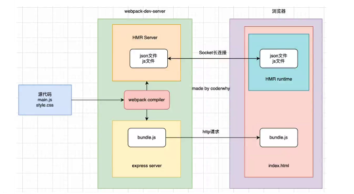

在这之前，存在一个问题，就是我们每次修改代码，都需要重新执行`npm run build`，开发效率很低。

-   我们可以在`package.json`中添加`watch`命令，运行`npm run watch`，只要修改代码，就会自动重新打包。

```js
    {
        "scripts": {
            "watch": "webpack --watch"
        },
    }
```

-   或者在`webpack.config.js`添加`watch`属性，执行`npm run build`，也会开启监听。

```js
module.exports = {
    watch: true,
};
```

目前的开发模式：通过`watch`方案来监听文件变化，然后使用 VSCode 的`live-server`插件提供本地服务（当文件变化时，自动刷新页面），效率并不是特别高。

1. 对所有代码都重新进行编译
2. 编译成功后，都会生成新的文件进行替换
3. `live-server`属于 VSCode 插件，不属于`webpack`给我们的解决方案
4. `live-server`每次多会重新刷新整个页面

## DevServer

### webpack-dev-server

安装`webpack-dev-server`

```
npm install webpack-dev-server -D
```

在`package.json`中添加：

```js
    {
        "scripts": {
            "serve": "webpack serve"
        },
    }
```

执行`npm run serve`开启服务，开启服务后不会将编译结果写入到任何文件，而是直接放到内存里面。事实上，`webpack-dev-server`使用了一个库叫`memfs`，能够将文件存储在内存中。

### webpack-dev-middleware

使用`webpack-dev-middleware`可以自己开启一个本地服务，做了解即可。  
在根目录创建`server.js`，执行`node server.js`即可启动本地服务

```js
// 使用webpack-dev-middleware自己开启一个本地服务

const express = require("express");
const webpack = require("webpack");
const webpackDevMiddleware = require("webpack-dev-middleware");

const app = express();
// 拿到webpack配置对象
const config = require("./webpack.config");

// webpack根据配置信息进行编译
const compiler = webpack(config);

// 生成express中间件
const middleware = webpackDevMiddleware(compiler);

// 告知 express 使用 webpack-dev-middleware
app.use(middleware);

app.listen(3000, () => {
    console.log("服务器已经开启在3000端口上");
});
```

## HMR

什么是 HMR？  
HMR 全程是 Hot Module Replacement，翻译为模块热替换，指在程序运行中，替换、添加、删除模块，而无需重新刷新整个页面。

HMR 通过如下几种方式，来显著加快开发速度：

-   不重新加载页面，保留应用程序的状态不丢失。
-   只更新变更内容，节省开发时间
-   修改了 css、js 源代码，会立刻在浏览器中进行更新，相当于在浏览器 devtools 直接更改样式

直接在`webpack.config.js`进行配置即可开启 HMR。

```js
module.exports = {
    devServer: {
        hot: true, //开启HMR
        client: {
            overlay: {
                //控制警告、错误信息是否在浏览器显示
                errors: true, //只有错误才在浏览器显示
                warnings: false,
            },
        },
    },
};
```

还需要告诉 `webpack` 接受更新的模块。

```js
if (module.hot) {
    // 哪些模块想要使用热更新，则引入哪些模块
    module.hot.accept("./math.js", function () {
        console.log("热更新完成");
    });
}
```

## 框架的 HMR

在开发项目时，难道我们经常需要手动写入`module.hot.accept`来实现 HMR 吗？

答案是不用的，比如开发`Vue`、`React`项目：

-   `vue`开发中：我们使用的`vue-loader`，已经支持`vue`组件的 HMR 了。
-   `react`开发中，有`react hot loader`，也支持 HMR（目前官方已经弃用了，改成使用`react-refresh`）

### React 实现热更新

```
npm install -D @pmmmwh/react-refresh-webpack-plugin react-refresh
```

在`webpack.config.js`中使用该插件
:::warning 注意：
要在开发模式下使用该插件，不然会报错，可以使用三目再进行详细区分。
:::

```js
const ReactRefreshWebpackPlugin = require("@pmmmwh/react-refresh-webpack-plugin");

module.exports = {
    mode: "development",
    plugins: [
        new ReactRefreshWebpackPlugin(), //为React组件启用热重载
    ],
    module: {
        rules: [
            {
                test: /\.jsx?$/,
                use: "babel-loader",
            },
        ],
    },
};
```

在`babel.config.js`还需使用`react-refresh/babel`

```js
module.exports = {
    presets: [["@babel/preset-env"], ["@babel/preset-react"]],
    plugins: [["react-refresh/babel"]],
};
```

### Vue 实现热更新

正常使用`vue-loader`即可。:point_right:[加载 vue 文件](./06-babel.html#加载vue文件)

## HMR 原理

`webpack-dev-server`会创建两个服务：提供静态资源的服务（`express`）和 `Socket`服务（`net.Socket`）:

-   `express` 服务负责直接提供静态资源的服务（打包后的资源直接被浏览器请求和解析）。
-   `socket` 服务建立长连接，当服务器监听到对应的模块发生变化时，会生成两个文件`.json`（manifest 文件）和`.js`文件（update chunk），通过长连接可以直接将这两个文件发送给浏览器，流浪器拿到两个新的文件后，通过`HRM runtime`机制，加载这两文件，并对修改的模块进行更新。



## devServer 的配置

### devServer.hot

`devServer.hot`设为`true`开启模块热替换，当模块中有报错时，修复了报错，会直接刷新页面，设置成`"only"`，不会重新刷新页面，保留错误信息。

### devServer.host

默认值是`localhost`，如果希望其他地方也可以访问，可以设置为`0.0.0.0`.

-   `localhost`：本质上是一个域名，通常情况下会被解析成`127.0.0.1`，回环地址，只有我们主机自己能够接受
-   `0.0.0.0`：监听 ipv4 上的所有地址，再根据端口找到不同的应用程序，在同一个网段下的主机中，通过 ip 是直接可以访问的。

### devServer.port

设置端口，默认为`auto`，自动使用一个可用端口。

### devServer.open

设置为`true`可以开启本地服务完毕后，自动打开浏览器。

### devServer.proxy

`proxy` 用来解决跨域访问的问题，以`http://localhost:8080/`访问`http://localhost:3000/`为例

```js
module.exports = {
    devServer: {
        proxy: {
            "/api": {
                target: "http://localhost:3000",
                pathRewrite: { "^/api": "" },
                secure: true,
                changeOrigin: true,
            },
        },
    },
};
```

- `target`：本地发出 `/api/users` 的请求会将请求代理到 `http://localhost:3000/api/users`上。
- `pathRewrite`：然后经过路径重写，再由`http://localhost:3000/api/users`请求发送到`http://localhost:3000/users`，因为服务器之间的访问是不受浏览器的跨域策略影响的。
- `secure`：默认情况下，不接受`HTTPS`请求，设为`true`开启。
- `changeOrigin`：修改代理请求头的`host`属性，因为我们真实的请求是访问`http://localhost:3000/`，请求头的`host`属性应该也是`localhost:3000`，但是因为使用了代理，变成了`localhost:8080`，可以将`changeOrigin`设为`true`。


### devServer.historyApiFallback

当SPA应用使用history模式的路由时，进行路由跳转之后，又进行了页面刷新的操作，会返回404的错误，因为当进行了页面刷新时，不是进行路由跳转了，而是会向服务器发送请求，但是并没有该路由路径对应的资源，所以会返回404。  


`historyApiFallback`设为`true`，默认会回到`/index.html`文件，也提供一个对象，通过`rewrites`属性进行更精确的控制。
```js
module.exports = {
  devServer: {
    historyApiFallback: {
      rewrites: [
        { from: /^\/subpage/, to: '/views/subpage.html' },  //匹配到/subpage路由，
        // 会访问本地服务`http://localhost:8080/views/subpage.html资源
      ],
    },
  },
};
```