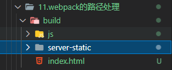

理解路径问题之前，需要搞清楚项目在服务器是如何部署的，以`tomcat`为例：

部署项目时是将前端静态放置在`tomcat/webapps/ROOT`目录下的，


:::tip 提示：
直接访问`http://linuxIp:8080/`，默认请求该目录下的 index.html 文件
:::
可以在该目录下新建一个`hello.html`文件，并写入

```html
<h1>hello tomcat</h1>
```

然后在浏览器输入`http://linuxIp:8080/hello.html`，浏览器会向服务器发起请求，便可以访问到`hello.html`。

一般，我们是不会直接将`html`文件等静态资源直接放到`Root`目录下的，而是会将资源都放在一个文件下，再将该文件放到`Root`目录中。比如上面的`build`目录，在浏览器输入`http://linuxIp:8080/build/`，浏览器就会请求`build`目录下的`index.html`进行加载。

如果你在`build/index.html`文件引入了其他文件，比如

```html
<script defer src="js/index.js"></script></head>
```

因为是相对路径，会找`build`文件下的`js/index.js`文件，而如果是绝对路径。

```html
<script defer src="/js/index.js"></script></head>
```

它会去找`tomcat/webapps/ROOT`目录下的`js`文件，但是压根就没有这个文件，就会造成 404。**搞清楚这点很重要，理解 webpack 中的各种路径配置就不难了**。

## context
基础路径：当解析入口 `entry` 或者 `loader` 中的路径使用的是相对路径时，是基于 `context` 配置的目录来进行查找的。

`context` 默认使用 `Node.js` 进程的当前工作目录，一般来说就是文件根目录，`context` 的使用可以查看 :point_right:[环境分离](./10-split.html#环境分离)

## `output.path`

`output.path`的作用是告知`webpack`的打包输出目录，然后将静态资源`html`、`js`、`css`等都放置在该目录下，常见的设置为`dist`、`build`文件夹等。

## `output.publicPath`

`output.publicPath`会在打包之后的静态资源前面进行一个路径的拼接，以下面的`html`模板为例

```html
<!DOCTYPE html>
<html lang="">
    <head>
        <meta charset="utf-8" />
        <meta http-equiv="X-UA-Compatible" content="IE=edge" />
        <meta name="viewport" content="width=device-width,initial-scale=1.0" />
        <link rel="icon" href="<%= BASE_URL %>favicon.ico" />
        <title><%= htmlWebpackPlugin.options.title %></title>
    </head>
    <body>
        <noscript>
            <strong
                >We're sorry but <%= htmlWebpackPlugin.options.title %> doesn't work properly without JavaScript enabled. Please enable it to
                continue.</strong
            >
        </noscript>
        <div id="app"></div>
        <!-- built files will be auto injected -->
    </body>
</html>
```

:::warning 注意：
自己直接写在模板中的路径是不会拼接上`publicPath`的，比如引入的`favicon.ico`图标。
:::

-   不设置`publicPath`，默认值为空。我们看看打包后的`html`文件，新增了一个对`js`文件的引入，为相对路径，会从`index.html`文件所属目录下，找到该`js`文件。

```html {9}
<!DOCTYPE html>
<html lang="">
    <head>
        <meta charset="utf-8" />
        <meta http-equiv="X-UA-Compatible" content="IE=edge" />
        <meta name="viewport" content="width=device-width,initial-scale=1.0" />
        <link rel="icon" href="./favicon.ico" />
        <title>webpack教程</title>
        <script defer src="js/index.js"></script>
    </head>
    <body>
        <noscript>
            <strong>We're sorry but webpack教程 doesn't work properly without JavaScript enabled. Please enable it to continue.</strong>
        </noscript>
        <div id="app"></div>
        <!-- built files will be auto injected -->
    </body>
</html>
```

-   `publicPath`设置为`/`，变成了绝对路径，会从服务器`Root`目录下的`js`文件。所以如果我们需要设置成绝对路径，是跟你在服务器如何部署打包后的资源有关的，一般将打包文件直接部署在`Root`目录下，所以`publicPath`设置成`/打包文件名`就行了。

```html
<link rel="icon" href="./favicon.ico">
<script defer src="/js/index.js"></script></head>
```

### 总结

`publicPath`设置总结：

-   可以不设置`publicPath`，为相对路径，这样打出来的包可以被部署在任意路径。
-   设置为`/打包文件名`，将打包文件部署在服务器根目录。
-   根据自己项目部署的位置，选取合适的值。

## DevServer 中的 static 属性

该配置项能够指定项目中的静态文件，默认是 public。也就是当启动本地服务时，会将 public 文件下的直接
拷贝到服务器根目录下。比如`public`文件下的`favicon.ico`，输入`http://localhost:8080/favicon.ico`就可以直接访问。设置为`false`可以关闭该功能，所以`public`下的静态资源可以直接在`index.html`模板中，手动设置相对路径`./静态资源`进行访问。

### `static.directory` 和 `static.publicPath`

静态文件默认是`public`，也可以设置`static.directory`指定目录，设置`static.publicPath`拷贝到开发服务器的指定文件目录

```js
module.exports = {
    devServer: {
        hot: true, //开启HMR
        // static: ["assets", "css"] //指定多个静态目录
        // static: {
        //     directory: "./static",
        //     publicPath:"/server-static"
        // },
        // static可以是数组，设置多个静态文件
        // static: [
        //     {
        //       /.../
        //     }
        // ],
    },
};
```

比如上面的设置，将项目中的`static`作为静态文件，拷贝到本地服务器根目录下的`server-static`文件下，
通过`http://localhost:8080/server-static/静态文件`才能访问到该资源，在`html`模板中这样引用：

```html
<script src="/server-static/index.js"></script>
<!-- 或者使用相对路径，因为index.html此时也在服务器根目录下 -->
<script src="./server-static/index.js"></script> 
```

上面这些设置（不论是默认还是手动设置），都只是对于本地开启的服务来说，**打包时是无法不会打包这些静态资源文件的**，所以需要配合`copy-webpack-plugin`将静态资源复制到打包文件下。

比如：

```js
const CopyWebpackPlugin = require("copy-webpack-plugin");

module.exports = {
    plugins: [
        new CopyWebpackPlugin({
            patterns: [
                {
                    from: "./static", //static目录内的文件作为静态文件
                    to: "./server-static", //静态文件的输出目录
                },
            ],
        }),
    ],
};
```

打包后的目录：



注意，**这里在 html 引用静态文件时不能用绝对路径**，不然会访问不到，因为此时静态文件是在打包的文件中，不是服务器根目录，应该使用相对路径。

```js
<script src="./server-static/index.js"></script>
```

## resolve 模块解析

`resolve`用于设置模块如何被解析，开发中会有各种各样的模块以来，这些模块可能来自自己编写的代码，也可能来自第三方库。`resolve`可以帮助`webpack`从每个`require/import`语句中，找到需要引入的模块代码。

-   绝对路径：由于已经获得文件的绝对路径，因此不需要进一步解析。
-   相对路径：在`require/import`中给定的相对路径，会拼接上下文路劲，来生成绝对路径。
-   模块路径：在`resolve.modules`中指定所有目录检索模块，默认值是`['node_modules']`。

### resolve.extensions

**当导入的是文件时**，使用`resolve.extensions`选项作为文件扩展名按顺序进行解析，默认值为`['.js', '.json', '.wasm']`，比如我们省略掉`.vue`后缀：

```js
import App from "./App";
```

想要 webpack 可以访问`.vue`文件，设置`extensions`属性
:::warning 注意：
这样使用 `resolve.extensions` 会 覆盖默认数组，可以使用 `'...'` 访问默认拓展名
:::

```js
module.exports = {
    resolve: {
        extensions: [".vue", "..."],
    },
};
```

### resolve.mainFiles

**当导入的是文件目录时**，会根据`resolve.mainFiles`选项指定的文件顺序查找。默认值是
`['index']`，比如：

```js
import Index from "./pages";
```

会找到`pages`目录下的`index`文件，再根据`resolve.extensions`匹配后缀，找到正确的文件。

```js
module.exports = {
    resolve: {
        mainFiles: ["index"],
    },
};
```

### resolve.alias

当我们项目的目录结构比较深的时候，可能会使用到`../../../`这样的路径。我们可以给某些常见的路径设置一个别名。

```js
const path = require('path');

module.exports = {
  resolve: {
    alias: {
        "@": path.resolve(__dirname, './src') //@ 指向目录下的src文件
        "pages": path.resolve(__dirname, './src/pages')
    },
  },
};
```
像下面这样引入就行了。
```js
import "@/pages/..."
import "pages/..."
```  


更多配置可以查看官网:point_right: [resolve配置](https://webpack.docschina.org/configuration/resolve/)

## 补充

### 封装解析路径函数
如果配置中很多地方都用到了路径，我们可以封装成一个函数比如
```js
const path = require("path");

const appDir = process.cwd(); //Node进程的工作目录（项目根目录）
const resolveApp = (relativePath) => path.resolve(appDir, relativePath);

// resolveApp("./src/..")  //相对于项目根目录
module.exports = resolveApp;
```