## 环境分离

当webpack配置信息越来越多，`webpack.config.js`文件变得不易维护，某些配置在开发环境使用，某些配置在生产环境使用，那么如何对配置进行划分？下面介绍一种 `webpack` 配置环境分离的方式。

1. 在文件根目录建立 `config` 文件，创建三个文件 
- `webpack.common.js`：通用配置
- `webpack.dev.js`：开发环境配置
- `webpack.prod.js`：生产环境配置

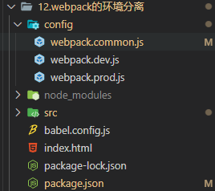

2. 在 `package.json` 进行如下配置，在启动命令时通过 `--env` 传入不同参数，即可对开发环境和生产环境进行区分
```json
{
    "scripts": {
        "serve": "webpack serve --config ./config/webpack.common.js --env development",
        "build": "webpack --config ./config/webpack.common.js --env production"
    },
}
```

在 `webpack.common.js` 进行配置，此时还是全部配置在一个文件，导出一个函数即可接收传递的参数
```js
const path = require("path");
const { CleanWebpackPlugin } = require("clean-webpack-plugin");
const HtmlWebpackPlugin = require("html-webpack-plugin");

module.exports = function (env) {
    console.log("----------", env);
    return {
        context: path.resolve(__dirname, "./"), //可以将context设置为config文件环境下
        entry: "../src/index.js", //入口文件路径则改为../
        output: {
            filename: "./js/index.js", //打包后的文件名
            path: path.resolve(__dirname, "../build"), //必须使用绝对路径
        },
        plugins: [
            new CleanWebpackPlugin(),
            new HtmlWebpackPlugin({
                title: "webpack教程",
                template: "../index.html", //plugin中的路径也是一样
            }),
        ],
    };
};
```
可以看到输出的参数有 `production: true`  

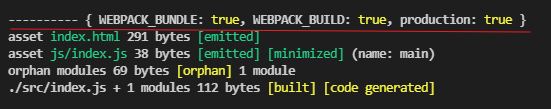


3. 然后判断哪些配置是开发环境哪些配置是生产环境，将代码拆分到对应文件

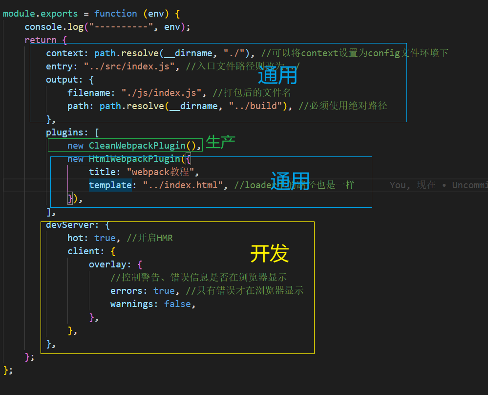

- `webpack.common.js`:
```js
module.exports = function (env) {
    console.log("----------", env);
    return {
        context: path.resolve(__dirname, "./"), //可以将context设置为config文件环境下
        entry: "../src/index.js", //入口文件路径则改为../
        output: {
            filename: "./js/index.js", //打包后的文件名
            path: path.resolve(__dirname, "../build"), //必须使用绝对路径
        },
        plugins: [
            new HtmlWebpackPlugin({
                title: "webpack教程",
                template: "../index.html", //loader中的路径也是一样
            }),
        ],
    };
};
```

- `webpack.dev.js`:
```js
module.exports = {
    mode: "development",
    devtool: "source-map",
    devServer: {
        hot: true, //开启HMR
        client: {
            overlay: {
                //控制警告、错误信息是否在浏览器显示
                errors: true, //只有错误才在浏览器显示
                warnings: false,
            },
        },
    },
};
```
- `webpack.prod.js`:
```js
const { CleanWebpackPlugin } = require("clean-webpack-plugin");

module.exports = {
    mode: "production",
    plugins: [new CleanWebpackPlugin()],
   
};
```

4. 环境进行了分离，还需要进行合并，这里需要用到 `webpack-merge` 插件
```
npm i install webpack-merge -D
```
修改 `webpack.common.js`，根据环境来合并对应的代码
```js
const { merge } = require("webpack-merge");
const DevConfig = require("./webpack.dev");
const ProdConfig = require("./webpack.prod");

const CommonConfig = {
    context: path.resolve(__dirname, "./"), //可以将context设置为config文件环境下
    entry: "../src/index.js", //入口文件路径则改为../
    output: {
        filename: "./js/index.js", //打包后的文件名
        path: path.resolve(__dirname, "../build"), //必须使用绝对路径
    },
    plugins: [
        new HtmlWebpackPlugin({
            title: "webpack教程",
            template: "../index.html", //loader中的路径也是一样
        }),
    ],
};

// 导出为函数，接收命令传递过来的参数
module.exports = function (env) {
    console.log("----------", env);
    const isProduction = !!env.production;
    return isProduction ? merge(CommonConfig, ProdConfig) : merge(CommonConfig, DevConfig);
};
```

5. 如果使用了 `babel`，有时候在 `babel.config.js` 中的插件也需要进行环境区分，因为在babel配置文件无法区分环境，我们可以利用Node的`process.env`来自己定义变量来区分环境，这样在`babel.config.js`中也能访问到

在 `webpack.common.js` 中设置变量 `process.env.NodeEnv`，在`babel.config.js`能够直接访问
```js
// 导出为函数，接收命令传递过来的参数
module.exports = function (env) {
    console.log("----------", env);
    const isProduction = !!env.production;
    process.env.NodeEnv = env.production ? env.production :"development";
    return isProduction ? merge(CommonConfig, ProdConfig) : merge(CommonConfig, DevConfig);
};
```

## 代码分离

代码分离是webpack一个非常重要的特性，它的主要目的是将代码分离到不同bundle中，之后我们可以按需加载，或者并行加载这些文件，提升首页加载的速度。webpack 中常用的代码分离有三种：
- 入口起点：使用entry配置手动分离代码
- 防止重复：使用Entry Dependencies后者SplitChunksPlugin去重和代码分离
- 动态导入：通过模块的内联函数调用来分离代码

### 入口分离
最简单的代码分离就是通过设置多入口
```js
module.exports = {
    context: path.resolve(__dirname, "./"), //可以将context设置为config文件环境下
    entry: {
        main: "../src/main.js",
        index: "../src/index.js",
    },
    output: {
        filename: "[name].bundle.js", //打包后的文件名
        path: path.resolve(__dirname, "../build"), //必须使用绝对路径
    },
}
```
打包后的文件：  

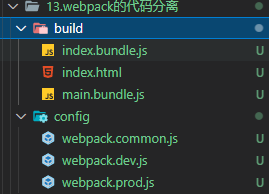

### 防止重复
入口分离有如下缺点：
1. 如果不同入口引用了重复的模块，哪些重复的模块都会被引入到各个 `bundle` 中
2. 不能动态的按照自己的需求从应用中将代码拆分出来  

所以还存在下面两种方式解决以上问题

#### 入口依赖（entry dependencies）
使用 `dependOn` 选项与其他入口共享模块
```js
module.exports = {
    context: path.resolve(__dirname, "./"), //可以将context设置为config文件环境下
    entry: {
        // 不同入口依赖了相同模块，使用 dependOn 可以共享模块
        // main: { import: "../src/main.js", dependOn: "lodash", /* filename:"" 这里也可以设置filename，不设置采用output.filename*/ },
        // index: { import: "../src/index.js", dependOn: "lodash" },
        // lodash: "lodash",

        // 依赖了多个模块，可以将依赖模块打包到一个文件中进行共享
        main: { import: "../src/main.js", dependOn: "shared", },
        index: { import: "../src/index.js", dependOn: "shared" },
        shared: ["lodash", "dayjs"],
    },
    output: {
        filename: "[name].bundle.js", //打包后的文件名
        path: path.resolve(__dirname, "../build"), //必须使用绝对路径
    },
}
```
打包后的文件：  

lodash模块打包成了一个 `lodash.bundle.js` 文件  

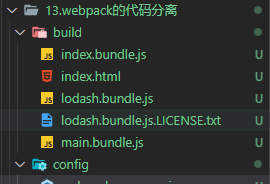

多个模块打包成了一个 `shared.bundle.js`  

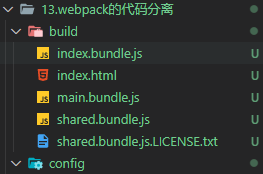


#### splitChunks
另一种分包模式是`splitChunks`，它是使用 `SplitChunksPlugin` 来实现的，webpack已经默认集成了该插件。

配置`optimization.splitChunks`：

- `chunks`：有三种取值，一般设置为 `all` 即可
  - `initial`： 同步导入的模块进行拆分共享
  - `async`： 异步导入的模块进行拆分共享
  - `all`： 同步异步都进行拆分共享
- `minSize`：最小尺寸（ bytes），如果要拆分的模块小于这个值，则不会拆分
- `maxSize`：将大于maxSize的部分，拆分成不小于minSize的包
- `minChunks`： 一个包至少被导入了2次（在不同入口导入），才会进行拆分
- `cacheGroups`：按条件分组，将匹配的模块打包到不同的chunk中


更多配置可查看 :point_right: [splitChunks配置](https://webpack.docschina.org/plugins/split-chunks-plugin/#optimizationsplitchunks)

:::tip 提示
设置名称占位符`[id]`使用哪种算法生成：:point_right:[chunkIds](https://webpack.docschina.org/configuration/optimization/#optimizationchunkids)
:::
```js
module.exports = {
    context: path.resolve(__dirname, "./"), //可以将context设置为config文件环境下
    entry: {
        main: "../src/main.js",
        index: "../src/index.js",
    },
    output: {
        filename: "[name].bundle.js", //打包后的文件名
        path: path.resolve(__dirname, "../build"), //必须使用绝对路径
    },
    optimization: {
        chunkIds: "natural", // id名称占位符使用哪种算法
        splitChunks: {
            // chunks: "initial", //同步导入的模块进行拆分共享
            // chunks: "async", //异步导入的模块进行拆分共享
            chunks: "all", //同步异步都进行拆分共享
            // 最小尺寸（ bytes），如果要拆分的模块小于这个值，则不会拆分
            minSize: 200,
            // 将大于maxSize的部分，拆分成不小于minSize的包
            // maxSize: 30000,
            // 一个包至少被导入了2次（在不同入口导入），才会进行拆分
            // minChunks: 2,
            /*
                cacheGroups：
                按条件分组，将匹配的模块打包到不同的chunk中
                不会立即将导入的模块进行输出，而是先缓存，等到所有匹配的模块加载完之后，再进行输出
            */
            cacheGroups: {
                // 将node_modules下引用的模块，打包到一个chunk中
                vendor: {
                    test: /[\\/]node_modules[\\/]/,
                    filename: "[id]_vendors.js",
                    priority: -10, //vendor分组优先级更高
                    // name:"" // name也可以设置打包的文件名称，可以是字符也可以是函数，与filename的区别就是，名字是固定的，不能使用名称占位符
                },
                // 将名称为bar_开头的文件，打包到一个chunk中
                bar: {
                    test: /bar_/,
                    filename:"[id]_bar.js"
                },
                // 默认分组，被导入了2次会打包到一个chunk中
                // 像lodash和dayjs满足既满足vendor分组也满足default，我们可以设置priority优先级
                // default: {
                //     minChunks: 2,
                //     filename: "[id]_common.js",
                //     priority: -20,
                // },
            },
        },
    },
}
```
打包后的文件：  

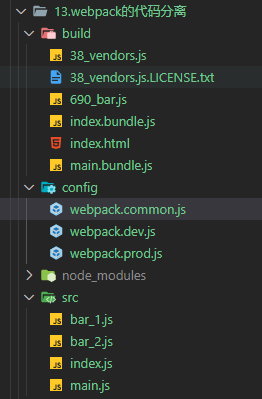


### 动态导入

另一种代码拆分方式是使用 `import()` 语法来实现动态导入动态导入，只要是异步导入的代码，webpack都会进行代码分离（即使splitChunks.chunks设置为initial） 

:::tip
如果有多个动态导入，不会在打包在一个文件内，会有多个chunk
:::

在文件中使用
```js
import("./foo").then((res) => {
    console.log(res);
});
```
打包之后的文件：  

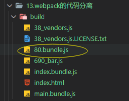

还可以设置 `output.chunkFilename` 设置动态导入的文件名称，非动态导入的无法设置

```js
module.exports = {
    output: {
        filename: "[name].bundle.js", //打包后的文件名
        path: path.resolve(__dirname, "../build"), //必须使用绝对路径
        chunkFilename: "./chunk/[name].chunk.js", //异步加载打包的文件名
    },
}
```
因为异步导入没有`name`占位符对应的值（会用 `id` 占位符进行替换），我们可以使用 `magic comments`（魔法注释）设置`name`占位符的值
```js
import(/* webpackChunkName: "foo" */ "./foo").then((res) => {
    console.log(res);
});
```
打包之后的文件：  

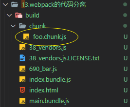

## 懒加载

在 `index.js` 添加一步导入代码
```js
const button = document.createElement("button");
button.innerText = "加载元素";
button.addEventListener("click", () => {
    import(/* webpackChunkName: "element" */ "./element").then((res) => {
        console.log(res);
        document.body.appendChild(res.default)
    });
});
document.body.appendChild(button);
```
新建 `element.js`，新增一个div元素
```js
const element = document.createElement("div");
element.innerText = "i am div";

export default element;
```
**异步导入时的缺点**：当点击按钮的时候，需要先下载js文件，浏览器再进行加载，如果文件很大，会造成页面卡顿。

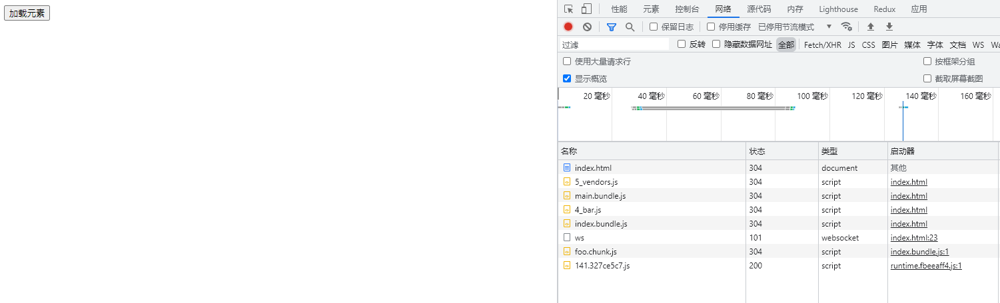
点击后加载

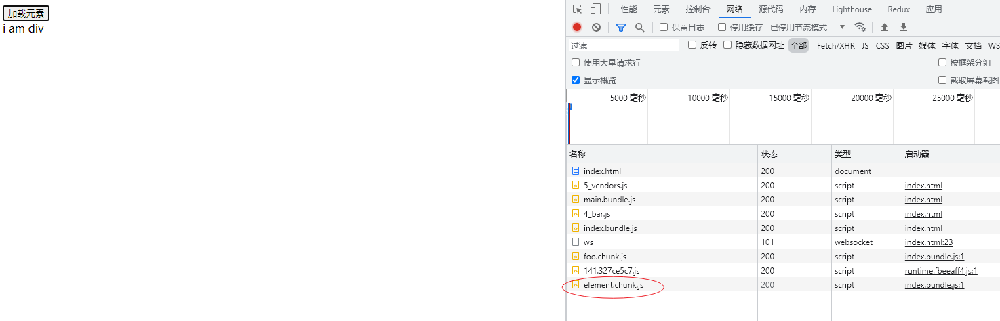

我们可以使用魔法注释 `prefetch` 和 `preload` 解决这个问题
### prefetch
`prefetch`，预加载，等到浏览器空闲时，下载好js文件。

在导入的地方添加魔法注释
```js
button.addEventListener("click", () => {
    import(/* webpackChunkName: "element" */ /* webpackPrefetch: true */  "./element").then((res) => {
        console.log(res);
        document.body.appendChild(res.default)
    });
});
```
可以看到 `element.chunk.js` 先是预加载，然后点击按钮，直接拿取缓存

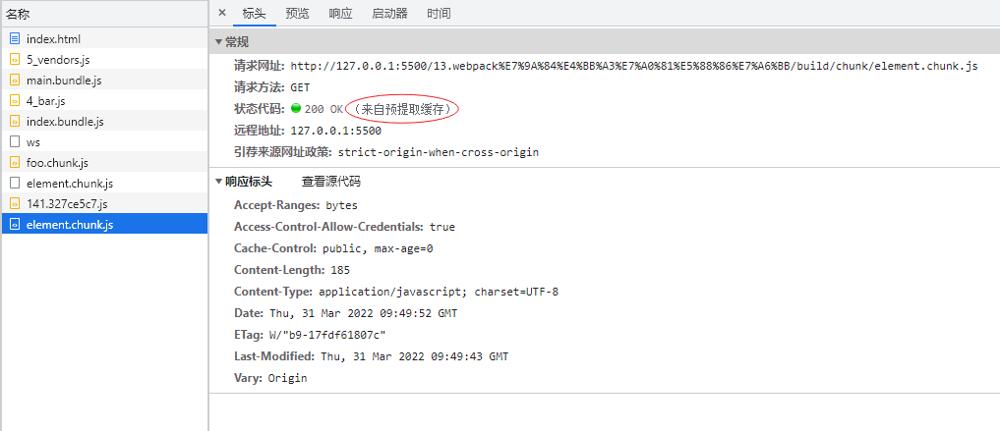

### preload
`preload `也是预加载，等到在父级块下载结束后再开始下载，而 `prefetch` 是等到浏览器空闲时下载，一般用 `prefetch` 更好

```js
button.addEventListener("click", () => {
    import(/* webpackChunkName: "element" */ /* webpackPreload: true */  "./element").then((res) => {
        console.log(res);
        document.body.appendChild(res.default)
    });
});
```

## 提取运行时代码

什么是运行时相关代码？
形如 `import('abc').then(res=>{})` 这种异步加载的代码，在 `webpack` 中即为运行时代码

通过 `optimization.runtimeChunk` 即可抽离出运行时代码，打包成一个单独的文件

`runtimeChunk` 可以设置成如下值
- `true | multiple`：每个入口都会提取出一个 `runtime` 文件
- `single`：多个入口也只会生成一个`runtime` 文件
- `{ name }`：用于设置`runtime`文件`name`占位符名称
```js
module.exports = {
    context: path.resolve(__dirname, "./"), //可以将context设置为config文件环境下
    entry: {
        main: "../src/main.js",
        index: "../src/index.js",
    },
    output: {
        filename: "[name].[hash:6].bundle.js", //打包后的文件名
        path: path.resolve(__dirname, "../build"), //必须使用绝对路径
        chunkFilename: "./chunk/[name].[hash:6].chunk.js", //异步加载的
    },
    optimization: { 
        chunkIds: "natural", // id名称占位符使用哪种算法
        // runtimeChunk: true,
        // runtimeChunk: {
        //     name: "runtime", //可以设置[name]字符占位名称的值
        // },
        runtimeChunk: {
            name: (entrypoint) => `runtime-${entrypoint.name}`, // entrypoint为入口文件的信息
        },
    },
};
```
打包后的文件： 

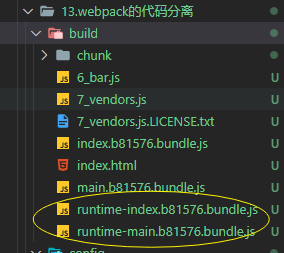

## 提取css代码

安装`mini-css-extract-plugin`插件，将css资源单独提取出来
```
npm i mini-css-extract-plugin -D
```

在生产环境 `webpack.prod.js`中进行配置，开发环境中可以不用提取
```js
const MiniCssExtractPlugin = require("mini-css-extract-plugin");

module.exports = {
    mode: "production",
    module: {
        rules: [
            {
                test: /\.css/i,
                use: [MiniCssExtractPlugin.loader, "css-loader"], //替换掉style-loader
            },
        ],
    },
    plugins: [
        new MiniCssExtractPlugin({
            filename: "./css/[name].[hash:6].css",
        }),
    ],
};

```