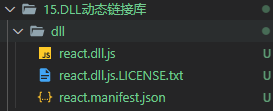
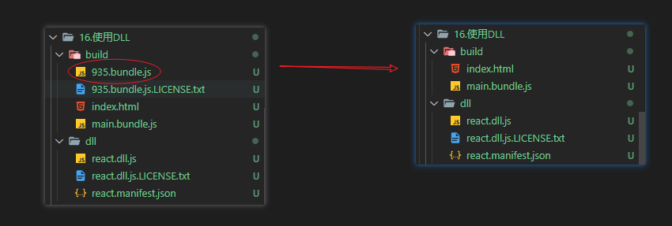
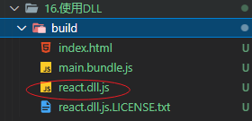
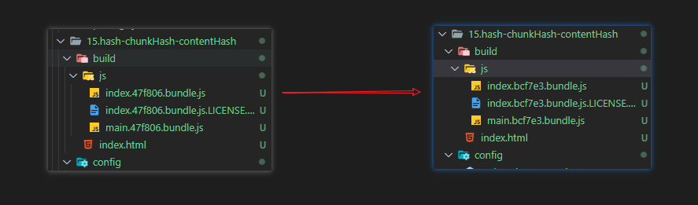
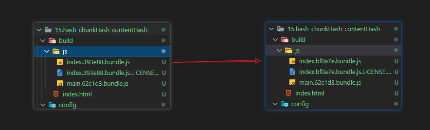
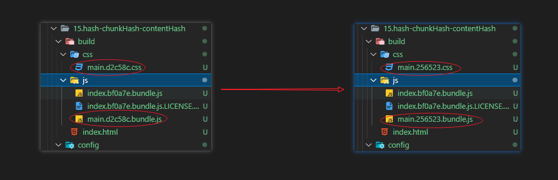
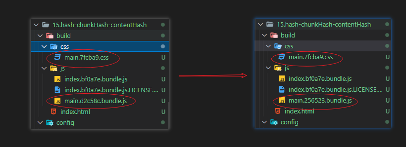

## CDN

什么是CDN？
CDN称之为内容分发网络网络（Content Delivery NetWork）。它是指通过相互连接的网络系统，利用最靠近每个用户的服务器，更快、更可靠的将音乐、图片、视频、应用程序即其他文件发送给用户。来提供高性能即低成本的网络内容传递给用户。

在开发中，我们使用CDN主要是两种方式
1. 打包所有静态资源，放到CDN服务器上，用户所有资源都是通过CDN服务器加载的
2. 一些第三方资源放到CDN服务器上


使用CDN
配置`externals`，排除第三方资源，不会打包到bundle中
```js
module.exports = {
    externals: {
        lodash: "_",
        dayjs: "dayjs",
        jQuery: "$",
    }
};

```
在 `index.html` 模板文件中进行引用即可，可以看到html中没有对打包的第三方资源的引入了
```html
<!DOCTYPE html>
<html>
    <head>
        <meta charset="utf-8" />
        <title>webpack教程</title>
        <meta name="viewport" content="width=device-width,initial-scale=1" />
        <script defer="defer" src="main.89ed56.bundle.js"></script>
        <script defer="defer" src="index.89ed56.bundle.js"></script>
    </head>
    <body>
        <div id="app"></div>
    </body>
    <script src="https://cdn.jsdelivr.net/npm/lodash@4.17.21/lodash.min.js"></script>
    <script src="https://unpkg.com/dayjs@1.8.21/dayjs.min.js"></script>
</html>
```

因为再开环境下我们是不需要使用CDN的，本地服务下的资源要更快，所以我们可以将 `externals` 配置放到 `webpack.prod.js` 中，那在模板中引入CDN时如何区分开发环境还是生产环境呢？

因为html模板是通过ejs引擎进行解析的，所以我们可以是用ejs引擎的语法
```html
<!DOCTYPE html>
<html>
    <head>
        <meta charset="utf-8" />
        <title>webpack教程</title>
        <meta name="viewport" content="width=device-width, initial-scale=1" />
    </head>
    <body>
        <div id="app"></div>
    </body>
    <% if(process.env.NODE_ENV === 'production'){ %>
    <script src="https://cdn.jsdelivr.net/npm/lodash@4.17.21/lodash.min.js"></script>
    <script src="https://unpkg.com/dayjs@1.8.21/dayjs.min.js"></script>
    <% } %>
</html>
```

## Shimming
预置依赖`Shimming` 的意思是用垫片，意思就是说可以将第三方模块当作“垫隙片”填入我们的项目。

比如：有的第三方库本身依赖了 `lodash` 插件，但是默认没有对 `lodash` 进行导入（认为全局存在 `lodash` ），那么我们就可以通过 `ProvidePlugin` 来实现 `Shimming` 效果

:::warning 注意
webpack并不推荐随意使用Shimming，webpack的理念是使前端开发更加模块化，需要编写具有封闭性的，不存在隐含依赖（比如全局变量）的模块。
:::

举例：
新建 `request.js` 文件，使用 `axios`，并在入口文件处导入，如果没有导入 `axios`，肯定会报错
```js
axios.get("xxxx");

get("xxx")
```
我们可以使用 `ProvidePlugin` 来实现 `Shimming` 效果，`ProvidePlugin`是webpack内置的，无需安装
```js
const webpack = require("webpack");

module.exports = {
    plugins:[
        new webpack.ProvidePlugin({
            axios: "axios",
            get: ["axios", "get"], //通过配置一个“数组路径”，暴露出模块的单个功能
        }),
    ]
}
```

## DLL

什么是DLL？
`DLL(Dynamic Link Library)` 称为为动态链接库，在项目中引用的很多第三方库，每次重新打包，第三方库也需要重新打包一次，但是这些第三模块的代码并不会经常发生变更，这时就可以用到DLL，把复用性较高的第三方模块打包到动态链接库中，在不升级这些库的情况下，动态库不需要重新打包，每次构建只重新打包业务代码。

在 `webpack` 中使用 `DLL` 需要用到 `DLLPlugin` 和 `DllReferencePlugin` 这两个插件，都是 `webpack` 内置插件，无需安装
- `DLLPlugin`：用来生成动态库
- `DllReferencePlugin`：在主项目中链接到生成的动态库

### 生成动态链接库

新建一个 `webpack` 项目，用来打包生成 DLL 库文件，这里将配置文件换成 `webpack.dll.js` （名称随自己定义）

```json
{
    "scripts": {
    "dll": "webpack --config ./webpack.dll.js"
  },
}
```
配置信息如下，这里我们用 `react` 来示例
```js
const path = require("path");
const { DllPlugin } = require("webpack");

module.exports = {
    mode: "production",
    entry: {
        react: ["react", "react-dom"], //将react打包成DLL动态链接库
    },
    output: {
        path: path.resolve(__dirname, "./dll"), //生成DLL动态链接库文件
        filename: "[name].dll.js", //输出的动态链接库名称
        library: "[name]", //作为一个库进行输出，为你的入口做导出，具体配置可以查看官网
    },
    plugins: [
        new DllPlugin({
            // 动态链接库的全局变量名称，需要和 output.library 中保持一致
            // 该字段的值也就是输出的 manifest.json 文件中 name 字段的值
            name: "[name]",
            path: path.resolve(__dirname, "./dll/[name].manifest.json"), //生成manifest.json文件， 用来描述生成的dll文件
        }),
    ],
};
```

打包生成 `dll `文件



可以看到 `manifest.json` 文件，就是对打包后的第三方模块的描述信息，而 `DllReferencePlugin` 的作用就是通过读取该文件，通过id将 `react.dll.js`中对应模块的源码找到

```json
{
    "name": "react",
    "content": {
        "./node_modules/react/index.js": {
            "id": 294,
            "buildMeta": { "exportsType": "dynamic", "defaultObject": "redirect" },
            "exports": [
                /*...*/
            ]
        },
        "./node_modules/react-dom/index.js": {
            "id": 935,
            "buildMeta": { "exportsType": "dynamic", "defaultObject": "redirect" },
            "exports": [
                /*...*/
            ]
        }
    }
}
```
### 使用动态链接库

在主项目中复制上面生成的dll文件，然后在 `webpack.config.js` 进行 `DllReferencePlugin` 的配置
```js
const path = require("path");
const HtmlWebpackPlugin = require("html-webpack-plugin");
const { CleanWebpackPlugin } = require("clean-webpack-plugin");
const { DllReferencePlugin } = require("webpack");
const AddAssetHtmlPlugin = require("add-asset-html-webpack-plugin");
module.exports = {
    mode: "production",
    entry: "./src/index.jsx",
    output: {
        path: path.resolve(__dirname, "./build"),
        filename: "[name].bundle.js", //输出的动态链接库名称
        publicPath: "",
    },
    module: {
        rules: [
            {
                test: /\.jsx?$/,
                exclude: /node_modules/, //第三方库中可能使用了polyfill，和babel可能会产生冲突，进行排除
                use: [
                    {
                        loader: "babel-loader",
                    },
                ],
            },
        ],
    },
    optimization: {
        splitChunks: {
            chunks: "all",
        },
    },
    plugins: [
        new CleanWebpackPlugin(),
        new HtmlWebpackPlugin({
            title: "webpack教程", //生成的html文件中，title标签的内容
            template: "./index.html",
        }),
        new DllReferencePlugin({
            context: __dirname, //上下文
            manifest: require("./dll/react.manifest.json"), //引用dll库的manifest文件
        }),
        new AddAssetHtmlPlugin({
            filepath: path.resolve(__dirname, "./dll/react.dll.js"),  //要添加到HTML文件中文件的绝对路径
            publicPath: "./", ////如果没有在output.publicPath，会在引入src前加上auto/xxx,导致资源引用不正确，设置为"./"
        }),
    ],
};
```

打包之后，我们可以看到本来由 `react` 第三方库生成的打包文件已经没有了


:::warning 注意：
此时打包的代码没有第三方库的源码，所以还需要将dll文件引入到HTML模板中，才能够正常使用
:::

安装 `add-asset-html-webpack-plugin` 插件进行引入dll文件，
```
npm i add-asset-html-webpack-plugin -D
```
配置插件
```js
const path = require("path");
const AddAssetHtmlPlugin = require("add-asset-html-webpack-plugin");
module.exports = {
    plugins: [
       
        new AddAssetHtmlPlugin({
            filepath: path.resolve(__dirname, "./dll/react.dll.js"),  //要添加到HTML文件中文件的绝对路径
            publicPath: "./", //如果没有在output.publicPath，会在引入src前加上auto/xxx,导致资源引用不正确，设置为"./"
        }),
    ],
};
```
最后打包生成的文件，这样就不需要每次打包，都再去打包第三方库的源码了，所以对打包速度会有很大的提升



## 补充

### Hash、ChunkHash、ContentHash的区别

- `hash`：是跟整个项目的构建相关，构建生成的文件hash值都是一样的，一旦项目中任何一个文件的修改，都会构建整个项目，重新获取hash值，缓存的目的将失效。
- `chunkhash`：根据不同的入口文件进行依赖文件解析，构建对应的chunk，生成对应的hash值，修改一个入口内文件内容，只有该入口chunk的hash值会变化，不会影响其他入口文件生成的hash值
- `contenthash`：由文件内容产生的hash值，内容不同产生的contenthash值也不一样

举例：

1. 使用 `hash` 时
```js
module.exports = {
    entry: {
        main: "../src/main.js",
        index: "../src/index.js",
    },
    output: {
        filename: "./js/[name].[hash:6].bundle.js",
        path: path.resolve(__dirname, "../build"),
    },
}
```
当修改任意其中一个入口文件内容时，另一个文件的 `hash` 值也会产生变化，我们不期望这样的变化，这时我们可以使用 `chunkhash`



2. 使用 `chunkhash` 时

```js
module.exports = {
    output: {
        filename: "./js/[name].[chunkhash:6].bundle.js",
        path: path.resolve(__dirname, "../build"),
    },
}
```
修改 `index.js` 入口文件内容，只有修改的文件的`hash` 值产生变化，正是我们想要的




继续做修改，我们先在 `main.js` 引入样式文件 `style.css`，也使用 `chunkhash`

```js
const MiniCssExtractPlugin = require("mini-css-extract-plugin");

module.exports = {
    plugins: [
        new MiniCssExtractPlugin({
            filename: "./css/[name].[chunkhash:6].css",
        }),
    ],
};
```
当修改 `main.js` 文件时，css文件的 `hash` 值也发生了变化，我们不期望这样的变化，这时我们可以使用 `contenthash`



3. 使用 `contenthash`

```js
module.exports = {
    plugins: [
        new MiniCssExtractPlugin({
            filename: "./css/[name].[contenthash:6].css",
        }),
    ],
};
```
当修改 `main.js` 文件时，css文件的 `hash` 值并没有发生变化，只有`main.js` 文件的`hash` 值变化了，符合我们的期望  




**总结**：

由 `splitChunks` 或者 `MiniCssExtractPlugin` 拆分出来的chunk，最好使用 `contenthash`。而像由入口文件生成的 `bundle`，则使用 `chunkhash`