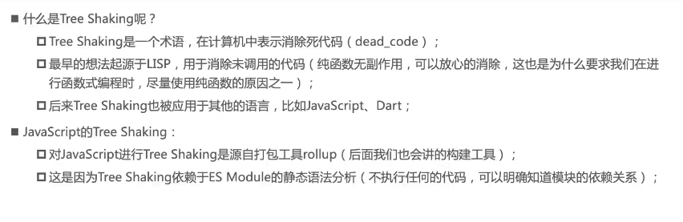
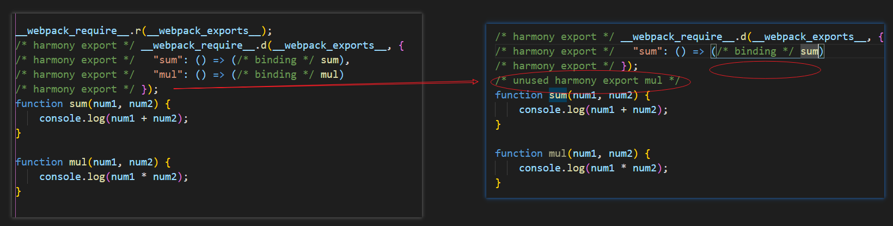
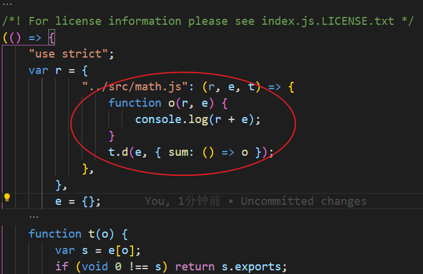
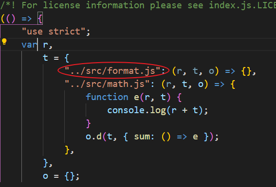
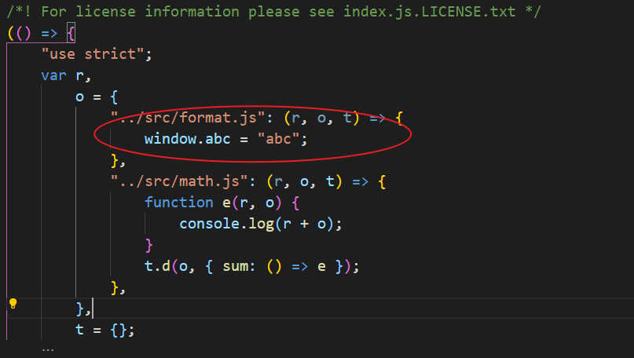

## Tree Shaking



webpack 实现 `Tree Shaking` 采用了两种不同方案

-   `usedExports`：通过标记某些函数是否被使用，之后通过 `Terser` 来进行优化
-   `sideEffects`：跳过整个模块/文件，直接查看该文件是否有副作用

### usedExports

因为在生成环境默认会开启代码压缩，先将改为 `mode: "development"; devtool: "source-map"` 方便查看源代码

先在 `math.js` 中导出两个函数

```js
export function sum(num1, num2) {
    console.log(num1 + num2);
}

export function mul(num1, num2) {
    console.log(num1 * num2);
}
```

然后在入口文件 `index.js` 只引入一个函数

```js
import { sum } from "./math";
sum(1, 1);
```

设置 `optimization.usedExports`，观察选项开启前后有什么变化

```js
module.exports = {
    mode: "development",
    devtool: "source-map",
    entry: "../src/index.js", //入口文件路径则改为../
    output: {
        filename: "./js/index.js", //打包后的文件名
        path: path.resolve(__dirname, "../build"), //必须使用绝对路径
    },
    optimization: {
        usedExports: true, //生产环境下默认是true，目的是在源代码通过注释标注出来哪些函数没有使用，然后Terser会将没使用的代码进行删除
    },
};
```

我们可以看到 `usedExports` 设为 `true` 的时候注释不一样了，目的是在源代码通过注释标注出来哪些函数没有使用，然后`Terser` 会将没使用的代码进行删除


然后我们设置 `minimize: true` 开启压缩，格式化代码之后，会发现没有导入的 `mul` 函数已经被删除了



### sideEffects

`sideEffects` 是用于告知 `webpack compiler` 哪些模块是有副作用的，那什么东西是副作用？

对于模块化来说，函数内部除了做正常工作任务以外，还与外部环境发生了交互，并对外部环境产生了影响，被称为函数副作用

先创建一个 `format.js`

```js
export function format() {
    return "format";
}
```

在入口文件进行导入，但不使用

```js
import "./format";
```

此时打包是会看到 `format.js` 还是打包进去了，但我们并不希望这样



我们可以在 `package.json` 中设置 `sideEffects` 属性为 `false`

```json
{
    "sideEffects": false
}
```

认为所有模块都没有副作用，这时没用到的代码就不会进行打包

此时我们 `format.js` 加入副作用，我们在 `window` 对象上设置属性，可以被其他模块用到

```js
window.abc = "abc";
```

但是因为我们设置除了所有模块都没有副作用，`window.abc` 是不会生效的，我们可以设置 `sideEffects` 为数组，指定那些文件是有副作用的，这样就不会删除了

```json
{
    "sideEffects": ["./src/format.js"]
}
```



:::tip 提示：
在生产环境中一般是不需要配置 `usedExports` 和 `sideEffects`的
:::
**总结**：
引用了但没有被使用的模块，本应该被删除，但是该模块中有副作用，此时不应该删除，所以我们可以设置 `sideEffects` 属性来告诉哪些模块是有副作用的。建议在开发中写纯模块，少写副作用代码。

### css 的 sideEffects

如果在 `package.json` 开启了 `sideEffects` 属性，但是没有设置 `css` 文件，那么 `css` 文件也是不会进行打包的
因为 `css` 文件也是可以 `import` 语法导入的

可以添加所有 `css` 文件认为是有副作用的，这样就可以打包 `css` 文件了

```json
{
    "sideEffects": [
        "**/*.css" //使用*号匹配所有文件夹下的css文件
    ]
}
```

或者在 `module.rules` 处理 `css` 选项中设置`sideEffects`

```js
const MiniCssExtractPlugin = require("mini-css-extract-plugin");

module.exports = {
    module: {
        rules: [
            {
                test: /\.css/i,
                use: [MiniCssExtractPlugin.loader, "css-loader"], //替换掉style-loader
                sideEffects: true,
            },
        ],
    },
};
```

## css 实现 Tree Shaking

上面的都是对于`JavaScript`的 `Tree Shaking`，那么 css 是否也可以进行`Tree Shaking`呢?

创建 `style.css`，在入口文件进行导入，像 `title` 这样没有使用到的 `css` 属性应该删除，
我们可以借助`purgecss-webpack-plugin`来实现 css 的 `Tree Shaking`

```css
html,
body {
    height: 100%;
    background-color: aqua;
}

.title {
    color: red;
    font-size: 20px;
}
```

安装 `purgecss-webpack-plugin` 插件

```
npm i purgecss-webpack-plugin -D
```

进行配置

```js
const path = require("path");
const MiniCssExtractPlugin = require("mini-css-extract-plugin");
const CssMinimizerPlugin = require("css-minimizer-webpack-plugin");
const PurgeCssPlugin = require("purgecss-webpack-plugin");

const glob = require("glob");

module.exports = {
    plugins: [
        new MiniCssExtractPlugin({
            filename: "./css/[name].[hash:6].css",
        }),
        new CssMinimizerPlugin(),
        // 实现css的tree shaking，没有使用的css类名、标签名等会被删除
        new PurgeCssPlugin({
            // 匹配src目录下的所有文件
            // purgecss-webpack-plugin官方推荐使用glob来获取匹配的文件列表
            paths: glob.sync(`${path.resolve(__dirname, "./src")}/**/*`, {
                nodir: true, //文件夹不需要匹配
            }),
            // 安全列表，这些css属性不会删除
            safelist: function () {
                return { standard: ["html", "body"] };
            },
        }),
    ],
};
```

使用前

```css
body,html{background-color:aqua;height:100%}.title{color:red;font-size:20px}
```

使用后，没有用到的 css 属性删除了

```css
body,html{background-color:aqua;height:100%}
```
