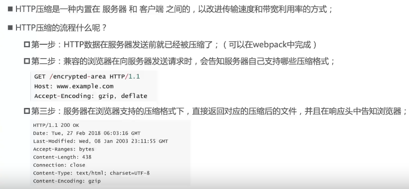
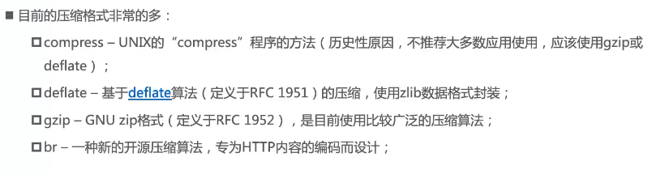

## HTTP压缩

什么是 `HTTP` 压缩？



压缩格式种类：



在webpack进行http压缩需要借助 `compression-webpack-plugin` 插件
```
npm i compression-webpack-plugin -D
```

一般在生产环境进行配置，开发环境需要的话也可以使用
```js
const CompressionPlugin = require("compression-webpack-plugin");

module.exports = {
    mode: "production",
    plugins: [
        new CompressionPlugin({
            test: /\.(css|js)$/i, //匹配css和js文件
            threshold: 0, // 文件大于该大小（字节），才会进行压缩
            // minRatio: 0.8, // 压缩之后的大小/压缩前的大小 小于该值才会进行压缩，默认0.8
            minRatio: Infinity, // 即使大于原始大小也进行压缩
            algorithm: "giz", // 使用的压缩算法
            // include:"", // 匹配哪些需要压缩
            // exclude:"", // 匹配哪些不需要压缩
            // filename:"", //设置压缩文件名称
        }),
    ],
};
```

## HTML压缩

控制HTML压缩，直接通过设置之前安装的 `html-webpack-plugin` 插件即可
```js
const HtmlWebpackPlugin = require("html-webpack-plugin");

// 导出为函数，接收命令传递过来的参数
module.exports = {
   plugins: [
        new HtmlWebpackPlugin({
            title: "webpack教程",
            template: "../index.html", //loader中的路径也是一样
            inject: true, // 是否自动将打包资源链接注入到html文件，默认为true
            // inject: "head", // 注入到head标签中
            inject: "body", // 注入到body标签中
            cache: true, // 当文件没有任何改变时，使用缓存
            // minify: true, //是否开启html文件压缩
            // 设置html-minifier-terser压缩插件的选项
            minify: {
                collapseWhitespace: true, //是否压缩空格
                removeComments: true, // 是否移除注释
                removeEmptyAttributes: true, //是否移除一些空属性，比如<div class=""></div>
                removeRedundantAttributes: true, //是否移除多余的属性，比如<input type="text">，type默认就是text,可以去掉
                minifyCss: true, //是否压缩style标签内的css代码
                // minifyJS: true, //是否压缩script标签内的js代码
                // 设置为对象，则里面是terser压缩的设置
                minifyJS: {
                    mangle: {
                        toplevel: true,
                    },
                },
            },
        }),
    ],
};

```
更多选项可以查看 :point_right: [HtmlWebpackPlugin选项](https://github.com/jantimon/html-webpack-plugin#options)

## 补充

### InlineChunkHtmlPlugin插件

当提取运行时代码时，运行时的代码不是很多时，可以将运行时代码全部注入到 `html` 文件中，减少对js文件的请求。

需要借助 `react` 工具下的插件 `InlineChunkHtmlPlugin`，安装 `react-dev-utils`
```
npm i react-dev-utils -D
```
```js
const HtmlWebpackPlugin = require("html-webpack-plugin");
const InlineChunkHtmlPlugin = require("react-dev-utils/InlineChunkHtmlPlugin");

// 导出为函数，接收命令传递过来的参数
module.exports = {
      plugins: [
        // 因为提取运行时的代码不是很多时，可以将runtime.***.js 内容全部注入到html文件中，减少对js文件的请求
        new InlineChunkHtmlPlugin(HtmlWebpackPlugin, [/runtime.*\.js/]),
    ],
};

```