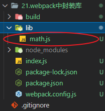
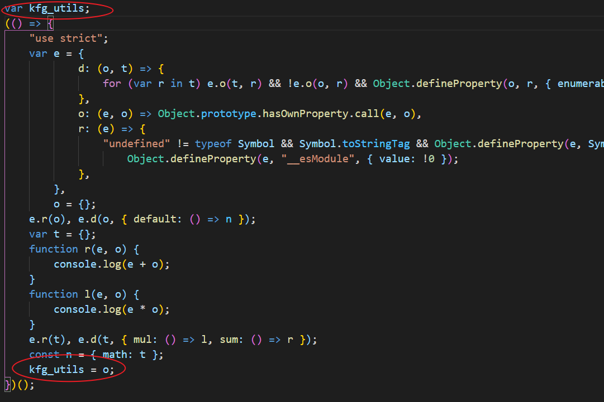
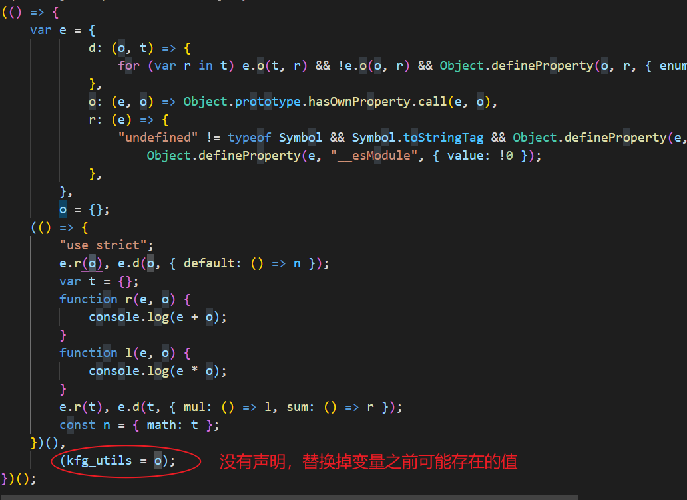
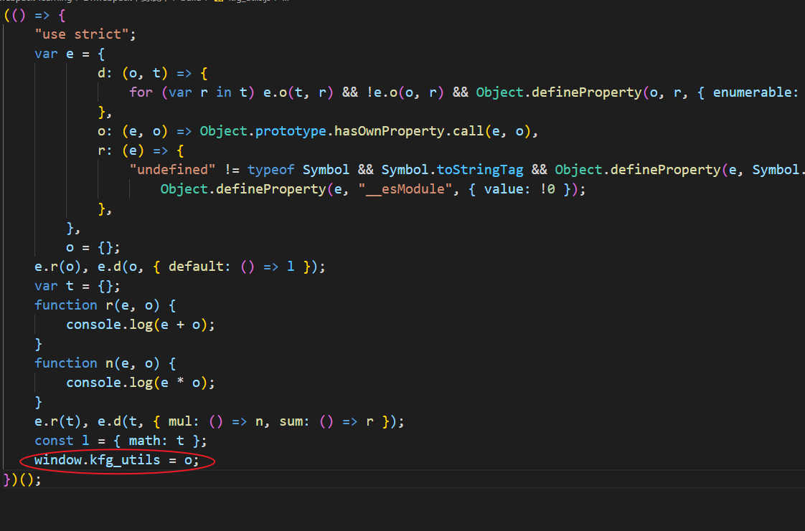
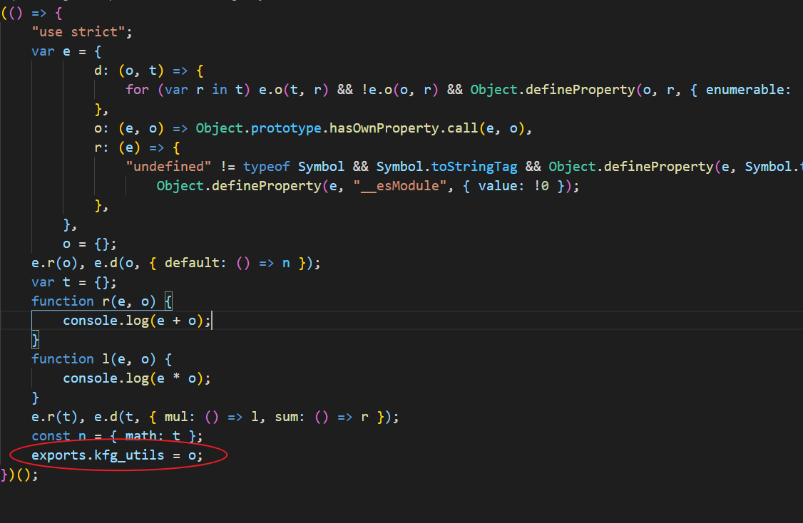
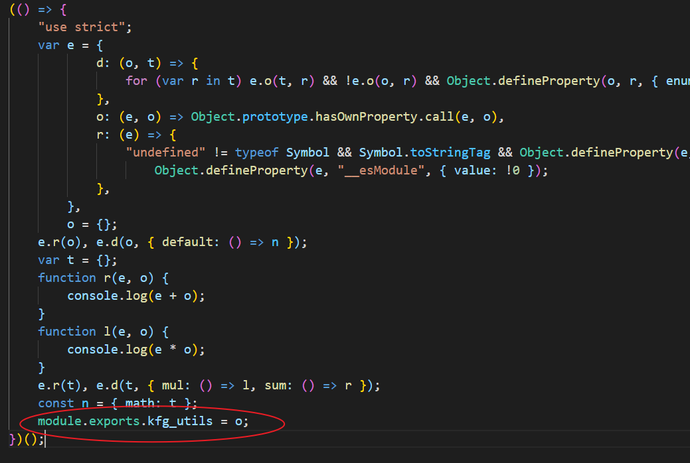
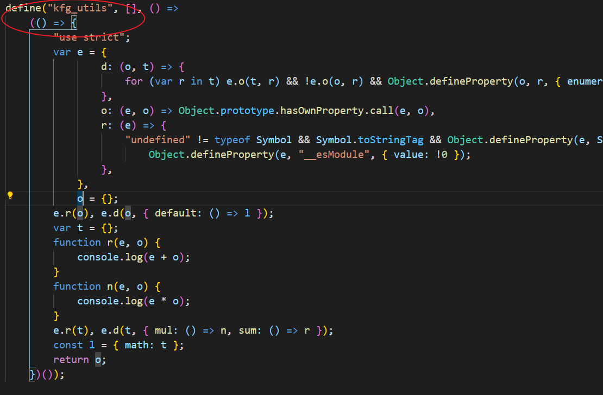
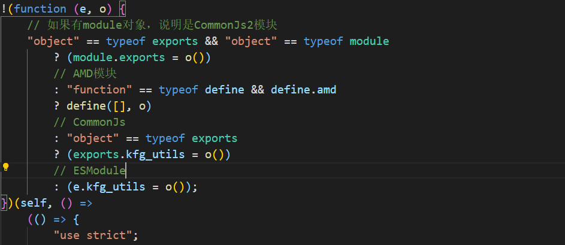
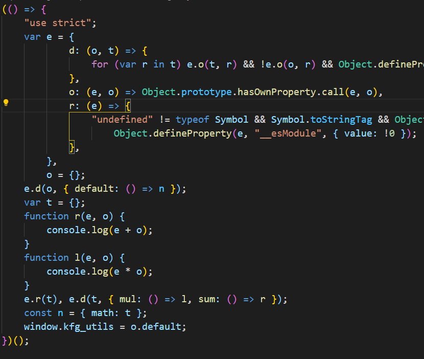
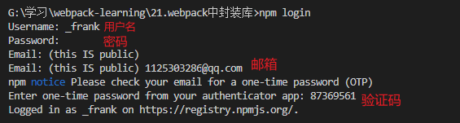

## 封装库

`webpack` 除了打包应用程序代码，还可以用于打包 JavaScript 库，也就是可以生成第三方包

示例：



新建 `math.js`

```js
export function sum(num1, num2) {
    console.log(num1 + num2);
}

export function mul(num1, num2) {
    console.log(num1 * num2);
}
```

在 `index.js` 中导入导出

```js
import * as math from "./lib/math";

export default {
    math,
};

export function format() {
    return "format";
}
```

配置 `webpack.config.js`，因为普通应用程序的打包经过了模块化处理，是没有对外暴露接口给其他人进行调用的，`webpack` 提供了 `output.library` 属性给我们进行配置，如下：

```js
const path = require("path");

module.exports = {
    mode: "production",
    entry: "./index.js",
    output: {
        path: path.resolve(__dirname, "./build"),
        filename: "kfg_utils.js",
        // 暴露的模块名称。取决于 libraryTarget 的值
        // library: "kfg_utils",
        library: {
            name: "kfg_utils",
            // type: "var", // 将导出的库赋值给一个变量
            // type: "assign", // 将导出的库赋值给一个变量，没有声明变量，更加安全
            // type: "global",
            type: "window", // 将导出的库赋值给window
            // type: "commonjs", //社区规范的commonjs
            // type: "commonjs2", //Node的commonjs（commonjs2多了对module属性的支持）
            // type: "module", //支持ESModule
            // type: "amd", //支持AMD模块
            // type: "umd", //支持所有环境
            export: "default", // 可以指定哪一个导出应该被暴露为一个库
            // export: ["default", "math"], //也可以传递一个数组，按照该路径作为库进行导出
        },
        // 相当于library.type，官方推荐使用library.type，因为libraryTarget未来可能会废除该属性
        // libraryTarget: "window",
    },
};
```
### library.type

配置将库暴露的方式，下面查看具体源码看看 `library.type` 具体干了什么

- `var`：将导出的库赋值给一个变量，通过该变量使用库



- `assign`：将导出的库赋值给一个变量，当命名冲突时，替换掉之前的值，更加安全



- `window`：将导出的库赋值给window



- `commonjs`：使用commonjs规范导出库



- `commonjs2`：使用commonjs2规范导出库



- `amd`：使用AMD规范导出库



- `umd`：根据不同环境做不同的导出，所以支持所有环境



### library.export

`export` 可以指定哪一个导出应该被暴露为一个库，比如我们在 `index.js` 使用了默认导出，也导出了其他函数，我们可以指定只有默认导出暴露为一个库

- `default`: 将默认导出暴露为一个库



## 发布第三方库
### 发布包

发布自己的包到npm上非常简单，需要先去npm官网注册一个属于自己的账号。

1. 在项目根目录执行登录命令
```
npm login
```


2. 执行发布命令即可成功发布
```
npm publish
```

### 更新包

1. 方式一：手动更新 `package.json` 中的 `version` 值

2. 方式二：执行 `npm version` 命令，后面参数为版本号，也可以接参数。
    - `npm version patch`：细微的修改，最后一位加一
    - `npm version minor`：小幅度的修改，中间一位加一
    - `npm version major`：大范围的修改，重构，最后一位加一
```
npm version 1.1.1
npm version patch
npm version minor
npm version major
```

更新之后重新执行发布命令即可
