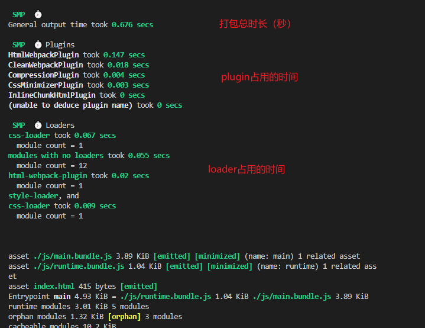
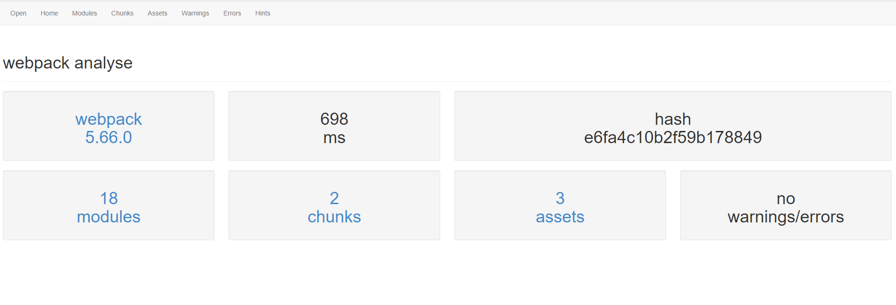
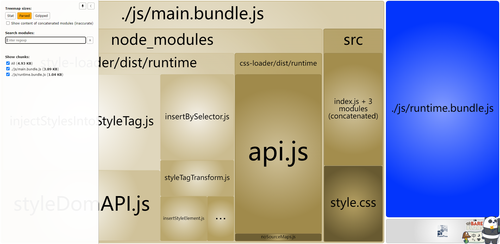

## 打包时间分析

如果我们希望看到每个 `loader` 、每个 `plugin` 消耗的打包时间，可以借助 `speed-measure-webpack-plugin` 插件

安装插件

```
npm i speed-measure-webpack-plugin -D
```

在 `webpack.common.js` 进行配置，不是在 `plugins` 中配置，而是使用 `wrap` 方法包裹最终的配置信息

```js
const SpeedMeasurePlugin = require("speed-measure-webpack-plugin");
const smp = new SpeedMeasurePlugin();

// 导出为函数，接收命令传递过来的参数
module.exports = function (env) {
    console.log("----------", env);
    const isProduction = !!env.production;
    process.env.production = env.production ? env.production : "development";
    const mergeConfig = isProduction ? merge(CommonConfig, ProdConfig) : merge(CommonConfig, DevConfig);
    return smp.wrap(mergeConfig);
};
```

:::warning 注意
如果报错的话，是因为该插件与其他插件有的不兼容，注释掉不兼容的插件即可
:::



## 打包大小分析

上面的插件只有打包时间分析，没有文件大小的分析，接下来介绍几种既有打包时间分析也有文件大小分析的工具。
### 官方分析工具

在 `package.json` 中添加以下命令

```json
{
    "script": {
        "stats": "webpack --config ./config/webpack.common.js --env production  --json stats.json"
    }
}
```

执行`npm run stats`，`webpack` 会将打包细节的详细信息输出到 `stats.json` 文件中，然后进入 :point_right: [webpack官方分析工具](https://webpack.github.io/analyse/)，导入该文件即可查看打包信息的图形化界面



### 社区分析插件

除了官方分析工具外，官方还推荐了一些社区开发的分析插件， :point_right: [社区分析插件](https://webpack.docschina.org/guides/code-splitting/#bundle-analysis)，我们以用的比较多的 `webpack-bundle-analyzer` 为例

安装插件

```
npm install webpack-bundle-analyzer -D
```

直接在 `webpack.prod.js` 中进行配置即可

```js
const { BundleAnalyzerPlugin } = require("webpack-bundle-analyzer");
module.exports = {
    mode: "production",
    plugins: [
        new BundleAnalyzerPlugin(),
    ],
};

```
会在打包之后开启一个本地服务，自动跳出打包分析的页面

