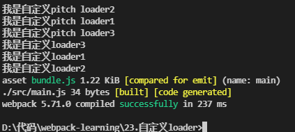
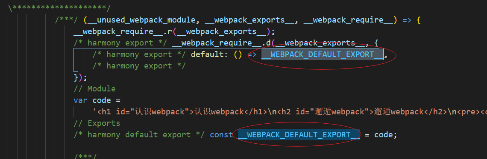

## 自定义loader

`loader` 本质上是一个导出为函数的 `JavaScript` 模块，`loader runner` 会调用这个函数，然后将上一个 `loader` 产生的结果或者资源传入进去


1. 新建 `loader` 文件

接收的第一个参数 `content` 就是由上一个 `loader` 处理过的值，拿到内容对其进行处理后返回即可

```js
module.exports = function (content) {

    const options = this.getOptions(); //获取传递的参数

    // 返回值的方式有两种
    // return content + 123;
    // 或者
    /**
     * @description:
     * @param {err} 错误信息
     * @return {content} 内容
     */
    this.callback(null, content); // this为loader的上下文
};
```

2. 在配置文件中使用 `loader` ，并传入选项

```js
const path = require("path");

module.exports = {
    mode: "development",
    // context: path.resolve(__dirname, "./"),
    entry: "./src/main.js",
    output: {
        path: path.resolve(__dirname, "./build"),
        filename: "bundle.js",
    },
    module: {
        rules: [
            {
                test: /\.js$/i,
                // use: "./kfg-loader/index.js", //不使用路径，则可以配置resolveLoader
                use: {
                    loader: "kfg-loader1",
                    options: {
                        name: "kfg",
                        age: 22,
                    },
                },
            },
        ],
    },
    resolveLoader: {
        modules: ["node_modules", "./kfg-loader"], //如果在node_modules找不到，则从kfg-loader中找
        mainFields: ["loader", "main"], //默认值
        extensions: [".js", ".json"], //默认值
    },
};
```

如果在loader中进行了异步处理

```js
// 异步Loader处理方式
module.exports = function (content) {

    const callback = this.async(); //loader处理为异步的时候

    setTimeout(() => {
        callback(null, content);
    }, 0);
};
```

### 校验loader传递的选项

新建 `json` 文件，描述 `loader` 的选项
```json 
{
    "type": "object",
    "properties": {
        "name": {
            "type": "string",
            "description": "请输入你的名字"
        },
        "age": {
            "type": "number",
            "description": "请输入你的年龄"
        }
    },
    "additionalProperties": true
}
```

安装 `schema-utils` 工具，进行校验

```
npm i schema-utils -D
```
```js
const { validate } = require("schema-utils");
const schema = require("./kfg-schema.json");
// 异步Loader处理方式
module.exports = function (content) {
    const options = this.getOptions(); //获取传递的参数

    validate(schema, options); //校验传递的参数

    return content
};
```

更多使用方法可以查看官网 :point_right: [自定义loader的api接口](https://webpack.docschina.org/api/loaders/)

### loader的执行顺序
`loader` 的执行顺序默认是从后往前，从右到左，我们可以通过修改 `enforce` 属性来修改执行顺序

`enforce` 属性用来指定 `loader` 的种类，有四种取值：`pre、normal、inline、post`，默认是 `normal`，行内设置的`loader` 是 `inline`（形如 `import "loader1!loader2!./test.js"` ）

- 在 `Normal Loader` 中执行优先级为：`pre > normal > inline > post`
- 在 `Pitching Loader` 中执行优先级为: `post > inline > normal > pre`

什么是 `Normal Loader` 和 `Pitching Loader` 可以查看这篇文章 :point_right: [Normal Loader和Pitching Loader的区别](https://juejin.cn/post/7037696103973650463)

先定义3个自定义loader
```js
// NormalLoader
module.exports = function (content) {
    console.log("我是自定义loader1");
    return content;
};

// PitchLoader
module.exports.pitch = function () {
    console.log("我是自定义pitch loader1");
};
```
```js
module.exports = {
    module: {
        rules: [
            {
                test: /\.js$/i,
                use: "kfg-loader1",
            },
            {
                test: /\.js$/i,
                use: "kfg-loader2",
                enforce: "post",
            },
            {
                test: /\.js$/i,
                use: "kfg-loader3",
            },
        ],
    },
    resolveLoader: {
        modules: ["node_modules", "./kfg-loader"], //如果在node_modules找不到，则从kfg-loader中找
        mainFields: ["loader", "main"], //默认值
        extensions: [".js", ".json"], //默认值
    },
};
```
可以看到执行顺序为：
 



### 示例

以解析markdown文件为例：

在 `doc.md` 中写入，
```md
# 认识webpack

## 邂逅webpack

- 列表1
- 列表2
- 列表3

```
并在入口文件 `main.js` 中进行导入
```js
import  "./doc.md";
```

新建 `md-loader` 来处理markdown内容，处理 `markdown` 内容需要安装 `marked` 插件，`marked` 插件会将 `markdown` 内容转为 `HTML`

:::tip 提示
如果想要实现markdown代码区域的样式，还需要借助 `highlight.js` 库
:::

```
npm i marked -D
npm i highlight.js -D
```

```js
const marked = require("marked");
const hljs = require("highlight.js");

module.exports = function (content) {

    // 使用highlight.js，这里只是给标签加上类名，还需要在入口导入highlight.js提供样式文件
    marked.setOptions({
        highlight: function (code, lang) {
            return hljs.highlight(lang, code).value;
        },
    });

    const htmlContent = marked.parse(content);
    // 转为HTML后，还需要依赖html-loader将 HTML 导出为字符串
    return htmlContent; //因为返回的要是字符串或者二进制流
};
```
因为webpack无法对HTML或者其它格式的内容进行处理，所以我们有两种方式处理


1. 使用 `html-loader` 去处理HTML内容：

安装
```
npm i html-loader -D
```
在配置文件中，进行配置
```js
module.exports = {
    mode: "development",
    devtool: "source-map",
    module: {
        rules: [
            {
                test: /\.md$/i,
                use: ["html-loader", "md-loader"],
            },
        ],
    },
    resolveLoader: {
        modules: ["node_modules", "./kfg-loader"], //如果在node_modules找不到，则从kfg-loader中找
        mainFields: ["loader", "main"], //默认值
        extensions: [".js", ".json"], //默认值
    },
};

```

可以看到打包后 `doc.md` 文件默认导出的内容变成了一个HTML字符



所以我们可以直接默认导入该字符，添加到HTML中即可
```js
import code from "./doc.md";

document.body.innerHTML = code;
```

2. 第二种方式是自己将HTML内容转为js字符

```js
const marked = require("marked");

module.exports = function (content) {
    const htmlContent = marked.parse(content);
    const innerContent = "`" + htmlContent + "`";
    const moduleCode = `var code=${innerContent}; export default code;`; //转为js字符，进行默认导出

    return moduleCode; 
};
```

## 自定义