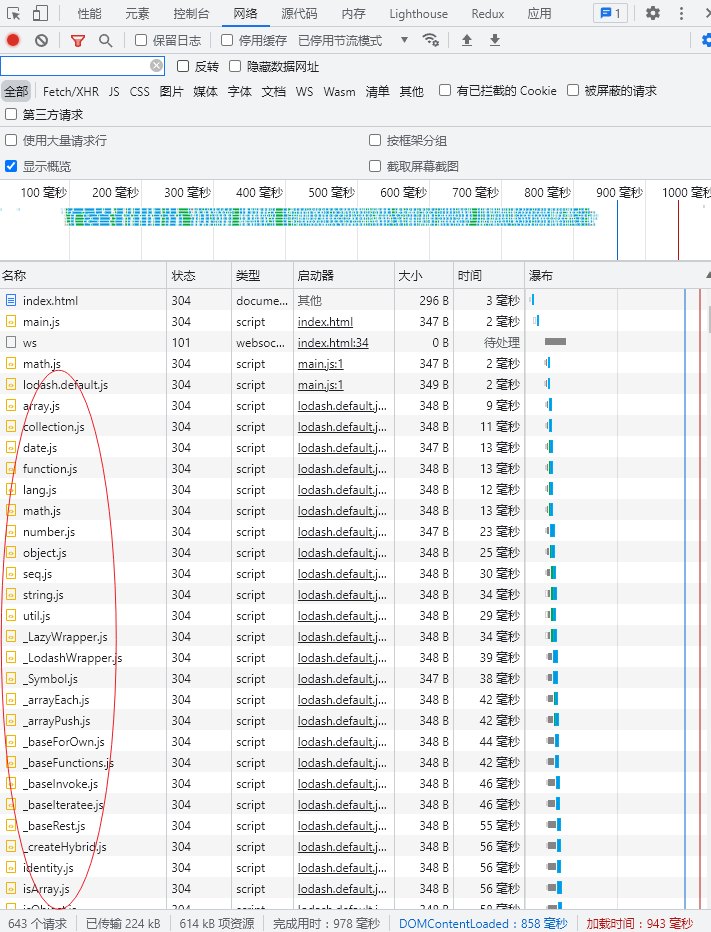
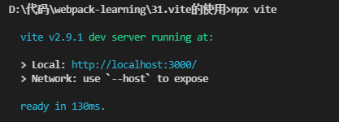
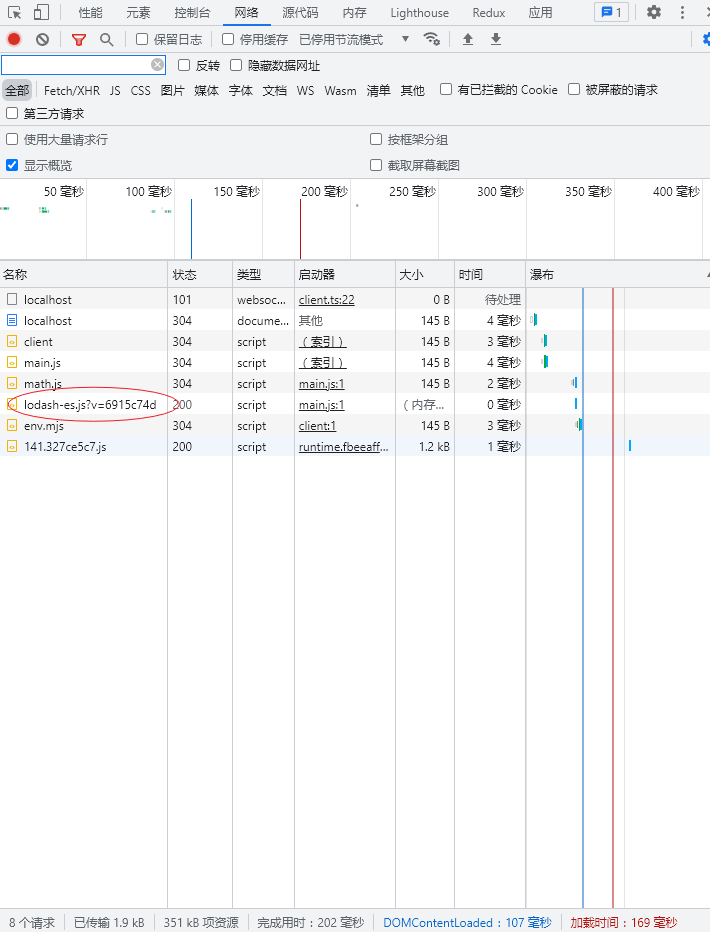
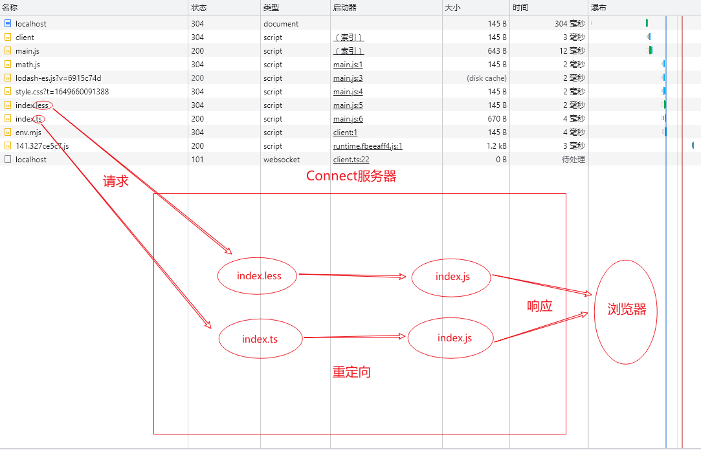
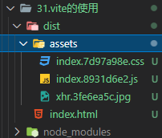
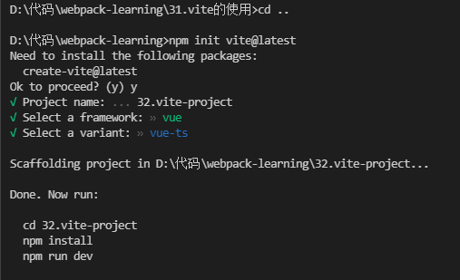

## Vite 简介

**什么是 Vite？**

:point_right: [Vite 介绍](https://vitejs.cn/guide/)

**为什么使用 Vite？**

:point_right: [为什么选 Vite](https://vitejs.cn/guide/why.html)

## 浏览器的原生支持

大部分的浏览器都已经支持 ESModule，我们可以使用 ESModule 模块化代码直接泡在浏览器里

新建 `math.js`，使用 ESModule 语法导出

```js
export function sum(a, b) {
    return a + b;
}
```

新建 `main.js`，导入`lodash-es`库，该库支持 ESModule 语法

```js
import { sum } from "./util/math.js";
import _ from "../node_modules/lodash-es/lodash.default.js";

console.log(sum(1, 1));
console.log(_.join("a", "b"));
```

在项目根目录新建 `index.html` 文件，引入 `main.js`

```html
<!DOCTYPE html>
<html lang="en">
    <head>
        <meta charset="UTF-8" />
        <meta http-equiv="X-UA-Compatible" content="IE=edge" />
        <meta name="viewport" content="width=device-width, initial-scale=1.0" />
        <title>Document</title>
    </head>
    <body>
        <script src="./src/main.js" type="module"></script>
    </body>
</html>
```

使用 VSCode 的 `live-server` 插件，开启本地服务



打开浏览器网络请求，可以看到，直接使用浏览器原生支持，有多少个模块就会向服务器发起多少次请求。

虽然浏览器支持了 ESModule，但是浏览器还是无法实现代码合并压缩，无法实现 Tree Shaking ，无法处理向 `.jsx`、`.vue`、`.ts`等文件的处理，等等功能，所以我们还是需要借助打包工具

## Vite 的使用

安装 Vite

```
npm i vite -D
```

### 基本使用

修改 `main.js` 导入 `lodash-es` 方式

```js
import { sum } from "./util/math.js";
import _ from "lodash-es";

console.log(sum(1, 1));
console.log(_.join("a", "b"));
```

直接执行命令，即可开启一个本地服务，使用非常简单

vite 默认会以根目录下的 `index.html` 文件为入口

```
npx vite
```



可以看到使用 vite 后，`loadsh-es` 文件的请求就变成一个文件了



### 使用样式文件

-   `.css` 文件

直接引入即可

```js
import "./css/style.css";
```

-   支持 `postcss`

无需配置，只需要安装 `postcss` 即可

```
npm i postcss -D
npm i postcss-preset-env -D //使用预设插件
```

直接新建 `postcss.config.js`，进行配置

```js
module.exports = {
    plugins: [require("postcss-preset-env")],
};
```

-   `.less` 文件

无需配置，只需要安装 less 插件即可

```
npm i less -D
```

```js
import "./css/index.less";
```

Vite 也同时提供了对 `.scss, .sass, .less, .styl` 和 `.stylus` 文件的内置支持，只需要安装对应的预处理器依赖即可

### 使用 .ts 文件

无需配置，vite 默认支持 `.ts` 文件，直接导入即可

```js
import { format } from "./ts/index.ts";
```

### 使用 .vue 文件

Vite 为 Vue 提供第一优先级支持，所以不需要安装 `vue`库 和 `vue-template-compiler`模板解析器，只需要安装 Vite 提供的插件即可

```
@vitejs/plugin-vue // 支持Vue3
vite-plugin-vue2 // 支持Vue2
```

新建 `vite.config.js`，进行配置即可加载 `.vue` 文件

```js
import { createVuePlugin } from "vite-plugin-vue2";

export default {
    plugins: [createVuePlugin()],
};
```

### 使用 .jsx 文件

`.jsx` 和 `.tsx` 默认支持，所以 Vite 对 `react` 也是开箱即用

:::tip 提示
还需要将入口文件修改为`.jsx`
:::

### 图片资源处理

无需配置，直接使用即可

```js
import xhr from "./img/xhr.jpg";
const imgEl = document.createElement("img");
imgEl.src = xhr;
document.body.append(imgEl);
```

到现在为止，我们对 Vite 还没有进行任何配置，只需要简单的进行插件的安装即可，使用起来可以说是非常简单

## Vite 原理

通过 Connect 搭建一个本地服务器，虽然浏览器上面显示的是请求 `.less、.ts` 文件，但是浏览器是无法解析这些文件的。Connect 服务器会进行拦截转发，响应的真正的文件，是已经编译好的`.js`文件



**为什么 Vite 的构建速度快？**

1.  预打包

:point_right: [预缓存](https://vitejs.cn/guide/dep-pre-bundling.html#monorepos-and-linked-dependencies)

2.  ESbuild 解析：

Vite 使用 ESbuild 对 `ts、jsx、tsx` 文件进行转义

**ESbuild 的特点：**

-   超快的构建速度，并且不需要缓存
-   支持 ES6 和 CommonJS 模块
-   支持 Tree Shaking
-   支持 Go、JavaScript 的 Api
-   支持 TypeScript、JSX 等语法的编译
-   支持 SourceMap
-   支持代码压缩
-   支持其他插件

**ESbuild 的构建速度：**

-   使用 Go 语言编写，可以直接转换成机器代码
-   充分利用 CPU 的多内核，尽可能然他们饱和运行
-   所有内容从零开始编写，没有使用第三方库

## Vite 打包

在 `package.json` 中，配置打包命令即可

```json
{
    "scripts": {
        "serve": "vite",
        "build": "vite build"
    }
}
```

默认打包后的目录结构为



## 使用 Vite 脚手架

前面我们是从零开始使用 Vite ，Vite 同时还提供了一个脚手架，可以帮助我们快速构建一个 Vite 项目

执行命令

```
npm init vite@latest
```

然后按照提示进行操作即可




## 完结撒花:tada::tada::tada: